# [1회차] 컨설팅 개요: 산업 구조와 프로젝트 라이프사이클

No: 1
난이도: 초급
단계: Overview
상태: 완료
소요시간(분): 20
중요도: 낮음 (Low)
학습 목표: 컨설팅 산업 구조와 프로젝트 라이프사이클 이해


컨설팅 프로젝트 팀 미팅

### [1회차] 컨설팅 개요: 산업 구조와 프로젝트 라이프사이클

---

---

<aside>
🎯

**학습 목표**

- **컨설팅 산업**의 구조와 주요 펌 유형 이해
- **컨설팅 프로젝트 라이프사이클** 전체 흐름 파악
- **진단/PI/BPR/ERP구축** 프로젝트 유형별 특성 구분
- **컨설턴트 역할과 일하는 방식** 개요 이해
</aside>

---

## 1. 컨설팅이란?

<aside>
💡

**컨설팅(Consulting)**이란 조직의 문제를 진단하고, 해결책을 제시하며, 실행을 지원하는 전문 서비스입니다.

핵심 가치: **외부 시각 + 전문 방법론 + 변화 촉진**

</aside>

### 1.1 컨설팅이 필요한 이유

| **상황** | **내부 해결의 한계** | **컨설팅의 가치** |
| --- | --- | --- |
| **복잡한 문제** | 전문 인력/시간 부족 | 검증된 방법론과 전문가 투입 |
| **객관성 필요** | 내부 정치, 기득권 | 외부 시각의 객관적 진단 |
| **변화 추진** | 현업 저항, 관성 | 변화 촉진자(Change Agent) 역할 |
| **벤치마크** | 타사 사례 접근 어려움 | 다양한 산업/기업 경험 보유 |

### 1.2 실제 사례: 컨설팅 프로젝트 예시

<aside>
📋

컨설팅은 **유형에 따라 목적, 범위, 기간, 산출물**이 크게 다릅니다.

아래 표는 다양한 컨설팅 프로젝트의 실제 사례입니다.

</aside>

| **유형** | **프로젝트 예시** | **배경 및 범위** | **기간** | **주요 성과** |
| --- | --- | --- | --- | --- |
| **전략 컨설팅** | A그룹 신사업 진출 전략 | 시장 분석, 경쟁사 벤치마크, 진입 전략 수립 | 3개월 | 3개 신사업 후보 도출, 투자 우선순위 확정 |
| **ISP**
(정보화 전략) | B제조사 IT 마스터플랜 | IT 현황 진단, 정보화 로드맵 및 투자계획 수립 | 4개월 | 5년 IT 로드맵, 연간 80억 투자계획 확정 |
| **Operation**
(운영 혁신) | C제조사 SCM 혁신 | 수요예측~구매~생산~물류 E2E 진단 및 개선 | 6개월 | 재고 30% 감소, 납기 준수율 70%→92% |
| **PI**
(프로세스 개선) | D유통사 구매 프로세스 혁신 | 구매~입고~정산 프로세스 표준화 및 자동화 | 4개월 | 구매 리드타임 40% 단축, 오류율 80% 감소 |
| **BPR**
(업무 재설계) | E금융사 여신 프로세스 BPR | 여신 심사~실행~사후관리 全 프로세스 재설계 | 8개월 | 심사 소요시간 5일→1일, 인력 20% 재배치 |
| **CX**
(고객경험) | F통신사 고객여정 혁신 | 가입~이용~해지 고객여정 분석 및 터치포인트 개선 | 5개월 | NPS 15점 상승, 해지율 8% 감소 |
| **ERP 구축** | G제조사 SAP S/4HANA 구축 | 재무/구매/생산/판매 모듈 구축, 레거시 전환 | 18개월 | 월 마감 5일→2일, 실시간 경영정보 확보 |

<aside>
💡

**Point**: 본 특강은 위 유형 중 **Operation, PI, BPR, ERP 구축** 영역을 집중적으로 다룹니다.

전략 컨설팅, ISP, CX 등은 별도의 방법론과 역량이 필요한 영역입니다.

</aside>

---

## 2. 컨설팅펌 유형

### 2.1 전체 지형도

<aside>
🗺️

컨설팅 산업은 **전문 영역**에 따라 크게 4가지로 분류됩니다.

본 특강에서는 **운영 컨설팅** 영역을 집중적으로 다룹니다.

</aside>

| **유형** | **대표 펌** | **핵심 업무** | **본 특강** |
| --- | --- | --- | --- |
| **전략 컨설팅** | MBB (McKinsey, BCG, Bain) | 사업 전략, M&A, 신사업 | - |
| **운영 컨설팅** | Big4 컨설팅, AT Kearney | **Quick assess, PI, BPR, ERP, SCM** | **✅ Deep Dive** |
| **재무 자문** | Big4 회계법인 (Audit) | 재무 실사, 가치평가, 구조조정 | - |
| **HR/조직 컨설팅** | Mercer, Korn Ferry | 인사제도, 조직진단, 변화관리 | - |

### 2.2 산업 트렌드 변화: 설계와 구축의 통합

<aside>
📈

**과거와 현재의 역할 분담 변화**

컨설팅 산업의 역할 구분이 점점 모호해지고 있습니다.

</aside>

|  | **과거 (2000-2010년대)** | **현재 (2020년대~)** |
| --- | --- | --- |
| **설계 (Design)** | 전략/경영 컨설팅펌
(Big4, 전문 컨설팅) | 전략/경영 컨설팅펌
**+ Big4 Advisory** |
| **구축 (Implementation)** | **SI 기업** | SI 기업
**+ Big4, Accenture 등** |
| **프로젝트 범위** | 설계 → (인수인계) → 구축
**별도 프로젝트** | 설계 + 구축
**통합 프로젝트** |

<aside>
💡

**왜 이런 변화가 생겼는가?**

**과거의 문제점: "설계-구축 Gap"**

1. **설계 컨설턴트**가 To-Be 프로세스를 설계하고 프로젝트 종료
2. **SI 업체**가 별도로 시스템 구축 프로젝트 수주
3. 설계 의도와 구축 결과물 사이에 **큰 Gap 발생**
4. 결과적으로 **고객의 Pain Point가 해결되지 않음**

**현재의 해결책: "End-to-End 책임"**

- Big4 (Deloitte, PwC, EY, KPMG)도 **Advisory + Implementation** 역량 강화
- 설계한 컨설턴트가 구축까지 책임지는 **연속성 확보**
- 고객 입장에서 **Single Point of Contact** → 책임 소재 명확
</aside>

<aside>
❌

**과거: 분리 모델의 문제**

```
[설계 컨설팅]     →     [SI 구축]
↓ 인수인계 ↓
"이렇게 하세요"    "이건 안됩니다"
↓                  ↓
설계 의도 희석    현실 타협 구현
↓                  ↓
**Pain Point 미해결**
```

</aside>

<aside>
✅

**현재: 통합 모델의 장점**

```
[설계 + 구축 통합]
↓
설계 컨설턴트 = 구축 책임
↓
설계 의도 → 구현까지 일관성
↓
**Pain Point 해결**
```

</aside>

---

### 2.3 Big4 회계법인과 컨설팅펌의 관계

<aside>
🏛️

**Big4**란 전 세계 회계·컨설팅 시장을 주도하는 4대 글로벌 네트워크를 의미합니다.

각 네트워크는 **회계감사 법인**과 **컨설팅/자문 법인**으로 구성되어 있으며, 이들 간의 관계와 독립성 규정을 이해하는 것이 중요합니다.

</aside>

### Big4 네트워크 구조

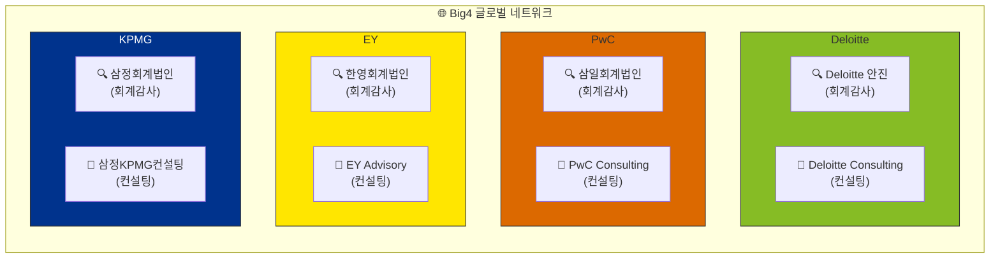

| **네트워크** | **한국 회계법인** | **컨설팅/자문 조직** |
| --- | --- | --- |
| **Deloitte** | 딜로이트 안진 | 딜로이트 컨설팅 |
| **PwC** | 삼일회계법인 | 삼일PwC컨설팅 |
| **EY** | 한영회계법인 | EY한영 Advisory |
| **KPMG** | 삼정회계법인 | 삼정KPMG Advisory |

<aside>
💡

**Point**: Big4 네트워크 내에서 **회계감사 법인**과 **컨설팅 법인**은 같은 브랜드를 사용하지만, 법적으로는 별도 법인입니다.

이 구조는 **독립성 규정** 때문에 형성되었습니다.

</aside>

### 독립성(Independence)이란?

<aside>
⚖️

**회계감사 독립성**이란 감사인이 감사 대상 회사와 이해관계가 없는 상태에서 객관적으로 감사를 수행할 수 있는 상태를 의미합니다.

</aside>

<aside>
🚫

**자기검토위협 (Self-Review Threat)**

컨설턴트가 설계한 재무 시스템이나 프로세스를 같은 네트워크의 감사인이 감사하면, 자신의 작업물을 검토하는 셈이 됩니다.

→ 오류를 발견해도 지적하기 어려움

→ 객관적 판단 불가능

</aside>

<aside>
🤝

**유착위협 (Familiarity Threat)**

컨설팅 매출을 올려주는 고객사의 회계감사를 수행하면, 관계 유지를 위해 엄격한 감사가 어려워집니다.

→ 고객 눈치를 보는 감사

→ 회계부정 묵인 가능성

</aside>

### 독립성 규정 체계

| **규정** | **내용** |
| --- | --- |
| **공인회계사법 21조2항** | 재무제표 감사 업무 수행 중 해당 회사의 재무정보 체제 구축·운영 업무 **금지** |
| **IESBA 국제윤리기준** | 같은 브랜드(네트워크)를 사용하는 회사 간에도 독립성 규정 적용 |
| **동일이사 교체의무** | 상장사는 동일 담당이사가 연속 3개 사업연도까지만 감사 가능 |
| **비감사용역 공시 (2025~)** | 네트워크 회계법인의 비감사용역 계약도 사업보고서에 공시 의무화 |

### 독립성 규정의 실무적 영향

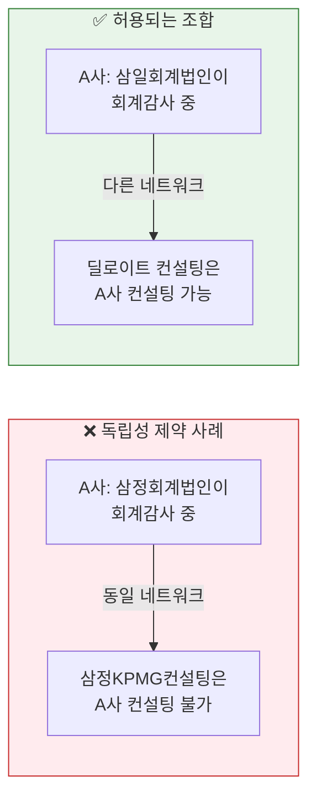

<aside>
📋

**실무 예시**

- 삼성전자의 회계감사를 삼일회계법인이 수행 중이라면, 삼일PwC컨설팅은 삼성전자의 ERP 구축 프로젝트 수주 불가
- 단, 딜로이트 컨설팅이나 삼정KPMG 등 **다른 네트워크**의 컨설팅펌은 수주 가능
- **M&A 의사결정에도 영향**: 인수 대상 회사의 기존 감사 관계가 인수 검토의 걸림돌이 되기도 함
</aside>

### 역사적 맥락: 분리와 재통합

<aside>
📜

2000년대 초 엔론, 월드컴 등 대형 회계부정 사건이 발생하면서, **회계법인의 컨설팅 겸업**이 감사 독립성을 해친다는 비판이 거세졌습니다.

</aside>

| **시기** | **상황** | **조치** |
| --- | --- | --- |
| 2000년대 초 | 엔론, 월드컴 등 회계부정 사건 | Big4 컨설팅 부문 **분리** 결정 |
| 2002 | 아더앤더슨 회계부정 연루로 해체 | 인력 분산 (각 Big4로 흡수) |
| 2002 | KPMG컨설팅 → 베어링포인트로 독립 | 별도 법인으로 나스닥 상장 |
| 2010년대 | 컨설팅 수요 증가 | Big4 Advisory 조직 **재강화** |
| 2020년대 | Big4 컨설팅 매출 > 감사 매출 | 독립성 논란 **재점화** |

<aside>
⚠️

**현재 상황**

- 설계(컨설팅)와 구축(SI)이 통합되는 트렌드 속에서 독립성 규정과의 균형이 과제
- 2025년부터 네트워크 법인의 비감사용역 계약 공시 의무화로 투명성 강화
</aside>

### 취업 준비생이 알아야 할 점

<aside>
🎯

**Big4 Advisory 지원 시 유의사항**

1. **같은 브랜드 ≠ 같은 회사**: 회계법인과 컨설팅 법인은 별도 법인, 채용도 별도
2. **프로젝트 투입 제한**: 네트워크 내 감사 클라이언트에는 컨설팅 투입 불가
3. **경쟁사 이해**: 특정 고객의 감사 관계에 따라 컨설팅 경쟁 구도가 달라짐
4. **규제 환경 변화**: 독립성 규정 강화 추세로 비즈니스 모델 변화 가능성
</aside>

---

### 2.4 운영 컨설팅 상세 (본 특강 범위)

<aside>
🔍

**운영 컨설팅(Operations Consulting)**은 기업의 **실행력**을 높이는 컨설팅입니다.

전략 수립 이후, 실제로 **프로세스를 설계하고 시스템을 구축**하여 성과를 만들어냅니다.

</aside>

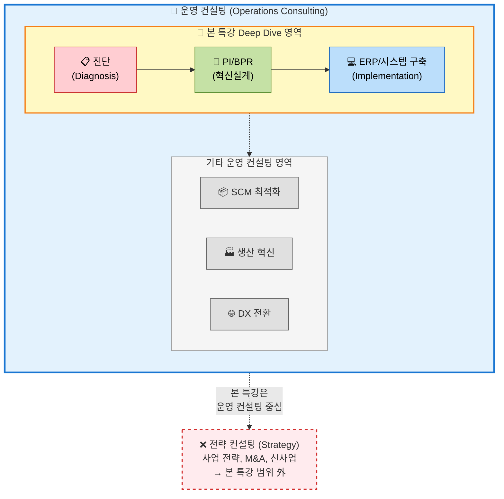

<aside>
📋

**진단 (Diagnosis)**

현황 분석 → 이슈 도출 → 개선 방향 제시

- 프로세스 맵핑
- Gap 분석
- 벤치마킹

**기간**: 1-3개월

</aside>

<aside>
🔄

**PI / BPR (프로세스 혁신)**

기존 프로세스 개선 또는 근본적 재설계

- To-Be 프로세스 설계
- 조직/R&R 재정의
- 변화관리

**기간**: 3-12개월

</aside>

<aside>
🏗️

**ERP/시스템 구축**

시스템 기반 업무 표준화 및 자동화

- Fit-Gap 분석
- Configuration/개발
- 통합테스트/Go-Live

**기간**: 12-24개월

</aside>

<aside>
⚠️

**본 특강의 범위 (Scope)**

**✅ 포함 (운영 컨설팅 중 Deep Dive)**

- 진단: As-Is 분석, 인터뷰, Gap 분석
- PI: 프로세스 개선, To-Be 설계
- BPR: 비즈니스 프로세스 리엔지니어링
- ERP구축: Fit-Gap, 통테, 컷오버

**❌ 제외 (전략 컨설팅)**

- 사업 전략 수립, M&A 실사, 신사업 진출 검토
- CEO/C-Level 대상 전략 자문

※ SCM 최적화, 생산혁신, DX 전환 등도 운영 컨설팅의 일부이나, 본 특강에서는 **PI/BPR/ERP구축 프로젝트**에 집중합니다.

</aside>

---

### 2.5 펌 내부 조직 구조와 문화

<aside>
🏢

컨설팅펌의 **조직 구조와 문화**는 인더스트리(일반 기업)와 상당히 다릅니다.

특히 **정치적 역학 관계**와 **팀 운영 방식**에서 차이가 큽니다.

</aside>

### 컨설팅 vs 인더스트리: 조직 문화 비교

| **구분** | **인더스트리 (일반 기업)** | **컨설팅펌** |
| --- | --- | --- |
| **정치 강도** | 상대적으로 높음
(고정된 조직, 기득권 구조) | 상대적으로 낮음
(프로젝트 기반, 실력 중심) |
| **승진 기준** | 연공서열 + 정치력 + 성과 | 레퍼런스(실적) + 실력 중심 |
| **평가 방식** | 상사 평가 비중 높음 | 다면 평가 + 프로젝트 성과 |
| **조직 변화** | 정적, 안정적 | 동적, 프로젝트별 재편 |

<aside>
💡

**Point**: 컨설팅펌은 **레퍼런스(프로젝트 실적)**가 곧 경쟁력입니다.

정치보다 **실력으로 인정받는 구조**이기 때문에, 일 잘하는 사람이 살아남습니다.

다만 위로 올라갈수록(Director/Partner급) 정치와 영업력의 비중이 커집니다.

</aside>

### 펌 내부 조직 유형: 파트너 라인제 vs 중앙집권제

<aside>
📊

컨설팅펌마다 **내부 조직 운영 방식**이 다릅니다.

크게 두 가지 유형으로 구분할 수 있습니다.

</aside>

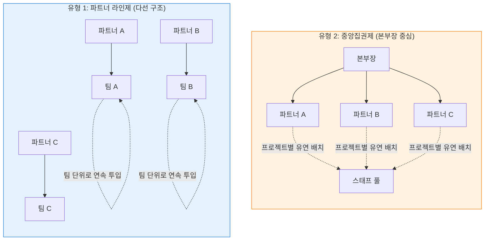

<aside>
🔵

**유형 1: 파트너 라인제 (다선 구조)**

- 여러 파트너 라인이 독립적으로 운영
- 특정 파트너 밑에서 **팀 단위로 연속 투입**
- 다음/다다음 프로젝트도 같은 팀과 이동

**장점**

- 팀워크 안정성, 예측 가능한 커리어
- 파트너와 깊은 신뢰 관계 구축

**단점**

- 파트너 의존도 높음
- **파트너가 퇴사/해임되면 영향력 급감**
</aside>

<aside>
🟠

**유형 2: 중앙집권제 (본부장 중심)**

- 본부장 밑의 파트너들은 상대적으로 평등
- 프로젝트마다 **스태프를 유연하게 배치**
- 협업하는 동료가 프로젝트마다 변경

**장점**

- 다양한 경험, 넓은 네트워크
- 특정 파트너 의존도 낮음

**단점**

- 팀 연속성 부족
- 매번 새로운 팀과 적응 필요
</aside>

<aside>
⚠️

**현실 체크**

- 어느 유형이든 **장단점은 분명**합니다.
- 입사 전에 해당 펌의 조직 문화를 현직자에게 확인하는 것이 중요합니다.
- 파트너 라인제의 경우, 자신이 속한 라인의 파트너가 회사를 떠나면 펌 내 입지가 약해질 수 있습니다.
</aside>

---

## 3. 컨설팅 공통 방법론 (A-E-D-B-D Framework)

<aside>
🔄

PI, BPR, ERP구축 등 **모든 운영 컨설팅 프로젝트**는 아래의 공통 방법론을 따릅니다.

프로젝트 유형에 따라 각 Phase의 깊이와 기간이 달라질 뿐, 기본 흐름은 동일합니다.

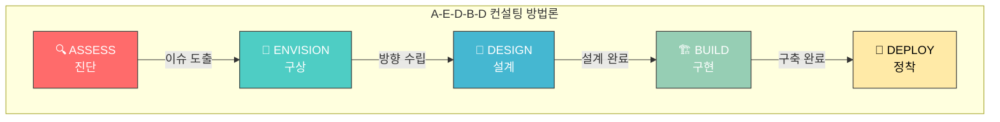

</aside>

### 3.1 Phase별 상세 활동

| **Phase** | **핵심 질문** | **주요 활동** | **산출물** | **마일스톤** |
| --- | --- | --- | --- | --- |
| **1. ASSESS**
(진단) | "현재 무엇이 문제인가?" | • 현황(As-Is) 분석
• 인터뷰/워크숍
• 벤치마킹
• Fit & Gap 도출 | 진단 보고서
Gap 목록
이슈 목록 | **Kick-off** |
| **2. ENVISION**
(구상) | "어디로 가야 하는가?" | • 개선 기회 도출
• To-Be 방향 수립
• 우선순위 결정
• 로드맵 수립 | 개선 방향성
To-Be 컨셉
마스터 플랜 | **중간보고** |
| **3. DESIGN**
(설계) | "어떻게 만들 것인가?" | • To-Be 프로세스 설계
• 시스템 설계
• 조직/R&R 설계
• 변화관리 계획 | To-Be 프로세스
설계 명세서
조직 설계서 | **설계 완료** |
| **4. BUILD**
(구현) | "실제로 구축하라" | • 시스템 개발/설정
• 단위/통합 테스트
• 데이터 이관
• 사용자 교육 | 시스템 개발물
테스트 결과
교육 자료 | **통합테스트**
**UAT 완료** |
| **5. DEPLOY**
(정착) | "안정적으로 운영하라" | • Go-Live (컷오버)
• 초기 안정화 지원
• 이슈 해결
• 지식 이전 | 운영 매뉴얼
종료 보고서
인수인계서 | **Go-Live**
**종료보고** |

### 3.2 프로젝트 유형별 Phase 비중

<aside>
💡

프로젝트 유형에 따라 각 Phase의 **깊이와 기간**이 달라집니다.

</aside>

| **프로젝트 유형** | **기간** | **ASSESS** | **ENVISION** | **DESIGN** | **BUILD** | **DEPLOY** |
| --- | --- | --- | --- | --- | --- | --- |
| **Quick Assessment** | 1-4주 | ⬛⬛⬛⬛⬛ | ⬛ | - | - | - |
| **ISP** (정보화 전략) | 2-4개월 | ⬛⬛⬛⬛ | ⬛⬛⬛⬛ | ⬛ | - | - |
| **BSP** (업무시스템 계획) | 2-3개월 | ⬛⬛⬛ | ⬛⬛⬛⬛ | ⬛⬛ | - | - |
| **진단 프로젝트** | 1-3개월 | ⬛⬛⬛⬛ | ⬛⬛⬛ | ⬛ | - | - |
| **PI 프로젝트** | 3-6개월 | ⬛⬛⬛ | ⬛⬛⬛ | ⬛⬛⬛⬛ | ⬛⬛ | ⬛ |
| **BPR 프로젝트** | 6-12개월 | ⬛⬛ | ⬛⬛⬛⬛ | ⬛⬛⬛⬛ | ⬛⬛⬛ | ⬛⬛ |
| **ERP구축** | 12-24개월 | ⬛⬛ | ⬛⬛ | ⬛⬛⬛ | ⬛⬛⬛⬛⬛ | ⬛⬛⬛ |

<aside>
📋

**진단/전략 수립 프로젝트 (ASSESS 중심)**

- **Quick Assessment**: 빠른 현황 진단 + 핵심 이슈 도출 (1-4주)
- **ISP (Information Strategy Planning)**: IT 전략 및 정보화 로드맵 수립
- **BSP (Business System Planning)**: 업무 시스템 구축 방향 및 우선순위 결정
- **진단 프로젝트**: 특정 영역(SCM, 생산, 재무 등) 심층 진단
</aside>

<aside>
📋

**진단 프로젝트**

ASSESS + ENVISION 중심

- 현황 파악이 목적
- 로드맵 제시로 종료
- 실행은 다음 프로젝트
</aside>

<aside>
🔄

**PI/BPR 프로젝트**

DESIGN 중심

- To-Be 프로세스 설계가 핵심
- BUILD는 시스템 연계 시 수행
- 변화관리 병행
</aside>

<aside>
🏗️

**ERP구축 프로젝트**

BUILD + DEPLOY 중심

- 시스템 구현이 핵심
- ASSESS는 Fit-Gap 분석
- 통테/컷오버가 Critical
</aside>

### 3.3 실제 프로젝트 일정 예시

<aside>
📅

**Quick Assessment 4주 일정 예시**

</aside>

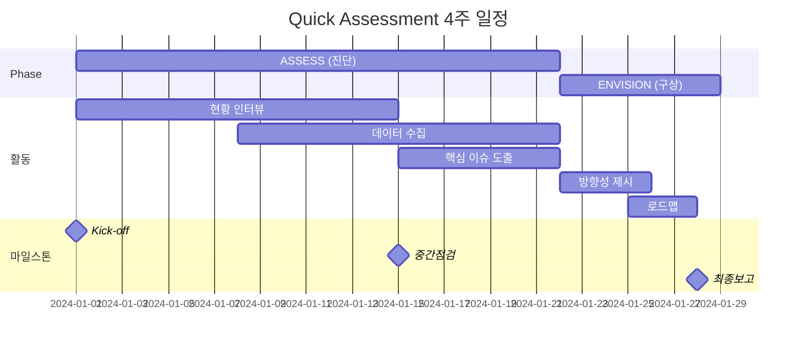

<aside>
📅

**PI 프로젝트 6개월 일정 예시**

</aside>

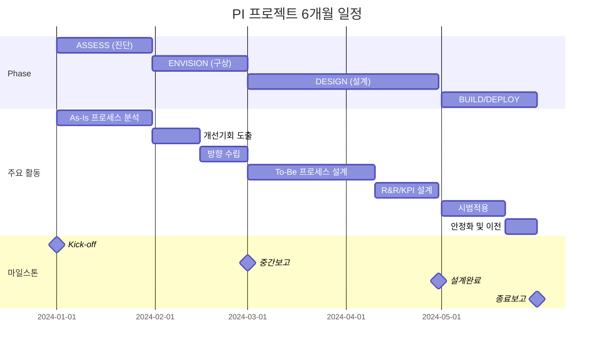

<aside>
📅

**BPR 프로젝트 10개월 일정 예시**

</aside>

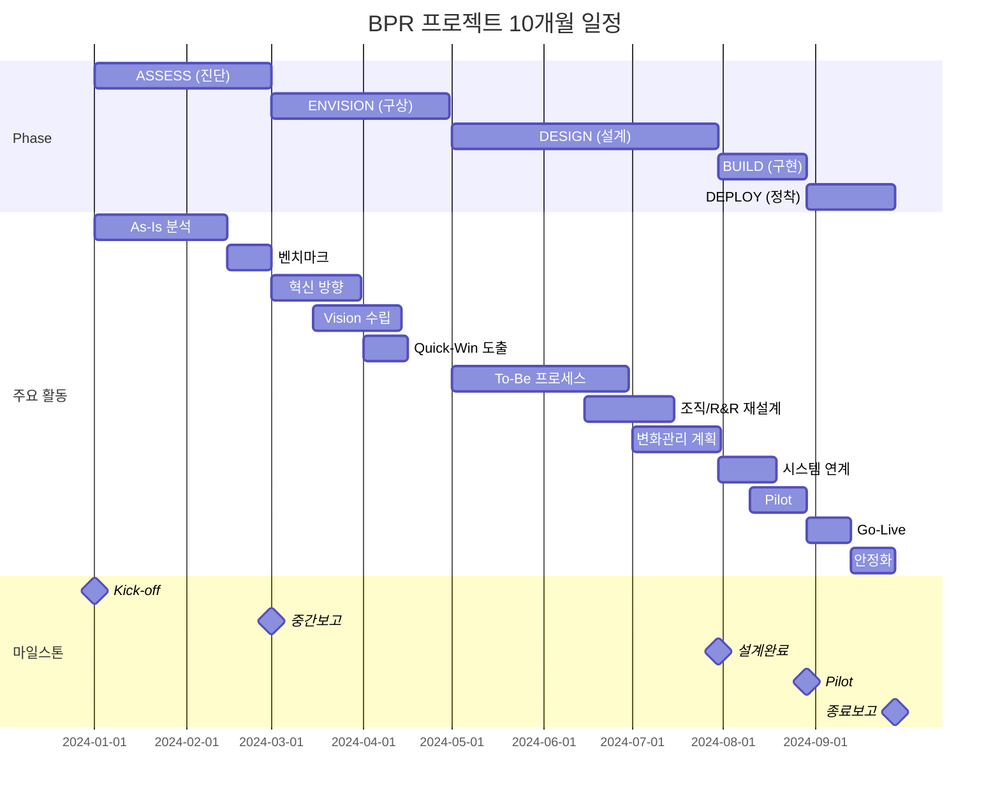

<aside>
📅

**ERP구축 프로젝트 12개월 일정 예시**

</aside>

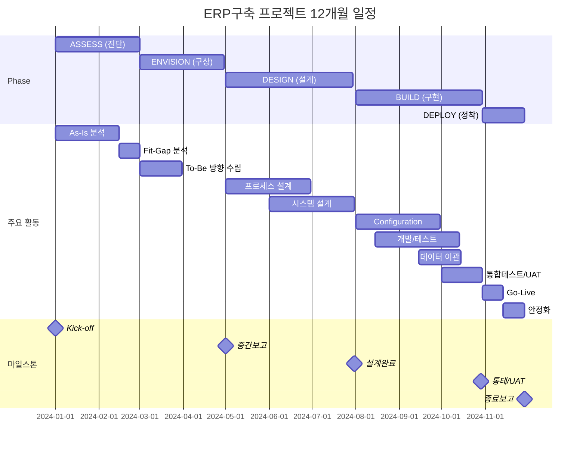

---

## 4. 본 특강 커리큘럼 매핑

<aside>
📚

본 특강의 각 회차는 **A-E-D-B-D 방법론**에 맞춰 구성되어 있습니다.

</aside>

| **회차** | **주제** | **방법론 Phase** | **핵심 내용** |
| --- | --- | --- | --- |
| 1회차 | 컨설팅 개요: 산업 구조와 방법론 | Overview (전체) | 컨설팅펌 유형, A-E-D-B-D 방법론 |
| 2회차 | 진단(Diagnosis): As-Is 분석과 이슈 도출 | **ASSESS** | 현황분석, 인터뷰, Gap분석, 이슈도출 |
| 3회차 | PI: To-Be 설계와 변화관리 | **ENVISION + DESIGN** | To-Be설계, 7대원칙, 변화관리 |
| 4회차 | BPR: 비즈니스 프로세스 리엔지니어링 | **ENVISION + DESIGN** | BPR 4대원칙, 재설계사례 |
| 5회차 | ERP 구축: 추진 단계와 Go-Live | **BUILD + DEPLOY** | Fit-Gap, 통테, 컷오버 |
| 6회차 | 컨설턴트 역량과 커리어 패스 | Wrap-up | 5C역량, 커리어패스, 진입방법 |

---

## 5. 컨설턴트의 일하는 방식

<aside>
📋

**가설 기반 접근 (Hypothesis-Driven)**

1. 가설 수립 → 2. 검증 설계 → 3. 분석 → 4. 결론

**핵심**: 모든 데이터를 보지 않고, 검증이 필요한 부분만 집중 분석

**예시**: "재고 과다의 원인은 수요예측 오류일 것이다" → 예측 정확도 데이터만 먼저 분석

</aside>

<aside>
📊

**구조화 사고 (Structured Thinking)**

- MECE (Mutually Exclusive, Collectively Exhaustive)
- Issue Tree / Logic Tree
- 80/20 법칙 (핵심 20%에 집중)

**핵심**: 복잡한 문제를 단순하고 명확하게 분해

**예시**: "매출 증대" = 신규고객 확대 + 기존고객 구매액 증가 (MECE)

</aside>

---

### 5.1 레벨별 핵심 역량 체계

<aside>
🎯

컨설턴트의 역량은 **레벨에 따라** 요구되는 영역이 다릅니다.

- **Junior Level (Senior Associate 이하)**: 분석/문서화/커뮤니케이션 중심
- **Manager Level 이상**: 리더십/프로젝트 관리/비즈니스 개발 중심
</aside>

---

### 5.2 Junior Level 핵심 역량 (Under Senior Associate)


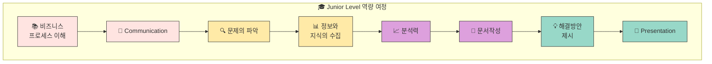

<aside>
📚

**1. 비즈니스 프로세스에 대한 이해**

회사의 업종과 규모는 다양하지만 기본 비즈니스 프로세스는 공통적으로 존재하며 이에 대한 이해가 필요함

</aside>

<aside>
💬

**2. Communication**

고객과의 대화를 통하여 고객사의 가장 근본적이고 민감한 사항들과 표면에 있지 않은 문제들을 효과적으로 파악하고, 이를 통하여 필요한 정보를 취득하여 시사점을 종합화 해냄

</aside>

<aside>
🔍

**3. 문제의 파악**

문제의 본질과 핵심을 새로운 시각에서 객관적으로 파악함

- 가설적 문제해결방법
- The Transform Framework
</aside>

<aside>
📊

**4. 정보와 지식의 수집**

회사內 Resource (Connected Source, SharePoint, Vantage 등) 및 외부 Resource (ICS, Gartner 등)를 활용하여 필요하고 정확한 정보를 효과적으로 찾아내어 적재적소에 활용함

- 문제해결을 위한 데이터 수집
</aside>

<aside>
📈

**5. 분석력**

문제에 알맞은 분석방법을 고안하여, 복잡한 분석도 체계적으로 수행하며 최종 결과물에 신뢰성 있게 활용함

- 문제해결을 위한 데이터 분석법
</aside>

<aside>
📝

**6. 컨설턴트의 문서작성**

파악된 문제 및 해결방안을 구조화 하여 논리적으로 정리하여 명확한 근거를 제시하고 이해하기 쉬운 문서를 작성함

- Documentation Skill
</aside>

<aside>
💡

**7. 해결방안 제시**

분석된 문제(AS-IS)로 부터 고객사에 필요한 시사점을 파악하여 고객사가 수용할 수 있는 해결방안을 제시함

</aside>

<aside>
🎤

**8. Presentation**

청중의 관심을 유지하면서 전달하고자 하는 메시지를 효과적으로 전달하며 심도 깊은 논의를 끌어냄. 일방적인 소통이 아닌 양방향(예, 원문던지기) 소통방식으로 청중의 긴장을 이끌어 갈 수 있어야 하며, 전달된 자체(아는 부분은 자신 있고 간결하게, 모르는 부분은 모른다고 할 수 있음)도 답할 수 있어야 함

</aside>

---

### 5.3 Manager Level 이상 핵심 역량 (Above Manager)


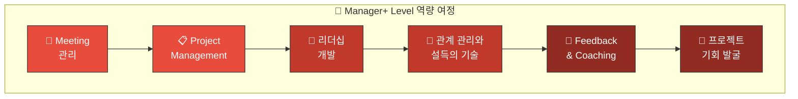

<aside>
📅

**1. Meeting 관리**

효율적이고 생산적인 회의의 구성과 이를 이끄는 능력

</aside>

<aside>
📋

**2. Project Management**

프로젝트의 착수-실행-종료의 일련의 과정에서 관리자로서의 통합 관리를 수행하는 능력. 범위·일정·비용·품질 등 전반적인 프로젝트 관리 방안에 대해 숙지함

</aside>

<aside>
👥

**3. 리더십개발**

프로젝트의 리더로서 팀원들을 격려하고, 적절한 동기부여와 때로는 건설적 비판을 통해 팀원들의 잠재력을 최대한 이끌어내는 능력

</aside>

<aside>
🤝

**4. 관계 관리와 설득의 기술**

고객사와 공감대를 형성하여 친밀한 관계를 유지하고 신뢰를 구축하며, 고객의 요구사항에 대해 적절하게 대응하고 관리하여 프로젝트를 원활하게 진행함

</aside>

<aside>
💬

**5. Feedback and Coaching**

효과적이고 직접적인 피드백을 통하여 명확한 가이드를 제시하고 팀원들을 올바른 길로 안내함

</aside>

<aside>
🎯

**6. 프로젝트 기회 발굴**

비즈니스의 연속성 확보와 신규 창출을 위하여, 기회에 포착하고, 효과적이고 자연스럽게 고객을 설득

</aside>

---

### 5.4 레벨별 역량 비교 요약

| **구분** | **Junior Level** | **Manager+ Level** |
| --- | --- | --- |
| **핵심 초점** | **개인 역량** (분석, 문서화, 발표) | **조직 역량** (리더십, 관리, BD) |
| **주요 역할** | 데이터 수집/분석, 보고서 작성, 발표 지원 | 팀 리드, 고객 관리, 프로젝트 총괄 |
| **성과 기준** | 산출물의 품질과 정확성 | 프로젝트 성공과 고객 만족 |
| **발전 방향** | 전문성 심화 → 독립적 업무 수행 | 비즈니스 개발 → 파트너십 |

---

### 5.5 주요 산출물 예시

<aside>
📑

**컨설팅 프로젝트의 주요 산출물**

</aside>

| **산출물** | **Phase** | **주요 내용** |
| --- | --- | --- |
| 진단 보고서 | ASSESS | 현황 분석, 이슈 목록, 개선 기회 |
| To-Be 설계서 | DESIGN | 프로세스 맵, 시스템 설계, 조직 설계 |
| Fit-Gap 분석서 | ASSESS/DESIGN | 표준 vs 요구사항 Gap, 해결 방안 |
| 테스트 시나리오 | BUILD | 테스트 케이스, 예상 결과, 실제 결과 |
| 운영 매뉴얼 | DEPLOY | 업무 절차, 시스템 사용법, FAQ |

---

## 🎯 핵심 Takeaway

<aside>
📌

**1. 컨설팅 공통 방법론 = A-E-D-B-D**

- **A**SSESS (진단) → **E**NVISION (구상) → **D**ESIGN (설계) → **B**UILD (구현) → **D**EPLOY (정착)
- PI든 BPR이든 ERP든 동일한 뼈대, 깊이만 다름

**2. 프로젝트 유형 = Phase 비중의 차이**

- 진단: ASSESS 중심 / PI·BPR: DESIGN 중심 / ERP: BUILD 중심
- 모든 프로젝트는 중간보고, 종료보고 포함

**3. 다음 회차부터 각 Phase 심화 학습**

- 2회차: ASSESS (진단)
- 3-4회차: ENVISION + DESIGN (PI/BPR)
- 5회차: BUILD + DEPLOY (ERP구축)
- 6회차: 컨설턴트 역량과 커리어 패스
</aside>

---

<aside>
💼

**사업기획 직무 연계**

본 회차에서 다룬 **A-E-D-B-D 방법론**은 사업기획 직무의 핵심 사이클과 동일한 구조입니다.

| 컨설팅 Phase | 사업기획 적용 |
| --- | --- |
| ASSESS | 사업 환경 분석, 시장/경쟁 현황 진단 |
| ENVISION | 사업 방향성 수립, 기회 발굴 |
| DESIGN | 사업계획서 작성, 실행 전략 설계 |
| BUILD | 사업 추진, 자원 투입 |
| DEPLOY | 성과 모니터링, KPI 관리 |

**활용 포인트**: 사업기획자는 이 프레임워크를 통해 **체계적인 사업 추진 로드맵**을 수립할 수 있습니다.

</aside>