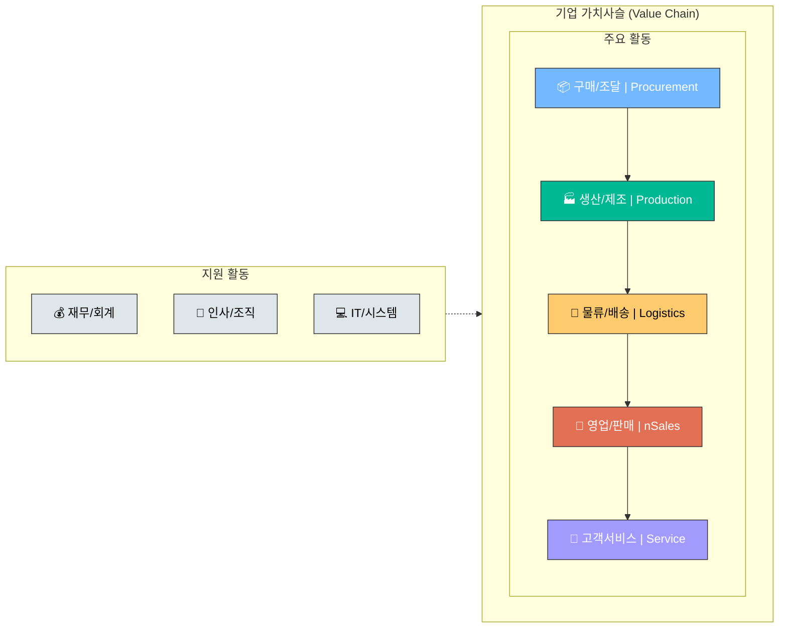

# [2회차] ASSESS: As-Is 분석과 이슈 도출

No: 2
난이도: 중급
단계: ASSESS
상태: 완료
선행 학습: [1회차] 컨설팅 개요: 산업 구조와 프로젝트 라이프사이클 (%5B1%ED%9A%8C%EC%B0%A8%5D%20%EC%BB%A8%EC%84%A4%ED%8C%85%20%EA%B0%9C%EC%9A%94%20%EC%82%B0%EC%97%85%20%EA%B5%AC%EC%A1%B0%EC%99%80%20%ED%94%84%EB%A1%9C%EC%A0%9D%ED%8A%B8%20%EB%9D%BC%EC%9D%B4%ED%94%84%EC%82%AC%EC%9D%B4%ED%81%B4%201cba38087d154212a68b70a49da58926.md)
소요시간(분): 25
중요도: 높음 (High)
학습 목표: As-Is 분석 방법론과 이슈 도출 기법 습득


데이터 분석 및 진단

### [2회차] 진단(Diagnosis): As-Is 분석과 이슈 도출

---

---

<aside>
🎯

**학습 목표**

- **As-Is 분석 방법론** 체계적 적용
- **인터뷰/워크숍** 설계 및 실행 기법 습득
- **Fit-Gap 분석 및 벤치마킹** 프레임워크 이해
- **Best Practice 식별 및 적용** 방법론 학습
- **Gap 분석 → 이슈 도출** 프로세스 수행
</aside>

---

## 0. 진단의 기본틀: 프로세스에 대한 이해

<aside>
⚙️

**진단과 As-Is 현황 분석을 시작하기 전에, 반드시 갖춰야 할 기본틀이 있습니다.**

바로 **"프로세스에 대한 이해"**입니다.

기업의 문제점을 정확히 파악하고 개선 기회를 도출하려면, 먼저 그 기업이 **어떤 프로세스로 움직이는지**를 명확히 알아야 합니다. 프로세스를 모르고 진단하는 것은 지도 없이 길을 찾는 것과 같습니다.

</aside>

### 기업의 핵심 프로세스 (End-to-End)



| **프로세스 영역** | **주요 활동** | **진단 시 핵심 질문** |
| --- | --- | --- |
| **구매/조달** | 공급업체 선정, 발주, 입고, 대금 지급 | 적시에, 적정 가격으로, 적정 품질의 자재를 확보하는가? |
| **생산/제조** | 생산 계획, 작업 지시, 품질 관리, 원가 관리 | 계획대로 효율적으로 생산하고 있는가? |
| **물류/배송** | 재고 관리, 입출고, 배송, 운송 | 재고는 최적화되어 있고, 납기는 준수되는가? |
| **영업/판매** | 수요 예측, 주문 관리, 출하, 매출 관리 | 고객 수요에 신속 정확하게 대응하는가? |
| **고객서비스** | A/S, 클레임 처리, 고객 지원 | 고객 만족도를 높이는 체계가 있는가? |
| **재무/회계** | 결산, 원가, 예산, 자금 관리 | 정확한 재무 정보로 의사결정을 지원하는가? |
| **인사/조직** | 채용, 평가, 급여, 교육 | 적재적소에 인력이 배치되어 있는가? |

<aside>
💡

**왜 프로세스 이해가 먼저인가?**

1. **문제의 위치 파악**: 프로세스 흐름을 알아야 어디서 병목이 발생하는지 찾을 수 있습니다.
2. **이해관계자 식별**: 각 프로세스별 담당자를 파악해야 정확한 인터뷰와 데이터 수집이 가능합니다.
3. **개선 범위 설정**: 프로세스 간 연결고리를 이해해야 개선의 파급 효과를 예측할 수 있습니다.
4. **공통 언어 확보**: 고객사와 같은 프로세스 용어로 소통해야 오해 없이 진단을 수행할 수 있습니다.
</aside>

---

## 1. 진단(Diagnosis)이란?

<aside>
🔍

**진단(Diagnosis)**이란 조직의 현재 상태(As-Is)를 객관적으로 파악하고, 문제점과 개선 기회를 도출하는 과정입니다.

**핵심 질문**: "현재 무엇이 문제이고, 왜 문제인가?"


</aside>

### 1.1 진단의 목적과 범위

| **구분** | **Quick Assessment** | **심층 진단** | **Fit-Gap 분석** |
| --- | --- | --- | --- |
| **목적** | 빠른 현황 파악 | 근본 원인 분석 | 시스템 적합성 검증 |
| **기간** | 1-4주 | 4-12주 | 4-8주 |
| **산출물** | Executive Summary | 상세 진단 보고서 | Fit-Gap 목록 + 해결방안 |
| **활용** | 프로젝트 범위 정의 | 개선 로드맵 수립 | ERP 구축 Blueprint |

---

## 2. As-Is 분석 프레임워크

### 2.1 분석 대상 영역

| **분석 영역** | **주요 분석 항목** | **분석 방법** | **핵심 질문** |
| --- | --- | --- | --- |
| **프로세스** | • 업무 흐름 (Workflow)
• 병목 구간 (Bottleneck)
• 비효율 활동 (NVA) | 프로세스 맵핑, VSM | 어디서 시간이 낭비되는가? |
| **조직/인력** | • 조직 구조 (R&R)
• 역량 수준
• 커뮤니케이션 흐름 | 조직도 분석, RACI 매트릭스 | 누가 무엇을 책임지는가? |
| **시스템/데이터** | • 시스템 아키텍처
• 데이터 품질
• 인터페이스 현황 | 시스템 맵핑, 데이터 프로파일링 | 정보가 어떻게 흐르는가? |
| **성과/KPI** | • 현재 성과 수준
• 벤치마크 Gap
• 개선 기회 | KPI 분석, 벤치마킹 | 목표 대비 어디가 부족한가? |

### 2.2 프로세스 맵핑 기법

<aside>
📊

**Level 0: 가치사슬 (Value Chain)**

```jsx
조달 → 생산 → 물류 → 판매 → 서비스
```

전사 프로세스 조망

- Porter's Value Chain
- 주요 활동 vs 지원 활동
</aside>

<aside>
📋

**Level 1: 주요 프로세스**

```jsx
조달: 구매요청 → 발주 → 입고 → 검수 → 대금지급
```

기능별 업무 흐름

- 시작/종료 이벤트 정의
- 주요 의사결정 포인트
</aside>

<aside>
📝

**Level 2-3: 상세 액티비티**

```jsx
발주: 공급업체선정 → 견적비교 → PO생성 → 승인
```

단위 업무/시스템 연계

- Input/Output 명시
- 담당자/소요시간 기록
</aside>

### 2.3 VSM (Value Stream Mapping)

<aside>
🔄

**VSM**은 프로세스의 **가치 흐름**을 시각화하여 낭비를 식별하는 Lean 기법입니다.

</aside>

| **구분** | **VA (Value-Added)** | **BNVA (Business NVA)** | **NVA (Non-Value-Added)** |
| --- | --- | --- | --- |
| **정의** | 고객이 비용 지불 의향 | 고객 무관, 사업상 필요 | 순수 낭비 |
| **예시** | 제품 가공, 조립 | 품질 검사, 보고서 작성 | 대기, 재작업, 이동 |
| **대응** | 효율화 | 최소화 | **제거** |
| **비중 (일반적)** | 5-10% | 30-40% | 50-60% |

---

## 3. 데이터 수집 방법

<aside>
🎤

**인터뷰 (Interview)**

**목적**: 정성적 정보, 숨겨진 이슈 발굴

**대상**: 경영진, 실무 담당자

**주요 질문**:

- "가장 어려운 업무는?"
- "왜 그런 방식으로 하는가?"
- "개선되었으면 하는 점은?"

**Tip**: 개방형 질문 → 구체화 질문

</aside>

<aside>
👥

**워크숍 (Workshop)**

**목적**: 이해관계자 참여, 합의 형성

**형식**: 그룹 토론, 브레인스토밍

**기법**:

- Affinity Diagram
- Pain Point 맵핑
- Root Cause 분석

**Tip**: 퍼실리테이션 스킬 필수

</aside>

<aside>
📈

**데이터 분석 (Data Analysis)**

**목적**: 정량적 근거 확보

**데이터 유형**:

- 트랜잭션 데이터 (ERP/MES)
- 마스터 데이터
- 외부 벤치마크

**분석 기법**:

- 파레토 분석
- 추세 분석
- 편차 분석
</aside>

### 3.1 인터뷰 설계 및 실행

<aside>
📝

**인터뷰 준비 체크리스트**

</aside>

| **단계** | **활동** | **산출물** |
| --- | --- | --- |
| **사전 준비** | • 인터뷰 대상자 선정 (레벨/기능별)
• 질문지 초안 작성
• 일정 조율 (1시간 기준) | 인터뷰 계획서 |
| **인터뷰 실행** | • 목적 설명 + 비밀보장 안내
• 개방형 → 구체화 질문
• 적극적 경청 + 메모 | 인터뷰 노트 |
| **사후 정리** | • 24시간 내 기록 정리
• 핵심 인사이트 추출
• 추가 확인 필요사항 정리 | 인터뷰 요약서 |

**인터뷰 질문 프레임워크 (STAR)**

- **S**ituation: 현재 상황은 어떠한가?
- **T**ask: 어떤 업무를 담당하는가?
- **A**ction: 어떤 방식으로 수행하는가?
- **R**esult: 결과/성과는 어떠한가?

### 3.2 워크숍 퍼실리테이션

<aside>
🎯

**효과적인 워크숍 운영 5원칙**

1. **명확한 목표** 설정 (1개 세션 = 1개 목표)
2. **적정 인원** 유지 (6-10명)
3. **시간 관리** 철저 (아이스브레이킹 10분 / 본론 60분 / 정리 20분)
4. **모든 참여자 발언 기회** 보장
5. **실시간 시각화** (화이트보드, 포스트잇)
</aside>

---

## 4. Fit-Gap 분석

<aside>
📐

**Fit-Gap 분석**이란 **표준 기능(Standard)** 또는 **목표 프로세스(To-Be)**와 **현재 요구사항(As-Is Requirement)** 간의 적합도를 분석하여 Gap을 식별하고 해결 방안을 결정하는 과정입니다.

</aside>

### 4.1 Fit-Gap 분석 프로세스


### 4.2 Gap 유형 및 해결 방안

| **Gap 유형** | **설명** | **해결 방안** | **의사결정 기준** |
| --- | --- | --- | --- |
| **Fit (100%)** | 표준 기능으로 완전 충족 | Configuration | 그대로 적용 |
| **Partial Fit (70-99%)** | 대부분 충족, 일부 기능 부족 | Workaround / 업무 조정 | 업무 변경 vs 경미한 개발 |
| **Gap - 경미 (30-69%)** | 핵심 기능 부족, 보완 필요 | 리포트/인터페이스 개발 | ROI 분석 필요 |
| **Gap - 심각 (0-29%)** | 표준 기능 없음, 대규모 개발 필요 | Add-on 개발 / 외부 솔루션 | Must-have vs Nice-to-have |

### 4.3 Fit-Gap 분석 템플릿

| **ID** | **프로세스** | **요구사항** | **표준 기능** | **Fit %** | **Gap 설명** | **해결방안** | **우선순위** |
| --- | --- | --- | --- | --- | --- | --- | --- |
| FG-001 | 구매요청 | 부서별 예산 통제 | 예산 관리 모듈 | 100% | - | Config | - |
| FG-002 | 발주 | 자동 공급업체 추천 | Sourcing 기능 | 60% | AI 추천 미지원 | 리포트 개발 | Medium |
| FG-003 | 입고 | 바코드 스캔 입고 | - | 0% | WMS 연계 필요 | 인터페이스 | High |

### 4.4 Gap 해결 의사결정 매트릭스

|  | **비즈니스 영향 高** | **비즈니스 영향 低** |
| --- | --- | --- |
| **개발 복잡도 低** | **개발 권장**
Quick Win, 빠른 ROI | **업무 변경 권장**
개발 불필요 |
| **개발 복잡도 高** | **신중히 검토**
Phase 2 검토 또는 외부 솔루션 | **개발 지양**
포기 또는 장기 과제 |

---

## 5. 벤치마킹 (Benchmarking)

<aside>
🎯

**벤치마킹**이란 최고 수준의 기업/프로세스를 분석하여 자사의 개선 기회와 목표 수준을 도출하는 방법론입니다.

**"Best-in-Class와의 Gap = 개선 기회"**

</aside>

### 5.1 벤치마킹 유형

| **유형** | **대상** | **장점** | **단점** | **활용 시점** |
| --- | --- | --- | --- | --- |
| **내부 벤치마킹** | 사내 타 부서/사업부 | 접근 용이, 비용 低 | 혁신성 제한 | 초기 진단 |
| **경쟁 벤치마킹** | 동종 업계 경쟁사 | 직접 비교 가능 | 정보 획득 어려움 | 경쟁력 분석 |
| **기능 벤치마킹** | 특정 기능 우수 기업
(타 산업 포함) | 혁신적 아이디어 | 적용 가능성 검증 필요 | 프로세스 혁신 |
| **일반 벤치마킹** | Best-in-Class 기업 | 최고 수준 학습 | Gap 크면 실행 어려움 | 장기 비전 수립 |

### 5.2 벤치마킹 프로세스


### 5.3 주요 벤치마킹 KPI (SCM 예시)

| **영역** | **KPI** | **일반 수준** | **Best-in-Class** | **측정 방법** |
| --- | --- | --- | --- | --- |
| **재고** | 재고회전율 | 6-8회/년 | 12회+ /년 | 매출원가 ÷ 평균재고 |
| **납기** | 납기 준수율 (OTIF) | 85-90% | 98%+ | 정시/정량 납품 건수 ÷ 전체 |
| **구매** | 구매 사이클 타임 | 5-7일 | 1-2일 | 구매요청 → 발주 완료 |
| **생산** | 설비 종합효율 (OEE) | 60-70% | 85%+ | 가동률 × 성능률 × 양품률 |
| **물류** | 주문처리 리드타임 | 3-5일 | 당일-익일 | 주문접수 → 출하 완료 |

---

## 6. Best Practice 식별 및 적용

<aside>
⭐

**Best Practice**란 특정 분야에서 **검증된 최적의 방법론/프로세스**입니다.

컨설팅에서는 다양한 프로젝트 경험을 통해 축적된 Best Practice를 활용합니다.

</aside>

### 6.1 Best Practice 소스

<aside>
🏢

**컨설팅펌 자산**

- 과거 프로젝트 사례
- 방법론 라이브러리
- Industry 템플릿
- Knowledge Base

**접근 방법**: 사내 검색, 전문가 인터뷰

</aside>

<aside>
📚

**외부 리서치**

- Gartner, Forrester
- 산업별 협회 자료
- 학술 논문
- 벤더 White Paper

**접근 방법**: 구독 서비스, 공개 자료

</aside>

<aside>
💻

**패키지 표준**

- SAP Best Practice
- Oracle Process Cloud
- 산업별 템플릿
- Reference Architecture

**접근 방법**: 벤더 문서, 데모

</aside>

### 6.2 Best Practice 적용 프레임워크

| **단계** | **활동** | **핵심 질문** | **주의사항** |
| --- | --- | --- | --- |
| **1. 식별** | 관련 Best Practice 조사 | 어떤 사례가 참고될 수 있는가? | 산업/규모 유사성 확인 |
| **2. 분석** | 성공 요인/핵심 원리 분석 | 왜 성공했는가? | 표면이 아닌 본질 파악 |
| **3. 적합성 평가** | 자사 환경과의 Fit 검토 | 우리에게도 적용 가능한가? | 맹목적 복제 지양 |
| **4. 커스터마이징** | 자사 상황에 맞게 조정 | 어떻게 변형해야 하는가? | 핵심 원리 유지 |
| **5. 적용** | Pilot → 확산 | 어디서부터 시작할 것인가? | 변화관리 병행 |

### 6.3 SCM Best Practice 예시

<aside>
📋

**Best Practice: 수요 예측 정확도 향상**

</aside>

| **항목** | **일반 관행** | **Best Practice** |
| --- | --- | --- |
| **예측 주기** | 월 1회 예측 | 주간 Rolling Forecast |
| **예측 방법** | 영업 직관 의존 | 통계 모델 + 영업 인사이트 조합 |
| **협업 범위** | 영업 단독 | S&OP (영업+생산+구매+물류) |
| **성과 측정** | 측정 안함 | MAPE, Bias 주간 리뷰 |
| **피드백** | 사후 분석 없음 | 예측 vs 실적 Gap 분석 → 모델 개선 |

---

## 7. Gap 분석 및 이슈 도출

### 7.1 Gap 분석 프레임워크

<aside>
📐

**Gap = To-Be (목표 수준) - As-Is (현재 수준)**

Gap의 크기와 원인을 분석하여 개선 우선순위를 결정합니다.

</aside>

| **분석 항목** | **As-Is (현재)** | **Benchmark** | **To-Be (목표)** | **Gap** | **우선순위** |
| --- | --- | --- | --- | --- | --- |
| 주문처리 리드타임 | 5일 | 1일 | 2일 | -3일 | **High** |
| 재고 정확도 | 85% | 99% | 98% | -13%p | **High** |
| 시스템 자동화율 | 40% | 90% | 80% | -40%p | **Medium** |
| 구매 비용 절감률 | 2%/년 | 5%/년 | 4%/년 | -2%p | **Low** |

### 7.2 이슈 구조화 (Issue Tree)

<aside>
🌳

**이슈 도출의 MECE 구조화 예시**

```jsx
[핵심 이슈] 주문처리 리드타임이 목표 대비 3일 초과
│
├── [프로세스] 수작업 단계 과다
│   ├── 주문 접수: 수기 입력 → 시스템 미연계
│   ├── 재고 확인: 여러 시스템 조회 필요
│   └── 출하 지시: 승인 단계 과다 (3단계)
│
├── [시스템] 실시간 정보 부재
│   ├── 재고 정보 1일 1회 배치 업데이트
│   └── 주문-재고 연계 누락
│
└── [조직] R&R 불명확
├── 영업-물류 간 책임 중복
└── 의사결정 지연 (평균 1일)
```

</aside>

### 7.3 Root Cause 분석 (5 Why)

<aside>
❓

**5 Why 분석 예시: 납기 지연 문제**

</aside>

| **단계** | **질문** | **답변** |
| --- | --- | --- |
| **Why 1** | 왜 납기가 지연되는가? | 생산이 늦어지기 때문 |
| **Why 2** | 왜 생산이 늦어지는가? | 자재가 제때 공급되지 않아서 |
| **Why 3** | 왜 자재가 늦게 공급되는가? | 발주가 늦게 이루어져서 |
| **Why 4** | 왜 발주가 늦는가? | 수요 예측이 부정확해서 |
| **Why 5** | 왜 예측이 부정확한가? | **영업-생산 간 정보 공유 부재** ← Root Cause |

### 7.4 이슈 우선순위화 매트릭스

|  | **영향도 高** | **영향도 低** |
| --- | --- | --- |
| **해결 용이** | **Quick Win**
즉시 실행 | **Fill-in**
여유 시 실행 |
| **해결 어려움** | **Major Project**
별도 프로젝트화 | **Deprioritize**
보류/제외 |

---

## 8. 진단 산출물 구조

<aside>
📑

**진단 보고서 목차 (표준)**

1. **Executive Summary** (1-2 페이지)
2. **프로젝트 개요** - 배경, 범위, 방법론
3. **현황 분석 (As-Is)** - 프로세스, 조직, 시스템
4. **벤치마킹 결과** - 경쟁사/Best Practice 비교
5. **Fit-Gap 분석 결과** - Gap 목록, 해결방안
6. **핵심 이슈 및 원인** - Issue Tree, Root Cause
7. **개선 방향 및 로드맵** - Quick Win + 중장기
8. **Appendix** - 상세 데이터, 인터뷰 결과
</aside>

---

## 🎯 핵심 Takeaway

<aside>
📌

**1. 진단의 목적 = 객관적 현황 파악 + 이슈 도출**

- "What" (무엇이 문제인가)
- "Why" (왜 문제인가) → Root Cause
- "How much" (얼마나 차이나는가) → Gap 정량화

**2. Fit-Gap 분석 = 표준 vs 요구사항 매핑**

- Fit → Config / Partial → Workaround / Gap → 개발 or 업무변경
- 모든 Gap을 날개발로 해결하지 않음

**3. 벤치마킹 = 개선 목표 설정의 근거**

- Best-in-Class와의 Gap = 개선 기회
- 맹목적 복제 X, 핵심 원리 적용

**4. Best Practice = 검증된 방법론 활용**

- 컨설팅펌 자산 + 외부 리서치 + 패키지 표준
- 자사 환경에 맞게 커스터마이징

**5. 이슈 우선순위화 = 영향도 × 실행 용이성**

- Quick Win 먼저 실행 → 신뢰 확보
- Major Project는 별도 관리
</aside>

---

<aside>
💼

**사업기획 직무 연계**

본 회차의 **As-Is 분석 방법론**은 사업기획 직무의 **사업 환경 분석** 단계와 직결됩니다.

| 컨설팅 기법 | 사업기획 적용 |
| --- | --- |
| As-Is 분석 | 시장 현황 분석, 경쟁사 동향 파악 |
| 인터뷰/워크숍 | 이해관계자 니즈 파악, 고객 VOC 수집 |
| 벤치마킹 | 경쟁사 비교 분석, Best Practice 발굴 |
| Gap 분석 | 사업 기회 도출, 차별화 포인트 식별 |
| 이슈 도출 | 핵심 문제 정의, 사업 방향성 수립 근거 |

**활용 포인트**: 사업기획자는 이 분석 기법을 통해 **데이터 기반의 객관적인 사업 타당성 검토**를 수행할 수 있습니다.

</aside>