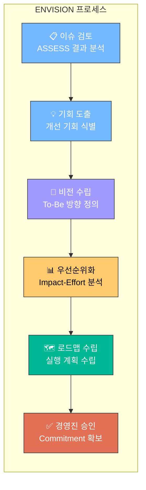
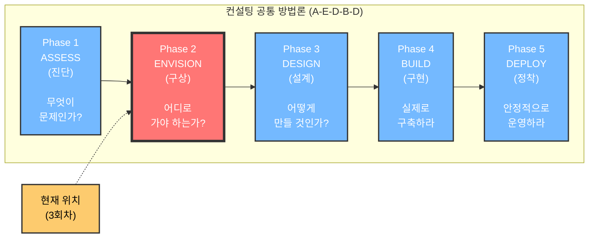
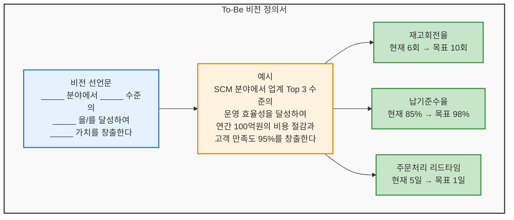
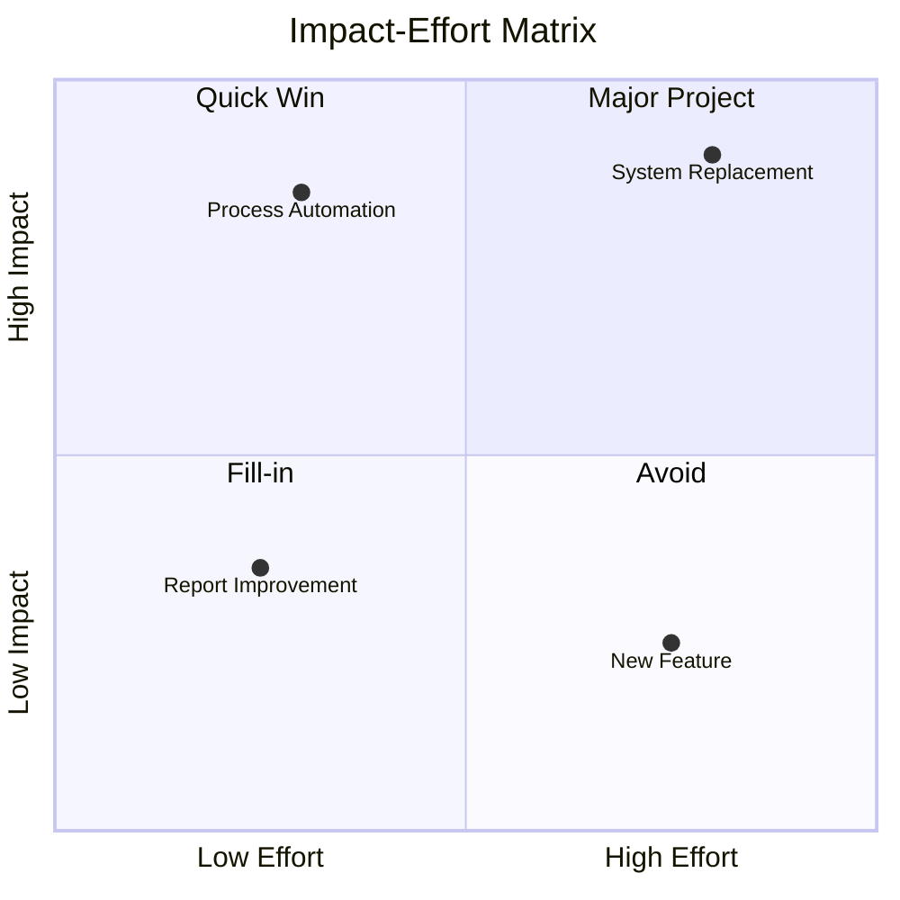
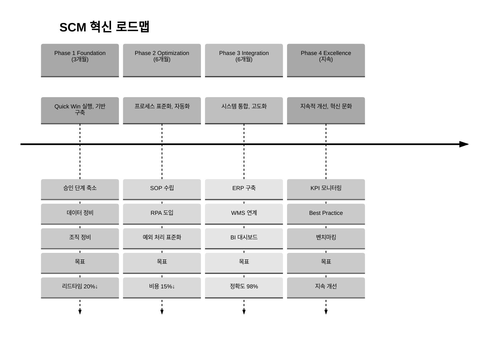

# [3회차] ENVISION: 개선 기회 도출과 To-Be 방향 수립

No: 3
난이도: 중급
단계: ENVISION
상태: 완료
선행 학습: [2회차] ASSESS: As-Is 분석과 이슈 도출 (%5B2%ED%9A%8C%EC%B0%A8%5D%20ASSESS%20As-Is%20%EB%B6%84%EC%84%9D%EA%B3%BC%20%EC%9D%B4%EC%8A%88%20%EB%8F%84%EC%B6%9C%2093059a39ba154640aa8d0a4178e965fc.md)
소요시간(분): 20
중요도: 높음 (High)
학습 목표: 개선 기회 도출과 To-Be 방향 수립 역량 확보

비전 수립과 전략 기획

### [3회차] ENVISION: 개선 기회 도출과 To-Be 방향 수립

---

---

<aside>
🎯

**학습 목표**

- **ENVISION 단계**의 목적과 위치 이해
- **개선 기회 도출** 방법론 습득
- **To-Be 방향 수립**과 비전 정의 프로세스 파악
- **우선순위화 프레임워크** 활용 능력 배양
- **로드맵 및 마스터 플랜** 수립 방법 이해
</aside>

---

## 1. ENVISION이란?

<aside>
🔭

**ENVISION**이란 ASSESS(진단)에서 도출된 이슈를 바탕으로 **"어디로 가야 하는가?"**를 결정하는 단계입니다.

**핵심 질문**: "우리의 목표 상태(To-Be)는 무엇이고, 어떤 순서로 달성할 것인가?"

</aside>

### 1.1 A-E-D-B-D에서의 위치

### 1.2 ASSESS vs ENVISION vs DESIGN

| **구분** | **ASSESS (진단)** | **ENVISION (구상)** | **DESIGN (설계)** |
| --- | --- | --- | --- |
| **핵심 질문** | "무엇이 문제인가?" | "어디로 가야 하는가?" | "어떻게 만들 것인가?" |
| **주요 활동** | 현황 분석, Gap 도출 | 방향 수립, 우선순위화 | 상세 프로세스 설계 |
| **산출물** | 진단 보고서, 이슈 목록 | 개선 방향서, 로드맵 | To-Be 프로세스, 설계서 |
| **의사결정** | "이것이 문제다" | **"이 방향으로 간다"** | "이렇게 만든다" |
| **참여자** | 컨설턴트 + 실무자 | **경영진 + 컨설턴트** | 컨설턴트 + Key User |

<aside>
💡

**왜 ENVISION이 중요한가?**

- ASSESS에서 100개의 이슈를 찾았다고 100개를 모두 해결할 수 없음
- **"무엇을 할 것인가"**보다 **"무엇을 하지 않을 것인가"**가 더 중요
- 경영진의 **의사결정과 Commitment**를 확보하는 단계
- DESIGN으로 넘어가기 전 **방향성 합의**가 없으면 프로젝트 표류
</aside>

---

## 2. 개선 기회 도출

### 2.1 이슈에서 기회로 전환

<aside>
🔄

**이슈(Issue)** = 현재의 문제점

**기회(Opportunity)** = 해결 시 얻을 수 있는 가치

**전환 공식**: 이슈 + 해결 방향 + 기대 효과 = **개선 기회**

</aside>

| **이슈 (ASSESS에서 도출)** | **해결 방향** | **기대 효과** | **개선 기회** |
| --- | --- | --- | --- |
| 주문처리 리드타임 5일 | 프로세스 자동화 | 리드타임 2일로 단축 | **고객 만족도 향상 + 매출 증대** |
| 재고 정확도 85% | 실시간 재고 관리 | 정확도 98% 달성 | **재고 비용 절감 + 결품 방지** |
| 수작업 데이터 입력 | 시스템 연계 자동화 | 입력 시간 80% 감소 | **인력 재배치 + 오류 감소** |

### 2.2 개선 기회 평가 기준

<aside>
📊

**정량적 기준**

- **재무적 효과**: 비용 절감액, 매출 증대
- **효율성**: 리드타임 단축, 생산성 향상
- **품질**: 오류율 감소, 정확도 향상
- **ROI**: 투자 대비 수익률

**예시**: "재고 정확도 98% 달성 시 연간 5억원 절감"

</aside>

<aside>
🎯

**정성적 기준**

- **전략 정합성**: 회사 전략과의 부합도
- **고객 가치**: 고객 경험 개선 정도
- **조직 역량**: 내부 역량 강화 기여
- **리스크**: 실행 실패 시 영향도

**예시**: "디지털 전환 전략과 직접 연계"

</aside>

### 2.3 Quick Win vs Strategic Initiative

| **구분** | **Quick Win** | **Strategic Initiative** |
| --- | --- | --- |
| **정의** | 빠르게 성과를 낼 수 있는 과제 | 장기적 변화를 이끄는 핵심 과제 |
| **기간** | 1-4주 | 3-12개월 |
| **효과** | 가시적이나 제한적 | 근본적 개선 |
| **목적** | 모멘텀 확보, 신뢰 구축 | 전략 목표 달성 |

<aside>
⚡

**Quick Win의 전략적 가치**

- 프로젝트 **초기 신뢰** 확보
- 변화에 대한 **저항 완화**
- "작은 성공"이 **큰 변화의 촉매제**
- ENVISION 단계에서 Quick Win을 먼저 식별하고 즉시 실행 권장
</aside>

---

## 3. To-Be 방향 수립

### 3.1 To-Be 비전 정의

<aside>
🏔️

**To-Be 비전**이란 프로젝트 완료 후 달성하고자 하는 **목표 상태(Target State)**를 명확히 정의하는 것입니다.

**좋은 비전의 조건**: 구체적(Specific), 측정 가능(Measurable), 영감을 주는(Inspiring)

</aside>

**비전 정의 템플릿**

### 3.2 To-Be 방향 수립 워크숍

<aside>
👥

**To-Be 방향 수립 워크숍**은 경영진과 핵심 이해관계자가 참여하여 **개선 방향에 대한 합의**를 도출하는 핵심 활동입니다.

</aside>

| **단계** | **활동** | **시간** | **산출물** |
| --- | --- | --- | --- |
| **1. Opening** | 목적 공유, 진단 결과 요약 | 30분 | - |
| **2. 기회 리뷰** | 개선 기회 목록 검토 | 1시간 | 기회 목록 확정 |
| **3. 비전 수립** | 목표 상태 정의, KPI 설정 | 1시간 | To-Be 비전 |
| **4. 우선순위화** | 기회별 우선순위 결정 | 1시간 | 우선순위 매트릭스 |
| **5. 로드맵 초안** | 실행 순서 및 일정 논의 | 30분 | 로드맵 초안 |
| **6. Wrap-up** | 합의 사항 정리, Next Step | 30분 | 회의록, Action Item |

### 3.3 경영진 Commitment 확보

<aside>
⚠️

**경영진 Commitment 없는 프로젝트는 실패한다**

ENVISION 단계에서 경영진의 명확한 의사결정과 지원 약속을 확보해야 합니다.

</aside>

**Commitment 확보 체크리스트**:

- [ ]  **자원 배분**: 필요 인력/예산 승인
- [ ]  **우선순위 확정**: "이것을 먼저 한다" 명확한 결정
- [ ]  **변화 스폰서십**: 저항 발생 시 지원 약속
- [ ]  **성과 목표 합의**: KPI 및 목표치 확정
- [ ]  **공식 승인**: 경영회의 보고 및 승인

---

## 4. 우선순위화 프레임워크

### 4.1 Impact-Effort 매트릭스

<aside>
📐

가장 널리 사용되는 우선순위화 도구입니다.

**X축**: 실행 노력(Effort) - 시간, 비용, 복잡도

**Y축**: 비즈니스 영향(Impact) - 재무 효과, 전략 가치

</aside>

|  | **노력 低** | **노력 高** |
| --- | --- | --- |
| **영향 高** | **Quick Win**
즉시 실행 (1순위) | **Major Project**
계획적 추진 (2순위) |
| **영향 低** | **Fill-in**
여유 시 실행 (3순위) | **Avoid**
보류/제외 (4순위) |

### 4.2 점수 기반 우선순위화

<aside>
🔢

복수의 평가 기준을 **가중 점수**로 환산하여 객관적으로 순위를 결정합니다.

</aside>

| **개선 기회** | **전략 정합성
(30%)** | **재무 효과
(30%)** | **실행 용이성
(20%)** | **리스크
(20%)** | **가중 점수** | **순위** |
| --- | --- | --- | --- | --- | --- | --- |
| A. 주문처리 자동화 | 5 | 4 | 3 | 4 | **4.1** | **1** |
| B. 재고 시스템 교체 | 5 | 5 | 2 | 2 | **3.8** | **2** |
| C. 보고서 자동화 | 2 | 2 | 5 | 5 | **3.2** | **3** |

*점수: 1(낮음) ~ 5(높음), 리스크는 역산(5=리스크 낮음)*

### 4.3 MoSCoW 기법

| **분류** | **의미** | **설명** | **비중** |
| --- | --- | --- | --- |
| **M**ust have | 필수 | 없으면 프로젝트 실패 | ~60% |
| **S**hould have | 중요 | 있으면 좋음, 없어도 운영 가능 | ~20% |
| **C**ould have | 선택 | 여유 있으면 포함 | ~15% |
| **W**on't have | 제외 | 이번 범위에서 제외 (Phase 2) | ~5% |

<aside>
💡

**MoSCoW 활용 팁**

- 고객/현업이 "모든 것이 Must"라고 하면 → 제약 조건(예산/일정) 제시 후 재논의
- Won't have는 **"안 한다"가 아니라 "나중에 한다"**로 포지셔닝
- 문서화하여 **범위 변경 시 참조 기준**으로 활용
</aside>

---

## 5. 로드맵 및 마스터 플랜

### 5.1 로드맵이란?

<aside>
🗺️

**로드맵(Roadmap)**이란 To-Be 비전 달성을 위한 **단계별 실행 계획**을 시각화한 것입니다.

**목적**: 언제, 무엇을, 어떤 순서로 할 것인지 한눈에 파악

</aside>

### 5.2 로드맵 구성 요소

### 5.3 마스터 플랜 구성

<aside>
📋

**마스터 플랜**이란 로드맵을 구체화한 **상세 실행 계획**입니다.

</aside>

| **구성 요소** | **내용** | **예시** |
| --- | --- | --- |
| **범위(Scope)** | 포함/제외 대상 명확화 | MM/SD 모듈 포함, HR 제외 |
| **일정(Timeline)** | Phase별 기간, 마일스톤 | Phase 1: 1-3월, Go-Live: 12월 |
| **자원(Resource)** | 인력, 예산, 인프라 | 컨설턴트 5명, 예산 10억 |
| **조직(Organization)** | 프로젝트 조직, R&R | PMO, 기능팀, 기술팀 구성 |
| **리스크(Risk)** | 주요 리스크 및 대응 방안 | 일정 지연 리스크 → 버퍼 확보 |
| **거버넌스(Governance)** | 의사결정 체계, 보고 체계 | 주간 SC 회의, 월간 경영보고 |

### 5.4 의존성 관리

<aside>
🔗

과제 간 **선후행 관계(의존성)**를 파악하여 실행 순서를 결정합니다.

</aside>

| **과제** | **선행 과제** | **의존성 유형** |
| --- | --- | --- |
| ERP 구축 | 프로세스 표준화 | Finish-to-Start (표준화 완료 후 구축) |
| 사용자 교육 | 시스템 개발 | Start-to-Start (개발 시작 후 교육 시작) |
| 데이터 이관 | 마스터 정비 | Finish-to-Start |

---

## 6. ENVISION 산출물

| **산출물** | **주요 내용** | **활용** |
| --- | --- | --- |
| **개선 기회 목록** | 이슈별 해결 방향, 기대 효과 | 우선순위화 Input |
| **To-Be 비전** | 목표 상태, 핵심 KPI | 프로젝트 방향성 가이드 |
| **우선순위 매트릭스** | 과제별 순위, 의사결정 근거 | 범위 확정, 자원 배분 |
| **로드맵** | Phase별 계획, 마일스톤 | 경영진 보고, 커뮤니케이션 |
| **마스터 플랜** | 상세 실행 계획 | DESIGN 단계 Input |

---

## 7. 실전 사례: SCM 혁신 프로젝트 ENVISION

<aside>
📋

**사례: B제조사 SCM 혁신 ENVISION 단계**

</aside>

**배경**

- ASSESS 결과: 47개 이슈 도출
- 주요 Pain Point: 재고 과다(매출 3개월분), 납기 준수율 75%

**ENVISION 활동**

1. **개선 기회 도출**: 47개 이슈 → 15개 개선 기회로 통합
2. **비전 수립**: "SCM 운영 효율성 업계 Top 3 달성"
3. **KPI 설정**: 재고회전율 10회, 납기준수율 95%
4. **우선순위화**:
    - Must have: 수요예측 고도화, 재고 정책 재설계 (5개)
    - Should have: 공급업체 협업, 물류 최적화 (4개)
    - Could have: BI 고도화 (3개)
    - Won't have: 신규 WMS (3개) → Phase 2
5. **로드맵 확정**: 3개 Phase, 18개월

**경영진 승인**

- Steering Committee 보고 및 승인
- 예산 15억, 전담 인력 8명 확보
- Quick Win 3개 즉시 실행 지시

---

## 🎯 핵심 Takeaway

<aside>
📌

**1. ENVISION = "어디로 가야 하는가?" 결정**

- ASSESS(진단)와 DESIGN(설계) 사이의 **방향 설정 단계**
- 경영진 의사결정과 Commitment 확보가 핵심

**2. 개선 기회 = 이슈 + 해결 방향 + 기대 효과**

- 모든 이슈를 해결할 수 없음 → **우선순위화 필수**
- Quick Win으로 초기 모멘텀 확보

**3. 우선순위화 프레임워크 활용**

- Impact-Effort 매트릭스: 빠른 의사결정
- 점수 기반: 객관적 평가
- MoSCoW: 범위 관리

**4. 로드맵 = 비전 달성의 단계별 경로**

- Phase별 목표와 산출물 명확화
- 의존성 고려한 실행 순서 결정

**5. ENVISION 없이 DESIGN으로 넘어가면?**

- 방향 없는 설계 → 범위 확대 → 일정/예산 초과
- 경영진 Commitment 부재 → 변화 저항 시 지원 없음
- **"ENVISION 생략은 프로젝트 실패의 지름길"**
</aside>

---

<aside>
💼

**사업기획 직무 연계**

본 회차의 **ENVISION 방법론**은 사업기획 직무의 **사업 방향성 수립 및 기회 발굴** 단계와 직결됩니다.

| 컨설팅 기법 | 사업기획 적용 |
| --- | --- |
| 개선 기회 도출 | 신규 사업 기회 발굴, 시장 기회 식별 |
| To-Be 비전 수립 | 사업 비전 정의, 목표 설정 |
| 우선순위화 | 사업 포트폴리오 구성, 자원 배분 의사결정 |
| 로드맵 수립 | 사업 추진 계획, 단계별 마일스톤 설정 |
| 경영진 Commitment | 투자 승인, 사업 추진 의사결정 확보 |

**활용 포인트**: 사업기획자는 이 프레임워크를 통해 **데이터 기반의 전략적 사업 방향성**을 수립하고 경영진 설득을 위한 근거를 마련할 수 있습니다.

</aside>