# [4회차] DESIGN: 프로세스 혁신과 To-Be 설계

No: 4
난이도: 중급
단계: DESIGN
상태: 완료
선행 학습: [3회차] ENVISION: 개선 기회 도출과 To-Be 방향 수립 (%5B3%ED%9A%8C%EC%B0%A8%5D%20ENVISION%20%EA%B0%9C%EC%84%A0%20%EA%B8%B0%ED%9A%8C%20%EB%8F%84%EC%B6%9C%EA%B3%BC%20To-Be%20%EB%B0%A9%ED%96%A5%20%EC%88%98%EB%A6%BD%20e842f1d05b604649a6ea720c50ab948a.md)
소요시간(분): 40
중요도: 높음 (High)
학습 목표: To-Be 프로세스 설계 방법론 및 변화관리 역량 확보, PI/BPR 개념 비교


프로세스 혁신과 To-Be 설계

### [4회차] DESIGN: 프로세스 혁신과 To-Be 설계

---

---

<aside>
🎯

**학습 목표**

- **DESIGN 단계**의 목적과 프로젝트 내 위치 이해
- **To-Be 프로세스 설계** 7대 원칙 및 9대 재설계 패턴 습득
- **PI(점진적)**와 **BPR(급진적)** 접근 방식의 차이 및 선택 기준 파악
- **변화관리(Change Management)** 프레임워크와 실행 전략 학습
</aside>

---

## 1. DESIGN 단계 개요

<aside>
📋

**DESIGN 단계**는 컨설팅 프로젝트 라이프사이클에서 **ASSESS(현황 분석) 및 ENVISION(방향성 수립) 이후**, 미래 상태(To-Be)를 구체적으로 설계하는 핵심 단계입니다.

이 단계에서 **"어떻게 바꿀 것인가"**에 대한 청사진이 결정됩니다.

</aside>

### 1.1 프로젝트 라이프사이클 내 위치

<aside>
📚

**본 교육 커리큘럼 기준 단계**

1회차 Overview → 2회차 ASSESS → 3회차 ENVISION → **4회차 DESIGN** → 5회차 BUILD → 6회차 DEPLOY

</aside>

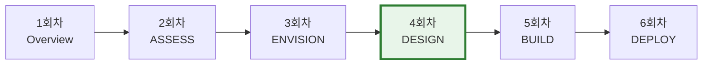

| **단계** | **회차** | **핵심 질문** | **주요 산출물** |
| --- | --- | --- | --- |
| Overview | 1회차 | 컨설팅이란 무엇인가? | 산업 구조, 프로젝트 이해 |
| ASSESS | 2회차 | 현재 상태는 어떠한가? | As-Is 프로세스, 이슈 목록 |
| ENVISION | 3회차 | 어디로 가야 하는가? | 개선 기회, To-Be 방향성 |
| **DESIGN** | **4회차** | **어떻게 바꿀 것인가?** | **To-Be 프로세스, Gap 분석** |
| BUILD | 5회차 | 어떻게 만들 것인가? | Fit-Gap, 시스템 구현 |
| DEPLOY | 6회차 | 어떻게 정착시킬 것인가? | Go-Live, 운영 안정화 |

### 1.2 DESIGN 단계의 핵심 활동

<aside>
✏️

**To-Be 프로세스 설계**

- 7대 설계 원칙 적용
- 9대 재설계 패턴 활용
</aside>

<aside>
⚖️

**접근 방식 결정**

- PI vs BPR 선택
- 변화 강도 결정
- 리스크/성과 균형
</aside>

<aside>
🔄

**변화 영향 분석**

- 조직/역할 변화
- 시스템 변화
- 이해관계자 영향
- 변화관리 계획
</aside>

---

## 2. To-Be 프로세스 설계 방법론

<aside>
🎯

**To-Be 설계**란 현재(As-Is) 프로세스의 비효율을 제거하고, 목표 상태로 개선하는 청사진을 그리는 활동입니다.

**핵심 원칙**: **`"자동화 전에 간소화"`**  (⚠️비효율을 자동화하면 비효율이 빨라질 뿐⚠️)

</aside>

### 2.1 7대 설계 원칙

| **원칙** | **설명** | **적용 예시** |
| --- | --- | --- |
| **1. 제거 (Eliminate)** | 부가가치 없는 활동 제거 | 불필요한 승인 단계 제거 |
| **2. 간소화 (Simplify)** | 복잡한 절차 단순화 | 양식 통합, 입력 항목 축소 |
| **3. 통합 (Integrate)** | 분산된 업무 통합 | One-Stop 처리 |
| **4. 병렬화 (Parallelize)** | 순차 → 동시 처리 | 동시 검토, 병렬 승인 |
| **5. 표준화 (Standardize)** | 업무 방식 통일 | SOP 수립, 템플릿 표준화 |
| **6. 자동화 (Automate)** | 수작업의 시스템화 | RPA, 워크플로우 자동화 |
| **7. 아웃소싱 (Outsource)** | 비핵심 업무 외부 위탁 | 단순 반복 업무 BPO |

<aside>
📋

**원칙 적용 우선순위**

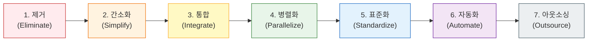

**Why?**: 없앨 수 있는 건 먼저 없애고, 남은 것을 개선한 후, 마지막에 자동화

</aside>

### 2.2 9대 재설계 패턴

<aside>
💡

**9대 재설계 패턴**은 프로세스를 근본적으로 바꾸는 **설계 템플릿**입니다.

각 패턴은 특정 문제 유형에 대한 검증된 해결책이며, 상황에 따라 **조합 적용**합니다.

</aside>

### 패턴 분류 개요

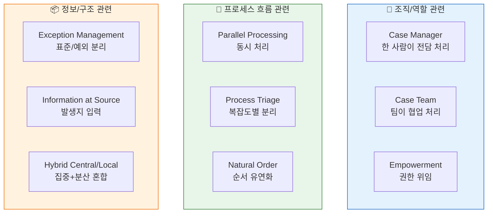

---

### 패턴 1-3: 조직/역할 관련

<aside>
👤

**1. Case Manager**

**핵심**: 한 사람이 고객 요청을 End-to-End로 처리

**문제**: 여러 부서를 거치면서 책임 불명확, 고객 불편

**해결**: 전담 매니저가 처음부터 끝까지 책임

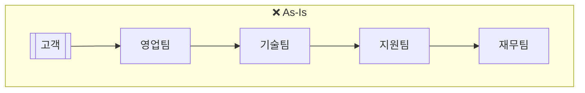

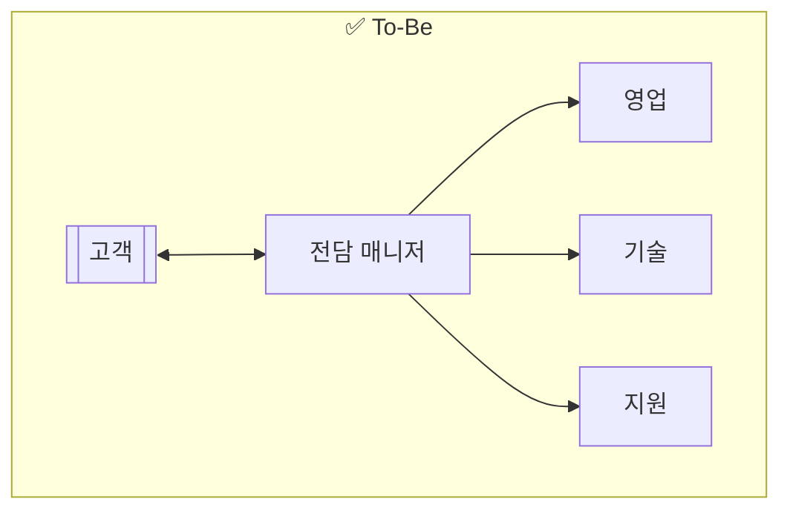

**예시**: 은행 PB, 보험 설계사, 고객성공매니저

</aside>

<aside>
👥

**2. Case Team**

**핵심**: Cross-functional 팀이 고객/프로젝트 전담 처리

**문제**: 복잡한 이슈는 한 사람이 처리 불가

**해결**: 다양한 전문가로 구성된 팀이 함께 처리

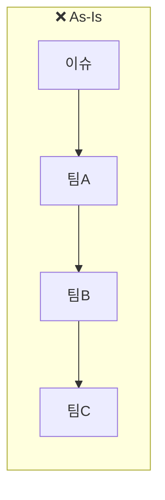

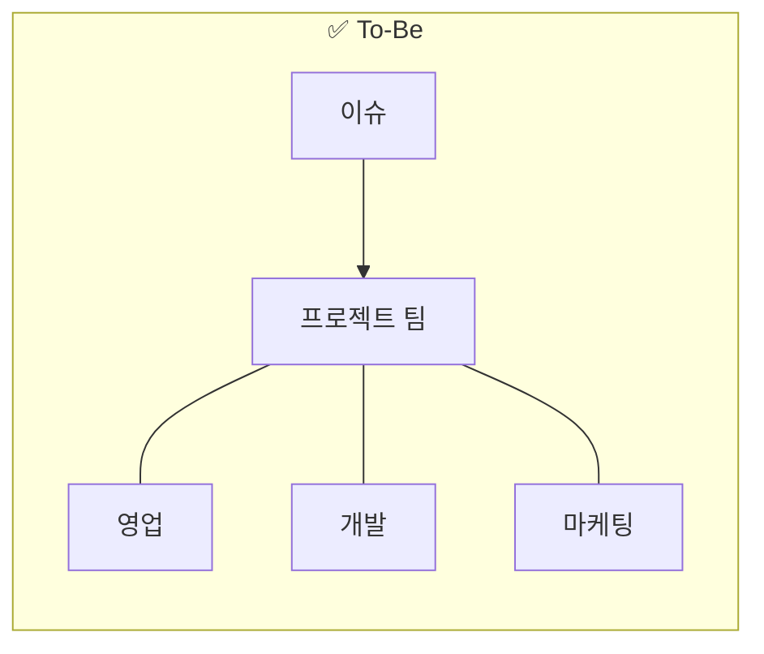

**예시**: 신제품 개발 TF, M&A 팀, ERP 구축 팀

</aside>

<aside>
⭐

**3. Empowerment (권한 위임)**

**핵심**: 현장에 의사결정 권한을 위임하여 승인 단계 단축

**문제**: 단순한 결정도 상위자 승인 필요 → 리드타임 증가

**해결**: 일정 범위 내에서 담당자가 직접 결정

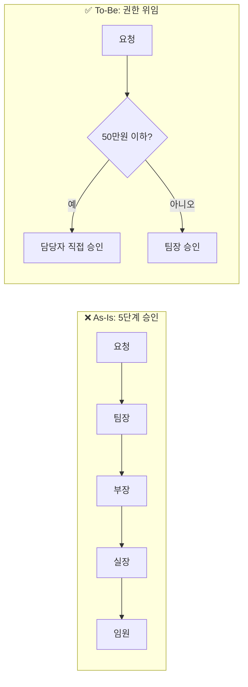

**예시**: 소액 구매 자동승인, 현장 AS 즉시 처리, 고객 불만 즉시 보상

</aside>

---

### 패턴 4-6: 프로세스 흐름 관련

<aside>
⚡

**4. Parallel Processing**

**핵심**: 순차적 작업을 동시에 처리하여 리드타임 단축

**문제**: A→B→C 순서로 처리하면 시간이 누적됨

**해결**: 독립적인 작업은 동시 진행

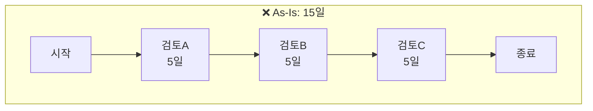

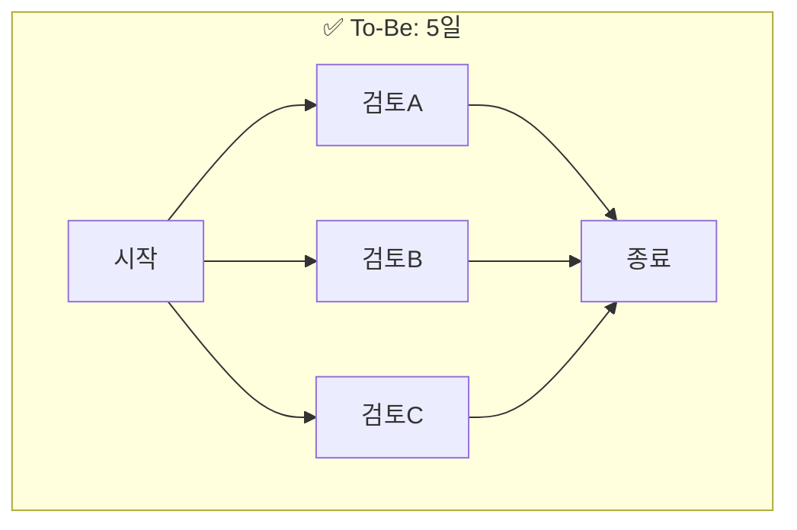

**예시**: 병렬 승인, 동시 검토, 병행 테스트

</aside>

<aside>
🚦

**5. Process Triage**

**핵심**: 복잡도/긴급도에 따라 다른 경로로 처리

**문제**: 모든 건을 동일한 프로세스로 처리 → 비효율

**해결**: 간단한 건은 Fast Track, 복잡한 건은 전문 처리

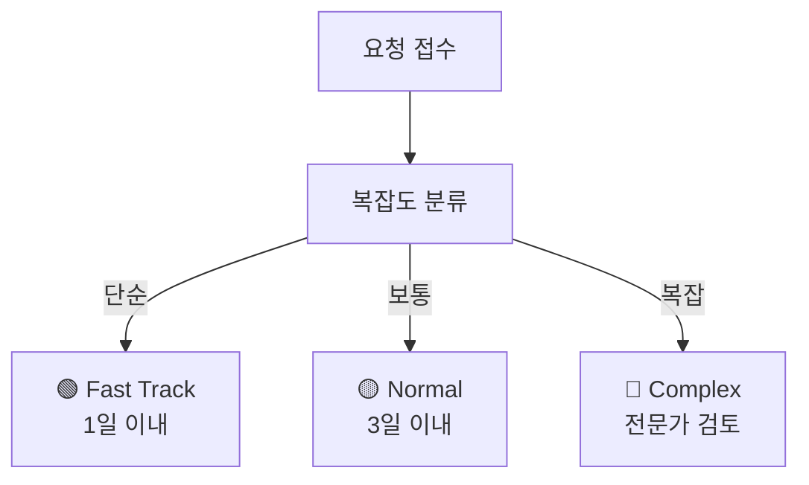

**예시**: 병원 응급실 트리아지, 고객센터 1/2/3차 대응

</aside>

<aside>
🔀

**6. Natural Order (자연스러운 순서)**

**핵심**: 인위적으로 정해진 순서를 제거하고, 필요할 때 수행

**문제**: "예전부터 이렇게 해왔다"는 이유로 불필요한 순서 유지

**해결**: 논리적 의존관계가 없으면 필요 시점에 수행

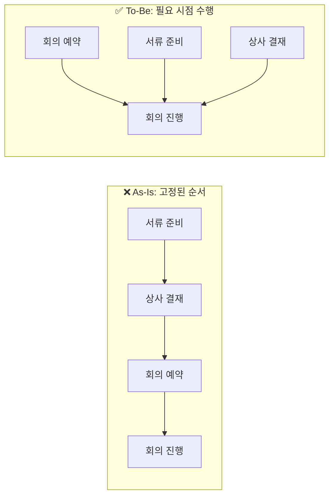

**예시**: 선주문 후정산, 주문 후 재고 확인, 동시 문서 작업

</aside>

---

### 패턴 7-9: 정보/구조 관련

<aside>
📊

**7. Exception Management**

**핵심**: 80%의 표준 케이스는 자동화, 20% 예외만 수동 처리

**문제**: 모든 건을 동일하게 수동 처리 → 자원 낭비

**해결**: 규칙 기반으로 표준/예외 분류 후 처리

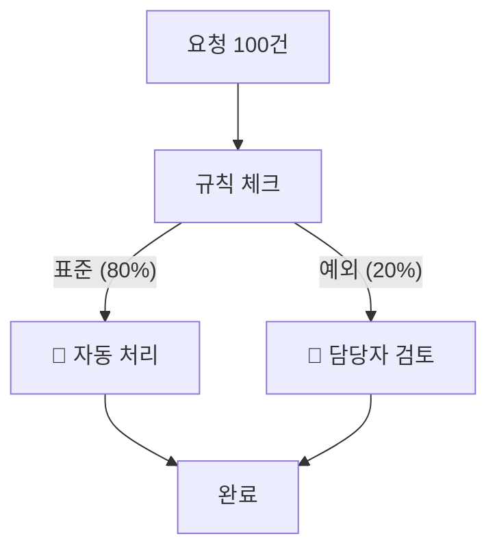

**예시**: 신용카드 승인, 보험 심사, 반품 처리

</aside>

<aside>
📝

**8. Information at Source**

**핵심**: 정보가 발생하는 곳에서 직접 입력

**문제**: 현장에서 수기로 작성 → 사무실에서 재입력 → 오류/지연

**해결**: 정보 발생 시점에 시스템 직접 입력

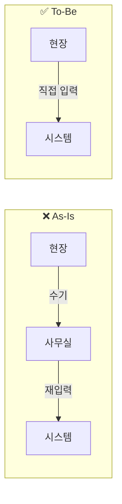

**예시**: 영업사원 모바일 주문, 창고 바코드 스캠, 현장 점검 태블릿

</aside>

<aside>
🏛️

**9. Hybrid Central/Local**

**핵심**: 집중화의 효율성과 분산화의 유연성을 동시 확보

**문제**: 완전 집중 → 현장 대응력 떨어짐 / 완전 분산 → 중복·비효율

**해결**: 전략/정책은 본사, 실행은 현장에서

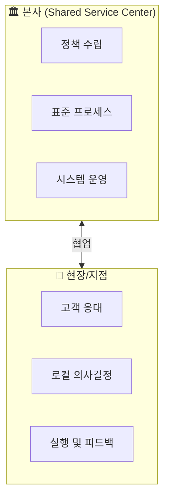

**예시**: HR 공유서비스센터, 글로벌 IT 운영, 물류 허브

</aside>

---

### 패턴 적용 결정 가이드

| **문제 상황** | **추천 패턴** | **기대 효과** | **그룹핑** |
| --- | --- | --- | --- |
| 고객이 여러 부서를 돌아다님 | **Case Manager** | 고객 만족도 ↑, 책임 명확화 | **조직/역할 관련** |
| 복잡한 프로젝트가 지연됨 | **Case Team** | Cross-functional 협업 강화 | **조직/역할 관련** |
| 단순한 건도 승인에 시간이 오래 걸림 | **Empowerment** | 승인 리드타임 ↓ | **조직/역할 관련** |
| 순차 처리로 전체 시간 김 | **Parallel Processing** | 리드타임 50-70% 단축 | **프로세스 흐름 관련** |
| 간단한 건도 복잡한 건과 똑같이 처리 | **Process Triage** | 자원 효율화, 빠른 대응 | **프로세스 흐름 관련** |
| "예전부터 이렇게 해왔다"로 비효율 유지 | **Natural Order** | 불필요한 대기 제거 | **프로세스 흐름 관련** |
| 모든 건을 수동으로 처리 | **Exception Management** | 자동화율 ↑, 예외 집중 관리 | **정보/구조 관련** |
| 현장 정보가 사무실에서 재입력됨 | **Information at Source** | 데이터 정확도 ↑, 실시간화 | **정보/구조 관련** |
| 집중화 vs 분산화 고민 | **Hybrid Central/Local** | 효율성 + 유연성 동시 확보 | **정보/구조 관련** |

### 2.3 설계 적용 사례

<aside>
❌

**As-Is: 구매요청 프로세스**

```jsx
현업 요청서 작성 (수기)
    ↓
팀장 승인 (대면)
    ↓
구매팀 접수 (재입력)
    ↓
구매팀장 승인
    ↓
임원 승인 (100만원 이상)
    ↓
발주 처리
```

**리드타임**: 5일

**문제점**: 수기 작성, 재입력, 다단계 승인

</aside>

<aside>
✅

**To-Be: 구매요청 프로세스**

```jsx
현업 시스템 입력
    ↓
자동 라우팅 (금액별)
├── 50만 미만: 팀장 자동승인
├── 50-500만: 팀장 승인
└── 500만 이상: 팀장+임원 병렬승인
    ↓
구매팀 자동 접수 + 발주
```

</aside>

**리드타임**: 1일 (80% 단축)

**적용 원칙**: 제거, 자동화, 병렬화

---

## 3. PI vs BPR: 설계 접근 방식

<aside>
📋

DESIGN 단계에서 **"얼마나 바꿀 것인가"**에 따라 접근 방식이 달라집니다.

- **PI (Process Innovation)**: 기존 프로세스 기반 **점진적 개선**
- **BPR (Business Process Reengineering)**: 프로세스 **근본적 재설계**
</aside>

### 3.1 PI vs BPR 비교

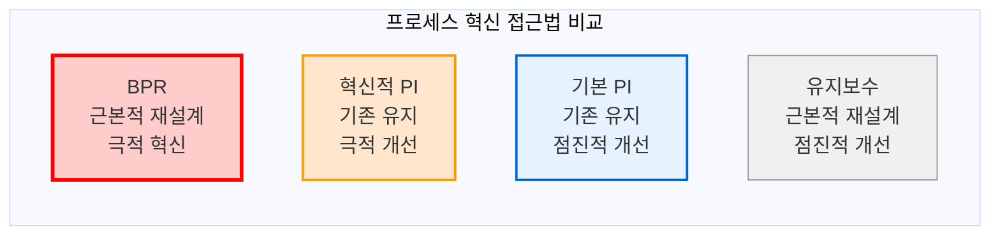

| **구분** | **PI (Process Innovation)** | **BPR (Business Process Reengineering)** |
| --- | --- | --- |
| **정의** | 기존 프로세스 기반 **점진적 개선** | 프로세스 **근본적 재설계** |
| **변화 강도** | Incremental (점진적) | Radical (급진적) |
| **접근 범위** | **전 영역** 방법론적 접근 | **특정 영역** 집중 (Deep Dive) |
| **목표** | ERP 구축을 위한 **사전 목표 수립** | 해당 영역 **고도화** |
| **개선 목표** | 20-30% 효율 향상 | 50% 이상 극적 개선 |
| **기간** | 4-18개월 | 3-6개월 |
| **리스크/성공률** | 中 / 70-80% | 高 / 50-70% |
| **출발점** | As-Is 프로세스에서 시작 | Clean Slate (백지 상태) |

### 3.2 상황별 선택 기준

<aside>
🔄

**PI 선택이 적합한 경우**

1. 기존 프로세스가 존재하고 **기본 골격이 유효**
2. 목표가 **20-30% 효율 향상** 수준
3. **리스크를 최소화**하면서 개선 필요
4. ERP 도입 **사전 단계**로 활용
5. **빠른 성과**가 필요한 경우
</aside>

<aside>
⚡

**BPR 선택이 적합한 경우**

1. 현재 프로세스로는 **목표 달성이 근본적으로 불가능**
2. **50% 이상**의 극적 성과 향상 필요
3. **조직 구조 재설계**가 수반되어야 함
4. 경영진의 **강력한 스폰서십** 확보 (Top-Down)
5. 전 영역이 아닌 특정 영역에 Focus
</aside>

### 3.3 PI 추진 프레임워크

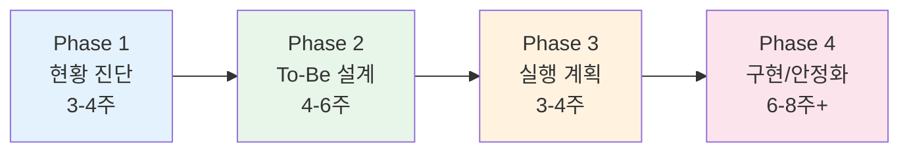

<aside>
🔍

**Phase 1: 현황 진단**

- 프로세스 맵핑 (L0-L2)
- Pain Point 인터뷰
- Quick Win 식별

**산출물**: As-Is 프로세스, 이슈 목록

</aside>

<aside>
✏️

**Phase 2: To-Be 설계**

- 개선 방향 수립
- To-Be 프로세스 설계
- Gap 해소 방안 수립

**산출물**: To-Be 프로세스, 개선안

</aside>

<aside>
📊

**Phase 3: 실행 계획**

- 마스터 플랜 수립
- 자원 배분 계획
- 변화관리 계획

**산출물**: 마스터 플랜, CM 계획

</aside>

<aside>
🚀

**Phase 4: 구현/안정화**

- Pilot 실행 → 전사 확산
- 교육/훈련
- 모니터링 및 지속 개선

**산출물**: SOP, KPI 대시보드

</aside>

### 3.4 BPR 5단계 방법론

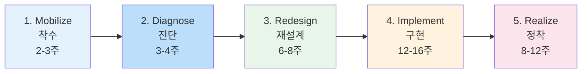

| **단계** | **핵심 활동** | **산출물** |
| --- | --- | --- |
| **1. Mobilize** | 경영진 스폰서십 확보, TF 구성, 비전 수립 | 프로젝트 헌장, TF 구성표 |
| **2. Diagnose** | 핵심 프로세스 선정, 현황 진단, 벤치마킹 | 핵심 프로세스 목록, 벤치마크 결과 |
| **3. Redesign** | Clean Slate 워크숍, To-Be 재설계, 조직 설계 | To-Be 프로세스, 조직 설계서 |
| **4. Implement** | 변화관리 실행, 시스템 구축, Pilot → 전사 확산 | 신규 프로세스, 시스템 |
| **5. Realize** | 성과 모니터링, 지속 개선, 문화 정착 | KPI 대시보드, 개선 보고서 |

### 3.5 BPR 4대 원칙 (FRDP)

<aside>
⚡

**BPR(Business Process Reengineering)**이란 비용, 품질, 서비스, 속도 등 핵심 성과에서 **극적인 향상**을 달성하기 위해 비즈니스 프로세스를 **근본적으로 재설계**하는 것입니다.

- Michael Hammer & James Champy, 1993
</aside>

<aside>
🔄

**1. Fundamental (근본적)**

**"왜 이 일을 하는가?"**

- 기존 방식에 대한 근본적 질문
- 암묵적 가정/규칙 파괴
</aside>

<aside>
💥

**2. Radical (급진적)**

**"어떻게 완전히 다르게 할 것인가?"**

- 표면적 개선이 아닌 근본 재설계
- Clean Slate에서 시작
</aside>

<aside>
📈

**3. Dramatic (극적)**

**"10%가 아닌 10배 개선"**

- 점진적 개선 X, 획기적 성과 향상
- 리드타임 50%↑, 비용 40%↓
</aside>

<aside>
⚙️

**4. Process (프로세스)**

**"기능이 아닌 프로세스 중심"**

- 부서 중심 → 프로세스 중심
- End-to-End 관점
</aside>

### 3.6 Clean Slate 접근법

<aside>
📝

**Clean Slate (백지 상태)**란 기존 프로세스를 완전히 무시하고, **"만약 처음부터 다시 만든다면?"**이라는 질문에서 시작하는 접근법입니다.

</aside>

| **제약 유형** | **일반적 가정** | **BPR 질문** | **가능한 혁신** |
| --- | --- | --- | --- |
| **시간** | "이 업무는 3일 걸린다" | "왜 3일인가? 3시간은?" | 병렬 처리, 자동화 |
| **장소** | "현장에서 해야 한다" | "원격으로 가능한가?" | 모바일, 원격 업무 |
| **순서** | "A 후에 B를 해야 한다" | "동시에 할 수 없는가?" | 병렬화, 선행 처리 |
| **담당자** | "이 부서가 해야 한다" | "꼭 이 부서여야 하는가?" | 통합, 아웃소싱 |
| **승인** | "임원 승인이 필요하다" | "정말 필요한가?" | 권한 위임, 자동 승인 |

### 3.7 Quick Win 및 Pilot 접근

<aside>
⚡

**Quick Win**이란 **적은 노력으로 빠르게 가시적 성과**를 낼 수 있는 개선 과제입니다.

**목적**: 프로젝트 모멘텀 확보, 이해관계자 신뢰 구축, 변화 저항 완화

</aside>

|  | **효과 高** | **효과 低** |
| --- | --- | --- |
| **실행 용이** | **Quick Win**
즉시 실행 (1-4주) | **Fill-in**
여유 시 실행 |
| **실행 어려움** | **Major Initiative**
별도 프로젝트화 | **Deprioritize**
보류/제외 |

<aside>
🧪

**Pilot 접근법**: 전사 적용 전 **제한된 범위에서 먼저 검증**하는 방법

- **장점**: 리스크 낮음, Pilot에서 학습 → 개선 후 확산
- **Pilot 대상 선정**: 대표성, 협조성, 적정 복잡도, 가시성
</aside>

---

## 4. 변화관리 (Change Management)

<aside>
⚠️

**"기술적으로 완벽한 프로젝트도 변화관리 실패로 무너진다"**

프로세스 혁신 프로젝트의 **70%가 변화관리 실패**로 목표 미달성

**핵심 인식**: 프로세스 변경 = 사람의 행동 변경 = 변화관리 필수

</aside>

### 4.1 ADKAR 모델 (Prosci)

<aside>
📋

**ADKAR 모델** — 개인이 변화를 수용하기 위해 거쳐야 하는 5단계

</aside>

| **단계** | **의미** | **핵심 질문** | **활동** |
| --- | --- | --- | --- |
| **A**wareness | 변화 필요성 인식 | "왜 변해야 하는가?" | 현황 공유, 위기 인식, 비전 제시 |
| **D**esire | 변화 참여 의지 | "나는 변화에 동참하고 싶은가?" | WIIFM 설명, 인센티브, 저항 관리 |
| **K**nowledge | 변화 방법 이해 | "어떻게 변해야 하는가?" | 교육, 훈련, 가이드 제공 |
| **A**bility | 변화 실행 능력 | "실제로 할 수 있는가?" | 실습, 코칭, 지원 체계 |
| **R**einforcement | 변화 지속/강화 | "변화가 유지되는가?" | 성과 인정, 피드백, 제도화 |

### 4.2 Kotter의 8단계 모델

```mermaid
graph LR
    %% Phase 1: 분위기 조성
    A1["1. 위기감 조성"] --> A2["2. 변화 추진팀 구성"]
    A2 --> A3["3. 비전과 전략 수립"]
    
    %% Phase 2: 참여 유도
    A3 --> B1["4. 비전 소통"]
    B1 --> B2["5. 장애물 제거"]
    B2 --> B3["6. 단기 성과 창출"]
    
    %% Phase 3: 변화 정착
    B3 --> C1["7. 성과 확대"]
    C1 --> C2["8. 문화에 정착"]
    
    %% 단계별 그룹 스타일
    style A1 fill:#e3f2fd,stroke:#1976d2
    style A2 fill:#e3f2fd,stroke:#1976d2
    style A3 fill:#e3f2fd,stroke:#1976d2
    
    style B1 fill:#e8f5e9,stroke:#388e3c
    style B2 fill:#e8f5e9,stroke:#388e3c
    style B3 fill:#e8f5e9,stroke:#388e3c
    
    style C1 fill:#fce4ec,stroke:#c2185b
    style C2 fill:#fce4ec,stroke:#c2185b
```

### 4.3 변화관리 3대 요소

<aside>
💬

**Communication (소통)**

- 일관된 메시지 반복
- 다양한 채널 활용
- 양방향 소통 (Q&A)
- 경영진 직접 소통
</aside>

<aside>
📚

**Training (교육)**

- 역할별 맞춤 교육
- 이론 + 실습 병행
- 충분한 연습 기회
- 사후 지원 체계
</aside>

<aside>
🤝

**Engagement (참여)**

- 초기부터 현업 참여
- 변화 챔피언 육성
- 의견 수렴 및 반영
- 성공 사례 공유
</aside>

### 4.4 저항 관리 전략

| **저항 유형** | **원인** | **대응 전략** |
| --- | --- | --- |
| **인지적 저항** | 변화 필요성 미인식
"왜 바꿔야 하지?" | 데이터 기반 설득, 성공 사례 공유 |
| **정서적 저항** | 불안, 두려움
"내 자리가 없어지면?" | 공감과 경청, 충분한 교육, 안전망 제시 |
| **정치적 저항** | 기득권 상실 우려
"내 영향력이 줄어든다" | 경영진 스폰서십, 새로운 역할 제시 |

---

## 5. 성공/실패 요인 및 실무 사례

### 5.1 핵심 성공 요인 (CSF)

### 5.2 주요 실패 요인

<aside>
✅

- **1. 리더십**
    - **CEO 직접 스폰서십**
    - 저항 세력 관리 권한
    - 명확한 비전 제시
</aside>

<aside>
✅

- **2. 전담 조직**
    - 핵심 인력 **Full-time 투입**
    - Cross-functional TF 구성
    - 충분한 권한 부여
</aside>

<aside>
✅

- **3. 명확한 목표**
    - **정량적 KPI 설정**
    - Quick Win 확보
    - 진행 상황 가시화
</aside>

<aside>
✅

- **4. 변화관리**
    - 초기부터 **현업 참여**
    - 지속적 소통
    - 충분한 교육/훈련
</aside>

<aside>
❌

- **리더십 부재**
    - 중간관리자에 위임
    - 저항 발생 시 후퇴
</aside>

<aside>
❌

- **실행력 부족**
    - 설계에만 집중
    - 구현 자원 부족
</aside>

<aside>
❌

- **범위 과다**
    - 전사 동시 추진 (Big Bang)
    - 과도한 기대/약속
</aside>

<aside>
❌

- **변화관리 소홀**
    - 기술 중심 접근
    - 현업 배제, 소통 부족
</aside>

### 5.3 실무 사례: H사 BPR 프로젝트

<aside>
🏭

**과제 1: OEM 외주 공정 고도화**

**배경**: OEM 생산 및 자재 가시성 부재

**핵심 개선**:

- MRP Area 활용 사급 회사별 재고 구분
- External Processing 프로세스 재설계

**성과**: OEM 생산 가시성 확보, 재고 정합성 향상

</aside>

<aside>
📦

**과제 2: 출하장 MES→ERP 고도화**

**배경**: MES-SAP 재고 불일치, 허수재고 4억원

**핵심 개선**:

- MES에서 SAP 기반으로 프로세스 전면 이관
- Fiori 기반 대시보드 구현

**성과**: 허수재고 **4억 → 6천만원** (85% 감소)

</aside>

---

## 🎯 핵심 Takeaway

<aside>
📌

**1. DESIGN 단계 = To-Be 설계의 핵심**

- 프로젝트 성패를 좌우하는 **청사진 수립 단계**
- "어떻게 바꿀 것인가"에 대한 명확한 답 필요

**2. To-Be 설계 = 7대 원칙 + 9대 패턴**

- **"자동화 전에 간소화"** — 비효율을 자동화하면 안 됨
- 상황에 맞는 재설계 패턴 조합 적용

**3. PI vs BPR = 상황에 맞는 선택**

- PI: 점진적 개선, 전 영역 방법론적 접근, ERP 사전 단계
- BPR: 급진적 재설계, 특정 영역 Deep Dive, 근본적 고도화

**4. 변화관리 = 프로젝트 성패의 70%**

- ADKAR: Awareness → Desire → Knowledge → Ability → Reinforcement
- Communication + Training + Engagement
- 저항은 자연스러운 것, **관리**가 핵심

**5. 성공의 핵심 = 리더십 + 전담조직 + 명확한 목표 + 변화관리**

- CEO 직접 스폰서십이 성패 좌우
- Quick Win으로 모멘텀 확보
</aside>

---

<aside>
💼

**사업기획 직무 연계**

본 회차의 **To-Be 설계와 PI/BPR 방법론**은 사업기획 직무의 **사업 실행 계획 수립 및 이해관계자 관리** 영역과 직결됩니다.

| 컨설팅 기법 | 사업기획 적용 |
| --- | --- |
| 7대 원칙 / 9대 패턴 | 업무 효율화, 운영 모델 최적화 |
| PI/BPR 선택 | 사업 추진 방식 결정 (점진적 vs 급진적) |
| Quick Win / Pilot | 시범 사업 추진, 빠른 성과 창출 |
| 변화관리 (ADKAR) | 이해관계자 설득, 조직 내 변화 주도 |
| Clean Slate 사고 | 기존 제약에서 벗어난 혁신적 사업 모델 설계 |
</aside>