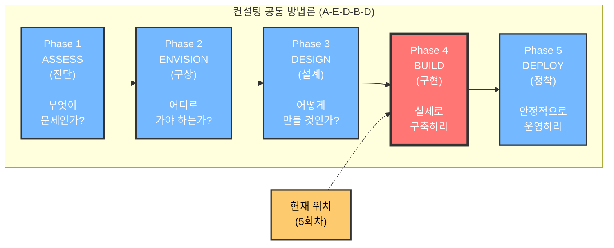
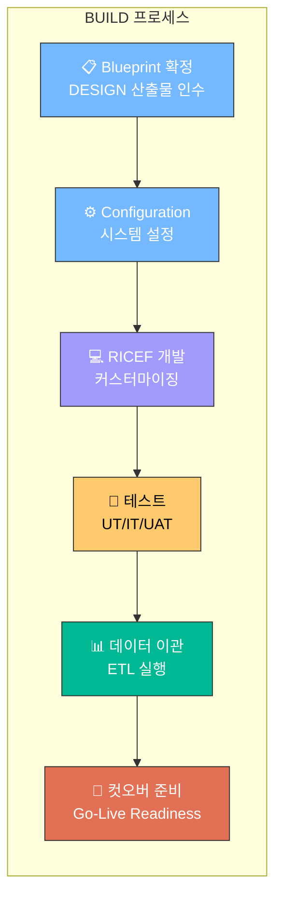
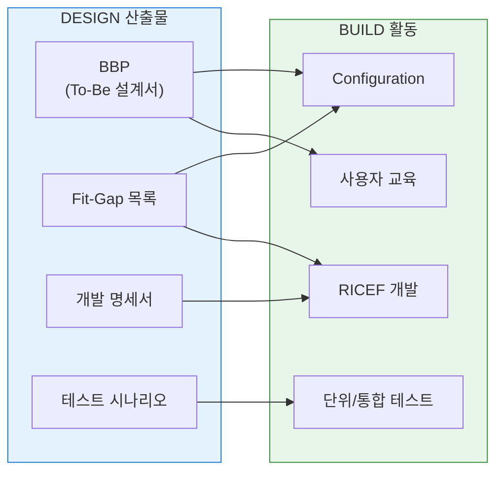
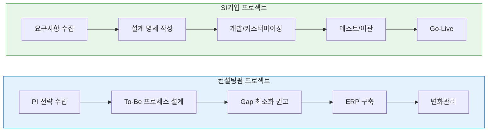
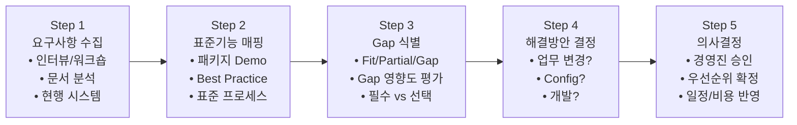
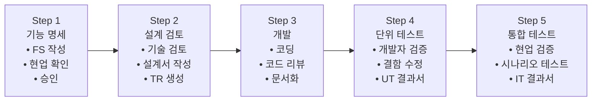
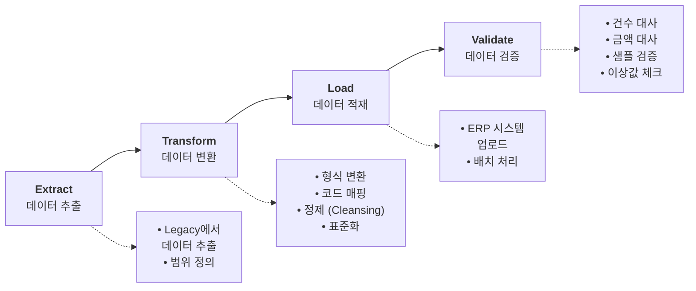
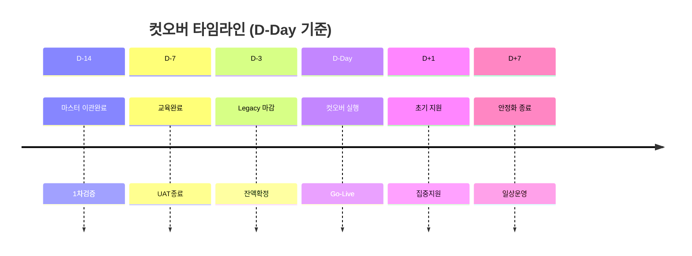

# [5회차] BUILD 단계: ERP 구축과 시스템 구현

No: 5
난이도: 고급
단계: BUILD
상태: 완료
선행 학습: [4회차] DESIGN: 프로세스 혁신과 To-Be 설계 (%5B4%ED%9A%8C%EC%B0%A8%5D%20DESIGN%20%ED%94%84%EB%A1%9C%EC%84%B8%EC%8A%A4%20%ED%98%81%EC%8B%A0%EA%B3%BC%20To-Be%20%EC%84%A4%EA%B3%84%20f7fcd6749b844523aeff042e5d30e5d5.md)
소요시간(분): 25
중요도: 낮음 (Low)
학습 목표: Fit-Gap 분석 수행 및 ERP 시스템 구현 역량 확보


ERP 시스템 구축

### [5회차] BUILD 단계: ERP 구축과 시스템 구현

---

---

<aside>
🎯

**학습 목표**

- **BUILD 단계**의 방법론적 위치와 DESIGN/DEPLOY 연계 이해
- **ERP 프로젝트 추진 단계** 전체 흐름 이해 (ASAP/AIM/Activate 등)
- **BUILD 5대 원칙** 및 방법론 선택 기준 습득
- **Fit-Gap 분석 및 커스터마이징** 의사결정 기준 습득
- **Configuration vs Development** 구분과 의사결정
- **통합테스트/데이터이관/컷오버** 핵심 활동 및 체크리스트 파악
- ERP 컨설턴트의 역할과 단계별 책임 이해
</aside>

---

## 0. BUILD 단계의 방법론적 위치

<aside>
🔧

**BUILD 단계**는 A-E-D-B-D 방법론에서 **"실제로 구축하라"**를 실행하는 핵심 단계입니다.

DESIGN에서 설계한 청사진을 **시스템으로 구현**하고, DEPLOY를 위한 **전환 준비**를 완료합니다.

</aside>

### 0.1 A-E-D-B-D 내 위치





### 0.2 DESIGN vs BUILD vs DEPLOY 비교

| **구분** | **DESIGN (설계)** | **BUILD (구현)** | **DEPLOY (정착)** |
| --- | --- | --- | --- |
| **핵심 질문** | "어떻게 만들 것인가?" | **"실제로 구축하라"** | "안정적으로 운영하라" |
| **주요 활동** | To-Be 프로세스 설계, 시스템 설계 | **Configuration, 개발, 테스트, 이관** | Go-Live, 안정화, 운영 이관 |
| **산출물** | BBP, 설계 명세서 | **시스템 개발물, 테스트 결과, 교육 자료** | 운영 매뉴얼, 종료 보고서 |
| **의사결정** | "이렇게 만든다" | **"Fit vs Gap, Config vs 개발"** | "Go/No-Go, 안정화 완료" |
| **참여자** | 컨설턴트 + Key User | **FC + TC + Key User + 개발팀** | 운영팀 + 현업 + 지원팀 |
| **기간 비중** | ~20% | **~50%** | ~15% |

<aside>
💡

**왜 BUILD가 가장 중요한가?**

- 프로젝트 기간의 **50% 이상**을 차지하는 핵심 단계
- DESIGN의 청사진이 **실제 시스템**으로 구현되는 단계
- **테스트와 데이터 이관**의 품질이 Go-Live 성패 좌우
- 변화관리가 **가장 활발하게** 진행되어야 하는 시점 (교육, Adoption)
</aside>

### 0.3 DESIGN 산출물 → BUILD 활동 연계



---

## 1. BUILD 5대 핵심 원칙

<aside>
⚡

4회차 DESIGN의 **7대 설계 원칙**처럼, BUILD 단계에도 반드시 지켜야 할 **5대 원칙**이 있습니다.

이 원칙을 위반하면 프로젝트 실패 확률이 급격히 높아집니다.

</aside>

<aside>
1️⃣

- **Fit-to-Standard (표준 수용)**
    - ERP 표준 기능을 **최대한 활용**
    - "시스템에 업무를 맞춘다" 원칙
    - 커스터마이징 욕구 억제

**Why?**: 표준 수용률 ↑ = TCO ↓, 업그레이드 용이

</aside>

<aside>
2️⃣

- **커스터마이징 최소화**
    - Gap은 **업무 변경 우선** 검토
    - 개발은 **최후의 수단**
    - Must-have vs Nice-to-have 구분

**Why?**: 개발 ↑ = 비용 ↑, 리스크 ↑, 유지보수 ↑

</aside>

<aside>
3️⃣

- **데이터 정합성 확보**
    - "Garbage In, Garbage Out" 방지
    - 이관 전 **데이터 정제 필수**
    - 대사(Reconciliation) 철저

**Why?**: 데이터 품질 = Go-Live 성패

</aside>

<aside>
4️⃣

- **테스트 완전성**
    - UT → IT → UAT **단계별 검증**
    - Critical/High 결함 **0건** 진입
    - 테스트 일정 **절대 단축 금지**

**Why?**: 테스트 소홀 = Go-Live 후 대혼란

</aside>

<aside>
5️⃣

- **변화관리 병행**
    - BUILD 중 **사용자 교육** 동시 진행
    - 4회차 ADKAR 모델 적용: Knowledge(교육) + Ability(실습)
    - 변화 챔피언 육성, 저항 관리

**Why?**: 시스템만 완벽해도 사용자가 못 쓰면 실패

</aside>

### BUILD 5대 원칙 적용 체크리스트

| **원칙** | **체크 항목** | **위반 시 리스크** |
| --- | --- | --- |
| Fit-to-Standard | [ ] 표준 기능 활용률 80% 이상
[ ] Gap 해결 시 업무 변경 우선 검토 | TCO 증가, 업그레이드 불가 |
| 커스터마이징 최소화 | [ ] RICEF 목록 경영진 승인
[ ] Phase 2 과제 분리 완료 | 일정/예산 초과, 품질 저하 |
| 데이터 정합성 | [ ] 마스터 정제율 100%
[ ] 대사 오차 0건 | Go-Live 후 업무 마비 |
| 테스트 완전성 | [ ] UAT 현업 100% 참여
[ ] Critical/High 결함 0건 | Go-Live 실패, 롤백 |
| 변화관리 병행 | [ ] Key User 교육 완료
[ ] 매뉴얼/FAQ 준비 | 사용자 저항, 시스템 외면 |

---

## 2. ERP 구축 프로젝트란?

<aside>
🏗️

**ERP(Enterprise Resource Planning) 구축**이란 기업의 핵심 업무 프로세스를 **표준 패키지 시스템**에 맞춰 재설계하고 구현하는 프로젝트입니다.

**핵심 특징**: 업무 표준화 + 시스템 통합 + 실시간 정보 공유

**성공률**: 약 50-60% (목표 기간/예산 내 완료 기준)

</aside>

### 1.1 ERP 프로젝트 특성

| **구분** | **ERP 구축** | **일반 SI 개발** |
| --- | --- | --- |
| **접근 방식** | 패키지 기반 (Fit to Standard) | 요구사항 기반 (Scratch) |
| **프로세스** | Best Practice 적용 | 현업 요구사항 반영 |
| **커스터마이징** | 최소화 권장 | 자유롭게 가능 |
| **업그레이드** | 벤더 의존 (주기적) | 자체 결정 |
| **리스크** | 업무 변화 저항 (매우 높음) | 기술적 이슈 중심 |
| **컨설턴트 역할** | 업무 설계 + 시스템 설정 | 요구사항 분석 + 개발 |

### 1.2 ERP 도입 유형

| **유형** | **설명** | **특징** | **적합 대상** |
| --- | --- | --- | --- |
| **신규 구축** | 처음으로 ERP 도입 | Legacy 없음, 유연한 설계 | 스타트업, 성장 중견기업 |
| **재구축 (Re-implementation)** | 기존 ERP 교체/업그레이드 | 기존 경험 활용, 저항 존재 | 노후화된 시스템 운영 기업 |
| **Roll-out** | 타 법인/사업장 확장 | 템플릿 기반, 빠른 구축 | 그룹사, 다국적 기업 |
| **확장 구축** | 기존 ERP에 모듈 추가 | 기존 시스템 연계 고려 | 단계별 도입 기업 |

### 1.3 컨설팅펌 vs SI기업 구축 프로젝트 비교

<aside>
🏛️

**ERP 구축 프로젝트**는 수행 주체에 따라 **컨설팅펌 주도**와 **SI기업 주도**로 구분됩니다.

동일한 ERP 시스템을 구축하더라도 **접근 방식과 관점**이 크게 다릅니다.

</aside>

### ① 프로젝트 접근 방식 비교

| **구분** | **컨설팅펌 (Big4 등)** | **SI기업 (SDS, SK C&C, CNS 등)** |
| --- | --- | --- |
| **대표 기업** | Deloitte, PwC, EY, KPMG, Accenture | 삼성SDS, SK C&C, LG CNS, 포스코ICT |
| **프로젝트 관점** | **PI(Process Innovation) 관점**
업무 혁신 + 시스템 구축 통합 | **개발/구현 관점**
명확한 요구사항 기반 구축 |
| **프로젝트 범위** | PI + ERP 구축 동시 수행 (혹은 PI 결과물 기반) | ERP 구축 중심 (PI는 별도 선행 또는 생략) |
| **주도권** | 컨설턴트가 **적극적으로 리드** | 고객사 요구사항에 **대응적** 수행 |
| **Gap 대응** | Gap **최소화** 시각으로 업무 변경 적극 권고 | 요구사항 반영 중심, 개발로 해결 경향 |
| **커스터마이징** | **최소화** 권고 (Fit-to-Standard 강조) | 고객 요구 반영으로 개발 범위 확대 가능 |

### ② 장단점 비교

<aside>
🏛️

**컨설팅펌 구축 프로젝트**

**장점**

- PI 관점에서 **업무 혁신**과 구축 동시 달성
- Gap 최소화로 **TCO 절감**, 업그레이드 용이
- Best Practice 적용으로 **전사 표준화** 가능
- 컨설턴트의 **적극적 리드**로 프로젝트 성공률 제고

**단점**

- 비용이 상대적으로 **고가**
- 현업 입장에서 **업무 변경 부담**
- 변화관리 **강도 높음**
</aside>

<aside>
🖥️

**SI기업 구축 프로젝트**

**장점**

- 명확한 요구사항 기반으로 **예측 가능**한 진행
- 고객 요구사항 **충실한 반영**
- 개발 역량 기반 **기술적 완성도** 높음
- 상대적으로 **비용 효율적**

**단점**

- 요구사항 품질에 따라 **결과물 편차**
- Gap을 개발로 해결 시 **TCO 증가**
- 업무 혁신 기회 **제한적**
</aside>

### ③ 프로젝트 수행 흐름 비교



### ④ 컨설턴트 지망생을 위한 권고

<aside>
🎯

**컨설턴트를 꿈꾸는 지망생이라면?**

컨설팅펌에서 ERP 구축 프로젝트를 경험하는 것을 **권장**합니다.

- **PI 관점**에서 업무를 바라보는 시각을 키울 수 있음
- **Fit-to-Standard** 원칙을 체화하여 Gap 최소화 능력 향상
- 고객을 **적극적으로 리드**하는 컨설팅 역량 습득
- 업무 혁신과 시스템 구축을 **통합적으로** 바라보는 시야 확보

SI 프로젝트는 개발 역량을 깊게 쌓을 수 있지만, **컨설팅 마인드셋**을 키우기에는 컨설팅펌 경험이 더 적합합니다.

</aside>

---

## 2. ERP 구축 방법론

### 2.1 주요 ERP 구축 방법론 비교

| **방법론** | **벤더** | **단계** | **특징** |
| --- | --- | --- | --- |
| **ASAP** | SAP | 5단계 | 가장 널리 사용, 체계적 산출물 |
| **SAP Activate** | SAP S/4HANA | 6단계 | Agile 접목, Best Practice 활용 |
| **AIM (OUM)** | Oracle | 6단계 | Oracle 제품 특화 |
| **Sure Step** | Microsoft | 6단계 | Dynamics 제품 특화 |

### 2.2 방법론 선택 가이드

<aside>
🧭

**상황별 방법론 선택 기준**

프로젝트 특성에 따라 최적의 방법론을 선택해야 합니다.

</aside>

<aside>
⚙️

**Waterfall 접근**

- 단계별 순차 진행
- 명확한 Gate 검토
- 산출물 중심

**적합**: 대규모, 복잡한 요구사항

</aside>

<aside>
🔄

**Agile 접근**

- Sprint 기반 반복
- 유연한 범위 조정
- 빠른 피드백

**적합**: Cloud, 빠른 구축 필요

</aside>

### 2.2 **Waterfall 접근** 5단계 방법론 (상세)

```mermaid
flowchart LR
    subgraph P1["1. Preparation"]
        A1[프로젝트 조직]
        A2[인프라 구축]
        A3[Kick-off]
    end
    
    subgraph P2["2. Blueprint"]
        B1[As-Is 분석]
        B2[Fit-Gap 분석]
        B3[To-Be 설계]
    end
    
    subgraph P3["3. Realization"]
        C1[Configuration]
        C2[RICEF 개발]
        C3[통합테스트]
    end
    
    subgraph P4["4. Final Prep"]
        D1[UAT]
        D2[데이터 이관]
        D3[사용자 교육]
    end
    
    subgraph P5["5. Go-Live"]
        E1[컷오버 실행]
        E2[안정화 지원]
        E3[운영 인수]
    end
    
    P1 --> P2 --> P3 --> P4 --> P5
    
    style P1 fill:#bbdefb
    style P2 fill:#c8e6c9
    style P3 fill:#fff9c4
    style P4 fill:#ffccbc
    style P5 fill:#e1bee7
```



<aside>
📋

**Waterfall 접근 : ASAP (Accelerated SAP)** - 가장 널리 사용되는 ERP 구축 방법론

</aside>

### 2.3 **Agile 접근 :** Activate 방법론 (상세)

```mermaid
flowchart LR
    subgraph Discover["1. Discover"]
        AD1[비즈니스 케이스]
        AD2[프로젝트 범위]
        AD3[Fit-to-Standard]
    end
    
    subgraph Prepare["2. Prepare"]
        AP1[팀 구성]
        AP2[시스템 프로비저닝]
        AP3[Sprint 0]
    end
    
    subgraph Explore["3. Explore"]
        AE1[Sprint 반복]
        AE2[프로토타입]
        AE3[빠른 피드백]
    end
    
    subgraph Realize["4. Realize"]
        AR1[Configuration]
        AR2[Delta 개발]
        AR3[통합테스트]
    end
    
    subgraph Deploy["5. Deploy"]
        ADP1[컷오버]
        ADP2[Hypercare]
        ADP3[지속개선]
    end
    
    subgraph Run["6. Run"]
        ARN1[운영 지원]
        ARN2[최적화]
        ARN3[확장]
    end
    
    Discover --> Prepare --> Explore --> Realize --> Deploy --> Run
    
    style Discover fill:#e3f2fd
    style Prepare fill:#f3e5f5
    style Explore fill:#e8f5e9
    style Realize fill:#fff9c4
    style Deploy fill:#ffe0b2
    style Run fill:#e1bee7
```



<aside>
🔄

**Agile 접근 : SAP Activate** - S/4HANA 시대의 Agile 기반 구축 방법론

전통적 Waterfall과 달리 **Sprint 기반 반복 개발**, **Best Practice 템플릿 활용**, **빠른 피드백**을 강조합니다.

</aside>

### Phase별 상세 활동

| **Phase** | **핵심 활동** | **주요 산출물** | **ASAP 대비 차이점** |
| --- | --- | --- | --- |
| **1. Discover** | • 비즈니스 케이스 정의
• Fit-to-Standard 평가
• 범위 및 로드맵 수립
• Best Practice 탐색 | Project Charter
Value Case
High-level Scope | **더 빠름**: 상세 As-Is 생략
Best Practice 즉시 적용 |
| **2. Prepare** | • 프로젝트 팀 구성
• Cloud 환경 프로비저닝
• Sprint 계획 수립
• Starter System 활성화 | Team Charter
Sprint Backlog
Starter System | **클라우드 중심**: 빠른 환경 구축
사전 구성된 템플릿 활용 |
| **3. Explore** | • Sprint 기반 반복 설계
• Fit-to-Standard Workshop
• 프로토타입 시연
• Delta 식별 | Fit-to-Standard Report
Sprint Demo
Delta Backlog | **반복적 접근**: 점진적 설계
현업 참여 강화 |
| **4. Realize** | • Sprint 개발 실행
• Configuration 완성
• Delta 개발 (최소화)
• 지속적 테스트 | Configured System
Delta Objects
Test Results | **지속적 통합**: Sprint마다 테스트
결함 조기 발견 |
| **5. Deploy** | • 데이터 이관
• 사용자 교육
• 컷오버 실행
• Hypercare 지원 | Migration Report
Training Materials
Go-Live Checklist | **유사**: 전환 활동 동일
단, 준비도 더 높음 |
| **6. Run** | • 운영 안정화
• 지속적 개선
• 기능 확장
• Innovation 적용 | Operation Handover
Improvement Backlog
Innovation Roadmap | **지속 진화**: 운영 중에도
지속적 개선 강조 |

### Agile 접근의 핵심 특징

<aside>
⚡

**Sprint 기반 반복 개발**

- 2-4주 단위 Sprint
- 매 Sprint 종료 시 Demo
- 빠른 피드백 → 즉시 반영
- 위험 조기 발견
</aside>

<aside>
📦

**Best Practice 템플릿**

- Starter System 제공
- 사전 구성된 프로세스
- 90% Fit-to-Standard 목표
- 빠른 구축 (30-50% 단축)
</aside>

<aside>
👥

**현업 참여 강화**

- 매 Sprint Review 참여
- 실시간 피드백 제공
- 점진적 학습 (Change by Design)
- 저항 최소화
</aside>

<aside>
☁️

**클라우드 최적화**

- S/4HANA Cloud 전용
- 자동 업그레이드 대응
- DevOps 통합
- 빠른 환경 구축
</aside>

### Waterfall(ASAP) vs Agile(Activate) 비교

| **비교 항목** | **Waterfall (ASAP)** | **Agile (Activate)** |
| --- | --- | --- |
| **접근 방식** | 순차적 단계별 진행 | 반복적 Sprint 기반 |
| **요구사항 분석** | 상세한 As-Is 분석 | Best Practice 중심, As-Is 최소화 |
| **설계 방식** | Blueprint 일괄 작성 | Sprint 단위 점진적 설계 |
| **현업 참여** | Blueprint 승인 시점 집중 | 매 Sprint Review 지속 참여 |
| **테스트 시점** | 개발 완료 후 통합테스트 | 매 Sprint 종료 시 테스트 |
| **변경 대응** | Change Control 엄격 | 유연한 Backlog 조정 |
| **구축 기간** | 12-18개월 (대규모) | 6-9개월 (템플릿 활용) |
| **적합 대상** | On-Premise, 복잡한 커스터마이징 | Cloud, Fit-to-Standard 수용 |

### Agile 접근 선택 기준

<aside>
⚠️

**Waterfall(ASAP) 권장 상황**

- 🏢 **On-Premise** 구축 (ECC, S/4HANA On-Prem)
- 🔧 **복잡한 커스터마이징** 불가피
- 📋 **명확한 요구사항** 사전 확정 필요
- ⚖️ **규제/컴플라이언스** 엄격
- 🏭 **레거시 연계** 복잡도 높음
- 📊 **단계별 Gate 검토** 필수 (대기업)
</aside>

<aside>
✅

**Agile(Activate) 권장 상황**

- ☁️ **S/4HANA Cloud** 도입 프로젝트
- ⚡ **빠른 구축**이 최우선 (6개월 이내)
- 📦 **Fit-to-Standard 90%+** 수용 가능
- 🔄 **유연한 범위 조정** 필요
- 👥 **현업의 적극적 참여** 가능
- 🚀 **신규 법인 Roll-out** (템플릿 활용)
</aside>

### 2.4 Phase별 상세 활동 및 산출물

| **Phase** | **핵심 활동** | **주요 산출물** | **Gate 통과 기준** |
| --- | --- | --- | --- |
| **1. Preparation** | • 프로젝트 조직 구성
• 범위/일정/예산 확정
• 인프라 환경 구축
• Kick-off 미팅 | 프로젝트 헌장
WBS/일정표
R&R 매트릭스
Communication Plan | • 조직 구성 완료
• 시스템 환경 준비
• 교육 계획 수립 |
| **2. Blueprint** | • As-Is 프로세스 분석
• Fit-Gap 분석
• To-Be 프로세스 설계
• 시스템 설계서 작성 | As-Is 분석서
Fit-Gap 매트릭스
BBP (To-Be 설계서)
개발 명세서 | • BBP 현업 승인
• 개발 범위 확정
• 변경관리 계획 |
| **3. Realization** | • Configuration (설정)
• RICEF 개발
• 단위 테스트 (UT)
• 통합 테스트 (IT) | Config 문서
개발 프로그램
테스트 결과서
이슈 로그 | • 통합테스트 완료
• 결함 해소
• UAT 준비 완료 |
| **4. Final Prep** | • UAT 실시
• 데이터 이관
• 사용자 교육
• 컷오버 리허설 | UAT 결과서
이관 데이터
교육 교재
컷오버 계획 | • UAT 승인
• 데이터 검증 완료
• Go-Live 승인 |
| **5. Go-Live** | • 컷오버 실행
• 초기 안정화 지원
• 성과 측정
• 인수인계 | Go-Live 체크리스트
이슈 대응 로그
안정화 보고서
운영 매뉴얼 | • 업무 정상 운영
• Critical 이슈 0건
• 운영팀 인수 |

---

## 3. Fit-Gap 분석

### 3.1 Fit-Gap 분석이란?

<aside>
📐

**Fit-Gap 분석**이란 ERP 표준 기능(Standard)과 업무 요구사항(Requirement) 간의 적합도를 분석하여 Gap을 식별하고 해결 방안을 결정하는 **Blueprint의 핵심 활동**입니다.

</aside>

### 3.2 Fit-Gap 분석 프로세스



### 3.3 Gap 유형 및 해결 방안

| **Gap 유형** | **설명** | **해결 방안** | **권장 우선순위** | **비용/리스크** |
| --- | --- | --- | --- | --- |
| **Fit** | 표준 기능으로 완전 충족 | Configuration (설정) | **1순위** | 低 / 低 |
| **Partial Gap** | 일부 기능 부족 (80% 충족) | Workaround / 업무 변경 | **2순위** | 低 / 低 |
| **Gap (경미)** | 표준 기능 없음 (단순) | 리포트/인터페이스 개발 | **3순위** | 中 / 中 |
| **Gap (복잡)** | 표준 기능 없음 (복잡) | Add-on 개발 / Enhancement | **4순위 (최소화)** | 高 / 高 |

### 3.4 Fit-Gap 분석 템플릿

<aside>
📝

**Fit-Gap 매트릭스 예시**

</aside>

| **ID** | **업무영역** | **요구사항** | **표준기능** | **Gap유형** | **해결방안** | **우선순위** | **담당자** |
| --- | --- | --- | --- | --- | --- | --- | --- |
| MM-001 | 구매 | 구매요청 자동생성 | MRP 실행 | Fit | Config | 필수 | 홍길동 |
| MM-002 | 구매 | 협력사 평가 | Vendor Rating | Partial | 업무변경 | 중요 | 김철수 |
| MM-003 | 구매 | 입찰 시스템 연계 | 없음 | Gap | I/F 개발 | 선택 | 이영희 |

### 3.5 Gap 해결 의사결정 프레임워크

<aside>
⚠️

**커스터마이징 최소화 원칙**

커스터마이징 ↑ → 비용 ↑ / 업그레이드 어려움 ↑ / 유지보수 복잡도 ↑

**Fit to Standard**: 업무를 시스템에 맞추는 것이 원칙

</aside>

|  | **비즈니스 영향 高** | **비즈니스 영향 低** |
| --- | --- | --- |
| **개발 복잡도 低** | **개발 권장**
ROI 높음 | **업무 변경 권장**
개발 불필요 |
| **개발 복잡도 高** | **신중히 검토**
대안 모색 | **개발 지양**
표준 수용 |

**의사결정 체크리스트**:

- [ ]  법적/규제 요건인가? → 필수 개발
- [ ]  경쟁 우위 창출 요소인가? → 검토 후 결정
- [ ]  편의성 요구인가? → 업무 변경 권장
- [ ]  현재만의 특수 상황인가? → 표준 수용 권장

---

## 4. RICEF 개발

### 4.1 RICEF란?

<aside>
💻

**RICEF**란 ERP 커스터마이징 개발 유형의 분류 체계입니다.

</aside>

| **유형** | **전체명** | **설명** | **예시** | **복잡도** |
| --- | --- | --- | --- | --- |
| **R** | Report | 조회/출력 프로그램 | 재고현황, 매출분석 | 低~中 |
| **I** | Interface | 타 시스템 연계 | MES 연동, 은행 I/F | 中~高 |
| **C** | Conversion | 데이터 이관 프로그램 | 마스터 이관, 잔액 이관 | 中 |
| **E** | Enhancement | 표준 기능 확장 | User Exit, BADI | 高 |
| **F** | Form | 출력 양식 | 세금계산서, 거래명세서 | 低~中 |

### 4.2 RICEF 개발 프로세스



### 4.3 RICEF 관리 대장

| **ID** | **유형** | **프로그램명** | **모듈** | **상태** | **담당자** | **완료예정** |
| --- | --- | --- | --- | --- | --- | --- |
| R-001 | Report | 재고현황조회 | MM | 개발중 | 개발자A | 12/15 |
| I-001 | Interface | MES 생산실적 연동 | PP | 설계완료 | 개발자B | 12/20 |
| F-001 | Form | 세금계산서 | SD | 완료 | 개발자C | 완료 |

---

## 5. 테스트 전략

### 5.1 테스트 단계 (V-Model)

```jsx
요구사항 분석  ←────────────────────────────→  인수 테스트 (UAT)
        │                                              ↑
        ↓                                              │
    시스템 설계  ←────────────────────→  시스템 테스트 (IT)
            │                                    ↑
            ↓                                    │
        상세 설계  ←─────────→  통합 테스트
                │                      ↑
                ↓                      │
              코딩  ←──→  단위 테스트 (UT)
```

### 5.2 테스트 유형별 상세

| **테스트 유형** | **목적** | **수행 주체** | **범위** | **기간** |
| --- | --- | --- | --- | --- |
| **단위 테스트 (UT)** | 개별 기능/프로그램 검증 | 개발자 | 단일 트랜잭션, 프로그램 | 개발 완료 즉시 |
| **통합 테스트 (IT)** | 프로세스 연계 검증 | 컨설턴트 + Key User | End-to-End 시나리오 | 2-4주 |
| **사용자 테스트 (UAT)** | 실제 업무 시뮬레이션 | 현업 Key User | 실제 데이터 + 시나리오 | 2-3주 |
| **성능 테스트** | 시스템 부하 검증 | 기술팀 | 대용량 처리, 동시 접속 | 1-2주 |
| **회귀 테스트** | 변경 후 기존 기능 검증 | 컨설턴트 | 영향받는 기능 | 수시 |

### 5.3 통합테스트 시나리오 설계

<aside>
📋

**통합테스트 시나리오 = End-to-End 업무 흐름 검증**

</aside>

**예시: Order-to-Cash (SD)**


| **시나리오 ID** | **시나리오명** | **선행 조건** | **테스트 단계** | **예상 결과** | **담당자** |
| --- | --- | --- | --- | --- | --- |
| IT-SD-001 | 국내 정상 판매 | 고객/자재 마스터 | 수주→출고→청구 | 매출 전기 완료 | SD팀 |
| IT-SD-002 | 분할 출고 | 재고 부족 상황 | 수주→분할납품 | 잔여 수량 관리 | SD팀 |
| IT-SD-003 | 반품 처리 | 기출고 건 존재 | 반품수주→입고 | 재고/매출 취소 | SD팀 |

### 5.4 결함 관리

| **심각도** | **정의** | **예시** | **해결 기한** |
| --- | --- | --- | --- |
| **Critical** | 업무 중단, 데이터 손실 | 전표 저장 불가, 시스템 다운 | 즉시 (4시간 내) |
| **High** | 주요 기능 장애 | 잘못된 계산, 프로세스 오류 | 24시간 내 |
| **Medium** | 일부 기능 장애 (우회 가능) | 조회 오류, 출력 형식 | Go-Live 전 |
| **Low** | 사소한 문제 | UI 개선, 메시지 수정 | Go-Live 후 |

---

## 6. 데이터 이관

### 6.1 데이터 이관 개요

<aside>
📊

**데이터 이관(Data Migration)**이란 기존 시스템의 데이터를 새로운 ERP 시스템으로 옮기는 과정입니다.

**핵심 원칙**: "Garbage In, Garbage Out" → **데이터 정제가 가장 중요**

</aside>

### 6.2 데이터 유형 및 이관 전략

| **데이터 유형** | **설명** | **예시** | **이관 시점** | **검증 방법** |
| --- | --- | --- | --- | --- |
| **마스터 데이터** | 기준 정보 | 거래처, 자재, BOM, 라우팅 | Go-Live 2주 전 | 건수, 필수값 검증 |
| **트랜잭션 데이터** | 거래 내역 | 미결 주문, 미결 전표 | 컷오버 직전 | 금액 대사 |
| **잔액 데이터** | 기초 잔액 | 재고 수량, 채권/채무 잔액 | 컷오버 당일 | 재무 대사 |
| **이력 데이터** | 과거 참조용 | 과거 거래 내역 | 선택적 | 샘플 검증 |

### 6.3 데이터 이관 프로세스 (ETL)



### 6.4 데이터 정제 (Cleansing) 체크리스트

<aside>
🔍

**필수 항목 점검**

- 코드 체계 표준화
- 중복 데이터 제거
- 필수 필드 누락 보완
- 마스터 간 정합성 확인
</aside>

<aside>
⚠️

**품질 이슈 유형**

- 불완전 (Incomplete): 필수값 누락
- 부정확 (Inaccurate): 잘못된 값
- 중복 (Duplicate): 동일 데이터 중복
- 비일관 (Inconsistent): 형식 불일치
</aside>

### 6.5 대사 (Reconciliation)

<aside>
✅

**대사**란 이관 전후 데이터의 **정합성을 검증**하는 활동입니다.

</aside>

| **대사 유형** | **검증 항목** | **기준** | **허용 오차** |
| --- | --- | --- | --- |
| **건수 대사** | 이관 건수 일치 여부 | Source 건수 = Target 건수 | 0건 |
| **금액 대사** | 금액 합계 일치 여부 | Source 합계 = Target 합계 | 0원 (또는 반올림 차이) |
| **샘플 대사** | 무작위 표본 상세 검증 | 모든 필드 일치 | - |

---

## 7. 컷오버 (Go-Live 전환)

### 7.1 컷오버란?

<aside>
🚨

**컷오버(Cutover)**란 기존 시스템에서 신규 ERP로 업무를 전환하는 **가장 중요하고 리스크가 높은 시점**입니다.

**실패 시 영향**: 업무 중단, 재무 손실, 고객 이탈, 프로젝트 실패

</aside>

### 7.2 컷오버 유형

| **유형** | **설명** | **장점** | **단점** | **적합 상황** |
| --- | --- | --- | --- | --- |
| **Big Bang** | 전 모듈 동시 전환 | 빠른 전환, 이중 운영 없음 | 高 리스크, 높은 복잡도 | 중소기업, 단순 업무 |
| **Phased** | 모듈/사업장별 단계 전환 | 리스크 분산, 학습 적용 | 긴 기간, 이중 운영 비용 | 대기업, 복잡한 업무 |
| **Parallel** | 신/구 시스템 병행 운영 | 안전한 전환, 검증 가능 | 2배 업무 부담, 높은 비용 | 위험 회피 필요 시 |

### 7.3 컷오버 계획서 구성

<aside>
📑

**컷오버 계획서 목차**

1. **컷오버 개요** - 전환 전략, 일정, 범위
2. **사전 준비** - 체크리스트, 담당자, 완료 기준
3. **컷오버 스케줄** - 시간대별 상세 활동
4. **데이터 이관 계획** - 이관 순서, 검증 방법
5. **Rollback Plan** - 실패 시 복구 절차
6. **지원 체계** - 핫라인, 에스컬레이션
7. **체크리스트** - Go/No-Go 결정 기준
</aside>

### 7.4 컷오버 타임라인 예시



### 7.5 컷오버 체크리스트

<aside>
✅

**Go-Live 전 체크리스트**

- [ ]  마스터 데이터 이관 및 검증 완료
- [ ]  기초 재고 이관 및 대사 완료
- [ ]  미결 주문/전표 이관 완료
- [ ]  인터페이스 연계 테스트 완료
- [ ]  사용자 교육 완료 (100%)
- [ ]  권한 설정 완료
- [ ]  Rollback Plan 준비
- [ ]  핫라인/지원 체계 가동
</aside>

<aside>
🚀

**Go-Live 후 체크리스트**

- [ ]  시스템 접속 가능 여부
- [ ]  핵심 트랜잭션 실행 가능
- [ ]  인터페이스 정상 작동
- [ ]  이슈 접수 체계 가동
- [ ]  Critical 이슈 0건
- [ ]  일일 마감 정상 처리
- [ ]  사용자 Q&A 대응
- [ ]  안정화 보고
</aside>

### 7.6 Go/No-Go 의사결정

| **영역** | **Go 기준** | **No-Go 기준** |
| --- | --- | --- |
| **테스트** | Critical/High 결함 0건 | Critical 결함 존재 |
| **데이터** | 대사 완료, 오차 0원 | 대사 불일치, 미이관 데이터 |
| **교육** | 핵심 사용자 교육 완료 | 교육 미완료 |
| **인프라** | 시스템 안정, 성능 확보 | 시스템 불안정 |
| **조직** | 지원 체계 준비 완료 | 지원 인력 미확보 |

---

## 8. ERP 컨설턴트 역할

### 8.1 역할별 상세

| **역할** | **주요 업무** | **필요 역량** | **Phase별 비중** |
| --- | --- | --- | --- |
| **기능 컨설턴트 (FC)** | • 업무 분석/설계
• Fit-Gap 분석
• Configuration
• Key User 교육
• 테스트 지원 | 업무 지식
ERP 모듈 전문성
소통 능력 | BP: 40%
Realization: 30% |
| **기술 컨설턴트 (TC)** | • RICEF 개발
• 인터페이스 개발
• 데이터 이관 개발
• 시스템 설정
• 성능 튜닝 | 프로그래밍 (ABAP 등)
DB/인프라 지식
문제해결 능력 | Realization: 50%
Final Prep: 30% |
| **PM/PMO** | • 프로젝트 계획/관리
• 이슈/리스크 관리
• 이해관계자 관리
• 품질 관리
• 보고/커뮤니케이션 | PM 방법론
리더십
협상/소통 | 전 Phase 균등 |
| **변화관리 (CM)** | • 변화 영향 분석
• 교육 기획/실행
• 소통 관리
• 저항 관리 | 교육 설계
소통 능력
심리 이해 | BP: 20%
Final Prep: 40% |

### 8.2 Phase별 컨설턴트 핵심 활동

| **Phase** | **FC 핵심 활동** | **TC 핵심 활동** |
| --- | --- | --- |
| **Preparation** | 프로젝트 범위 정의, 현업 인터뷰 준비 | 시스템 환경 구축, 개발 표준 수립 |
| **Blueprint** | As-Is 분석, Fit-Gap, To-Be 설계, BBP 작성 | 기술 아키텍처 설계, 개발 명세 검토 |
| **Realization** | Configuration, 단위테스트, 통합테스트 리드 | RICEF 개발, 인터페이스 구축 |
| **Final Prep** | UAT 지원, 교육 실행, 매뉴얼 작성 | 데이터 이관, 성능 테스트, 컷오버 지원 |
| **Go-Live** | 현장 지원, 이슈 대응, 안정화 지원 | 시스템 모니터링, 긴급 패치, 성능 최적화 |

---

## 9. ERP 프로젝트 성공 요인

### 9.1 성공 요인 (CSF)

<aside>
✅

**1. 경영진 스폰서십**

- Top-down 의지 표명
- 자원 지원 (인력/예산)
- 갈등 조정 권한
- 변화 저항 관리
</aside>

<aside>
✅

**2. 명확한 범위 관리**

- Scope Creep 방지
- 필수 vs 선택 구분
- Change Control 절차
- Phase 2 과제 분리
</aside>

<aside>
✅

**3. 핵심 인력 확보**

- Key User 전담 배치
- 업무 전문가 참여
- 지식 이전 계획
- 유지보수 인력 양성
</aside>

<aside>
✅

**4. 철저한 테스트**

- 충분한 테스트 기간
- 현업 참여 UAT
- 결함 완전 해소
- 리허설 실시
</aside>

### 9.2 실패 요인

<aside>
❌

**과도한 커스터마이징**

- 표준 미수용
- 개발 범위 확대
- 일정/예산 초과
</aside>

<aside>
❌

**부실한 데이터 이관**

- 정제 소홀
- 대사 미실시
- Go-Live 후 혼란
</aside>

<aside>
❌

**변화관리 실패**

- 교육 미흡
- 소통 부족
- 저항 방치
</aside>

<aside>
❌

**비현실적 일정**

- 압축 일정
- 테스트 단축
- 준비 부족 Go-Live
</aside>

---

## 10. BUILD 단계 변화관리

<aside>
🔄

**4회차 DESIGN**에서 학습한 **ADKAR 모델**이 BUILD 단계에서 어떻게 적용되는지 연계합니다.

BUILD는 변화관리가 **가장 활발하게** 진행되어야 하는 단계입니다.

</aside>

### 10.1 ADKAR 모델 BUILD 단계 적용

| **ADKAR 단계** | **BUILD 단계 적용** | **핵심 활동** |
| --- | --- | --- |
| **A**wareness (인식) | DESIGN에서 완료, BUILD에서 강화 | 프로젝트 진행 상황 공유, 시스템 데모 |
| **D**esire (의지) | DESIGN에서 완료, BUILD에서 유지 | 변화 챔피언 활용, 저항 관리 |
| **K**nowledge (지식) | **BUILD에서 집중** | **Key User 교육**, 시스템 사용법 전수 |
| **A**bility (능력) | **BUILD에서 집중** | **실습, UAT 참여**, 매뉴얼/FAQ 제공 |
| **R**einforcement (강화) | DEPLOY에서 집중 | Go-Live 후 지속 지원 |

### 10.2 BUILD 단계 교육 계획

<aside>
📚

**교육 대상 구분**

- **Key User**: 준전문가 수준, 심화 교육
- **End User**: 업무별 기본 교육
- **관리자**: 리포트/대시보드 교육
</aside>

<aside>
🎯

**교육 시점**

- Configuration 완료 후 Key User 교육
- UAT 직전 End User 교육
- Go-Live 1주전 전체 교육
</aside>

---

## 11. BUILD 단계 산출물 구조

<aside>
📄

**BUILD 단계 표준 산출물**

2~3회차의 산출물 구조와 일관되게 BUILD 단계의 표준 산출물을 정리합니다.

</aside>

| **산출물** | **주요 내용** | **작성 시점** | **활용** |
| --- | --- | --- | --- |
| **Configuration 문서** | 시스템 설정값, 조직구조, 마스터 설정 | Realization 초반 | 운영 인수인계, 유지보수 |
| **RICEF 개발 명세서** | 기능 명세, 설계서, 테스트 케이스 | Realization | 개발/테스트 기준 |
| **테스트 결과서** | UT/IT/UAT 결과, 결함 목록, 해결 현황 | 각 테스트 종료 시 | Go/No-Go 판단 |
| **데이터 이관 결과서** | 이관 건수, 대사 결과, 이상값 처리 | Final Prep | Go-Live 승인 |
| **사용자 매뉴얼** | 업무별 시스템 사용법, FAQ, 트러블슈팅 | Final Prep | 교육, 운영 |
| **컷오버 계획서** | 전환 전략, 상세 일정, Rollback Plan | Final Prep | Go-Live 실행 |
| **Go-Live 체크리스트** | 영역별 완료 기준, 담당자, 승인 | Final Prep | Go/No-Go 의사결정 |

---

## 12. 실전 사례: ERP 구축 프로젝트

<aside>
🏭

**사례 1: K제조사 SAP S/4HANA 구축**

</aside>

<aside>
✅

**성공 요인**

- CEO 직접 스폰서십
- Fit-to-Standard 90% 달성
- Key User Full-time 전담 배치
- 컷오버 리허설 2회 실시

**성과**

- 월 마감 5일 → 2일
- 재고 정확도 85% → 99%
- 예산 내 완료
</aside>

<aside>
❌

**도전 과제**

- 현업 저항 (초기 3개월)
- Legacy 데이터 품질 문제
- 인터페이스 복잡도

**대응**

- 변화관리 TF 별도 운영
- 데이터 정제 전담팀 구성
- I/F 우선순위화
</aside>

<aside>
🏬

**사례 2: L유통사 ERP 재구축 실패 → 복구**

</aside>

<aside>
❌

**실패 원인**

- 과도한 커스터마이징 (RICEF 200건+)
- 테스트 일정 50% 단축
- 데이터 대사 생략
- Go-Live 후 Critical 이슈 50건+
</aside>

<aside>
🔧

**복구 조치**

- Rollback 실행 (D+3)
- 재정비 기간 3개월
- RICEF 30% 제거 (업무 변경)
- 테스트 정상 일정 확보
- 2차 Go-Live 성공
</aside>

### 실패 사례에서 배우는 교훈

| **실패 유형** | **근본 원인** | **방지 대책** |
| --- | --- | --- |
| 과도한 커스터마이징 | Fit-to-Standard 원칙 미준수 | Gap 해결 시 업무 변경 우선 검토 |
| 테스트 부실 | 일정 압박으로 테스트 단축 | 테스트 일정 절대 단축 금지 |
| 데이터 이슈 | 대사 생략, 정제 부실 | 대사 오차 0건 기준 철저 |
| Rollback 실패 | Rollback Plan 미비 | Rollback 리허설 필수 실시 |

---

## 🎯 핵심 Takeaway

<aside>
📌

**1. ERP 구축 = 업무 표준화 + 시스템 구현**

- **Fit to Standard** 원칙: 시스템에 업무를 맞춤
- 커스터마이징 최소화 → TCO 절감, 업그레이드 용이

**2. Fit-Gap 분석 = 의사결정의 핵심**

- 모든 Gap을 개발로 해결하지 않음
- 업무 변경 / Workaround **우선** 검토
- 비즈니스 영향 vs 개발 복잡도 매트릭스 활용

**3. RICEF = 커스터마이징 개발 유형**

- Report, Interface, Conversion, Enhancement, Form
- 체계적 관리 및 품질 확보 필수

**4. 테스트 = 품질 확보의 핵심**

- UT → IT → UAT → 성능테스트 단계적 검증
- **결함 0건**으로 Go-Live 진입

**5. Go-Live = 가장 리스크 높은 시점**

- 데이터 이관 **정합성**이 성패 좌우
- 컷오버 계획 + **Rollback Plan** 필수
- Go/No-Go 의사결정 기준 명확화

**6. 컨설턴트 = 업무 + 기술 + 변화관리**

- FC: 업무 설계 및 Configuration 전문가
- TC: 개발 및 기술 구현 전문가
- PM: 프로젝트 성공의 오케스트레이터
</aside>

---

<aside>
💼

**사업기획 직무 연계**

본 회차의 **BUILD 단계 방법론**은 사업기획 직무의 **사업 실행 및 프로젝트 관리** 영역과 직결됩니다.

| 컨설팅 기법 | 사업기획 적용 |
| --- | --- |
| BUILD 5대 원칙 | 사업 실행 원칙, 표준화 우선 접근 |
| Fit-Gap 분석 | 요구사항 vs 가용 자원 Gap 분석, 우선순위화 |
| 테스트 전략 | Pilot 사업, 시범 운영, 단계별 검증 |
| 데이터 이관 (ETL) | 사업 자산 이전, 시스템 전환, M&A 통합 |
| 컷오버 계획 | 신사업 론칭, 서비스 오픈, 전환 계획 |
| Go/No-Go 의사결정 | 사업 추진 여부 판단, 투자 의사결정 |
| 변화관리 (ADKAR) | 사업부/현업 교육, 이해관계자 관리 |

**활용 포인트**: 사업기획자는 이 방법론을 통해 **채계적인 사업 실행 계획**을 수립하고, **리스크 관리** 및 **Go-Live 의사결정 프레임워크**를 활용할 수 있습니다.

</aside>