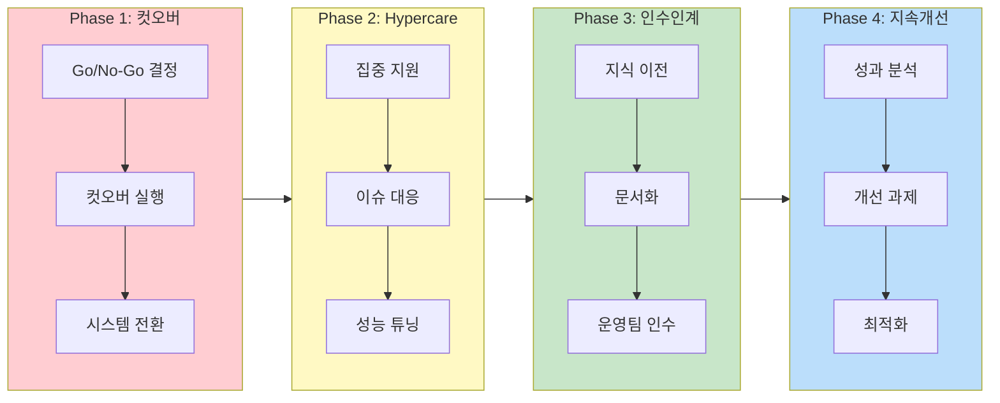

# [6회차] DEPLOY: Go-Live 실행과 운영 안정화

No: 6
난이도: 고급
단계: DEPLOY
상태: 완료
선행 학습: [5회차] BUILD 단계: ERP 구축과 시스템 구현 (%5B5%ED%9A%8C%EC%B0%A8%5D%20BUILD%20%EB%8B%A8%EA%B3%84%20ERP%20%EA%B5%AC%EC%B6%95%EA%B3%BC%20%EC%8B%9C%EC%8A%A4%ED%85%9C%20%EA%B5%AC%ED%98%84%200ad6e8f1bc7543699cacbe1cafb78bba.md)
소요시간(분): 25
중요도: 낮음 (Low)
학습 목표: Go-Live 실행 계획 수립 및 운영 안정화 전략 이해


Go-Live 실행과 런칭

### [7회차] DEPLOY: Go-Live 실행과 운영 안정화

---

---

<aside>
🎯

**학습 목표**

- **컷오버(Go-Live 전환)** 실행 계획 및 체크리스트 습득
- **Hypercare(초기 안정화)** 지원 체계와 이슈 대응 방법 이해
- **운영 인수인계** 프로세스와 산출물 파악
- **지속적 개선(Continuous Improvement)** 방법론 이해
- Go-Live 후 **성과 측정** 및 KPI 관리 방법 학습
</aside>

---

## 1. DEPLOY 단계 개요



<aside>
🚀

**DEPLOY**는 A-E-D-B-**D** 방법론의 마지막 단계로, 구축된 시스템을 **실제 운영 환경에 적용**하고 **안정화**시키는 단계입니다.

**BUILD vs DEPLOY 구분**

- BUILD: 시스템 구현, 테스트, 데이터 준비 → [[5회차] BUILD 단계: ERP 구축과 시스템 구현](%5B5%ED%9A%8C%EC%B0%A8%5D%20BUILD%20%EB%8B%A8%EA%B3%84%20ERP%20%EA%B5%AC%EC%B6%95%EA%B3%BC%20%EC%8B%9C%EC%8A%A4%ED%85%9C%20%EA%B5%AC%ED%98%84%200ad6e8f1bc7543699cacbe1cafb78bba.md) 참조
- DEPLOY: **실제 전환, 안정화, 운영 인계**
</aside>

### 1.1 DEPLOY 단계 타임라인

```jsx
┌─────────────────────────────────────────────────────────────────────────────┐
│                          DEPLOY 단계 타임라인                               │
├─────────────────────────────────────────────────────────────────────────────┤
│                                                                             │
│  [Phase 1]        [Phase 2]         [Phase 3]        [Phase 4]             │
│  컷오버 실행   →   Hypercare     →   운영 인계    →   지속 개선            │
│  (D-Day)         (초기 안정화)     (Handover)      (Optimization)        │
│  1-3일            2-4주            2-4주            지속적                 │
│                                                                             │
│  ┌──────────┐    ┌──────────┐    ┌──────────┐   ┌──────────┐            │
│  │Go-Live   │    │집중 지원  │    │지식 이전  │   │성과 분석  │            │
│  │실행       │    │이슈 대응  │    │문서화     │   │개선 과제  │            │
│  │모니터링   │    │성능 튜닝  │    │운영팀 인수│   │지속 개선  │            │
│  └──────────┘    └──────────┘    └──────────┘   └──────────┘            │
│                                                                             │
└─────────────────────────────────────────────────────────────────────────────┘
```

---

## 2. 컷오버 실행 (Go-Live)

### 2.1 컷오버란?

<aside>
🚨

**컷오버(Cutover)**란 기존 시스템에서 신규 ERP로 업무를 전환하는 **가장 중요하고 리스크가 높은 시점**입니다.

**실패 시 영향**: 업무 중단, 재무 손실, 고객 이탈, 프로젝트 실패

</aside>

### 2.2 컷오버 유형

| **유형** | **설명** | **장점** | **단점** | **적합 상황** |
| --- | --- | --- | --- | --- |
| **Big Bang** | 전 모듈 동시 전환 | 빠른 전환, 이중 운영 없음 | 高 리스크, 높은 복잡도 | 중소기업, 단순 업무 |
| **Phased** | 모듈/사업장별 단계 전환 | 리스크 분산, 학습 적용 | 긴 기간, 이중 운영 비용 | 대기업, 복잡한 업무 |
| **Parallel** | 신/구 시스템 병행 운영 | 안전한 전환, 검증 가능 | 2배 업무 부담, 높은 비용 | 위험 회피 필요 시 |

### 2.3 컷오버 타임라인

```jsx
┌─────────────────────────────────────────────────────────────────────────────┐
│                      컷오버 타임라인 (D-Day 기준)                            │
├─────────────────────────────────────────────────────────────────────────────┤
│                                                                             │
│  D-14        D-7         D-3         D-Day        D+1         D+7          │
│    │          │           │            │           │           │           │
│    │          │           │            │           │           │           │
│ 마스터      교육완료     Legacy      컷오버      초기        안정화        │
│ 이관완료    UAT종료     마감        실행        지원        종료          │
│ 1차검증    최종리허설   잔액확정    Go-Live     집중지원    일상운영      │
│                                                                             │
└─────────────────────────────────────────────────────────────────────────────┘
```

### 2.4 Go/No-Go 의사결정

| **영역** | **Go 기준** | **No-Go 기준** |
| --- | --- | --- |
| **테스트** | Critical/High 결함 0건 | Critical 결함 존재 |
| **데이터** | 대사 완료, 오차 0원 | 대사 불일치, 미이관 데이터 |
| **교육** | 핵심 사용자 교육 완료 | 교육 미완료 |
| **인프라** | 시스템 안정, 성능 확보 | 시스템 불안정 |
| **조직** | 지원 체계 준비 완료 | 지원 인력 미확보 |

### 2.5 컷오버 체크리스트

<aside>
✅

**Go-Live 전 체크리스트**

- [ ]  마스터 데이터 이관 및 검증 완료
- [ ]  기초 재고 이관 및 대사 완료
- [ ]  미결 주문/전표 이관 완료
- [ ]  인터페이스 연계 테스트 완료
- [ ]  사용자 교육 완료 (100%)
- [ ]  권한 설정 완료
- [ ]  **Rollback Plan 준비**
- [ ]  핫라인/지원 체계 가동
</aside>

<aside>
🚀

**Go-Live 후 체크리스트**

- [ ]  시스템 접속 가능 여부
- [ ]  핵심 트랜잭션 실행 가능
- [ ]  인터페이스 정상 작동
- [ ]  이슈 접수 체계 가동
- [ ]  **Critical 이슈 0건**
- [ ]  일일 마감 정상 처리
- [ ]  사용자 Q&A 대응
- [ ]  안정화 보고
</aside>

### 2.6 Rollback Plan

<aside>
⚠️

**Rollback Plan**은 Go-Live 실패 시 기존 시스템으로 복구하는 **비상 계획**입니다.

**필수 포함 내용**:

- Rollback 결정 기준 (언제, 누가)
- 복구 절차 및 담당자
- 데이터 복구 방법
- 사용자 커뮤니케이션 계획
- Rollback 후 재시도 일정
</aside>

| **Rollback 트리거** | **설명** | **의사결정자** |
| --- | --- | --- |
| **데이터 손실** | 핵심 데이터 유실/오류 | PM + 스폰서 |
| **업무 중단** | 핵심 업무 수행 불가 | PM + 스폰서 |
| **성능 문제** | 시스템 응답 지연 지속 | PM + 기술팀 |
| **연동 실패** | 핵심 인터페이스 오류 | PM + 기술팀 |

---

## 3. Hypercare (초기 안정화)

### 3.1 Hypercare란?

<aside>
🏥

**Hypercare**란 Go-Live 직후 **집중적인 지원**을 통해 시스템과 업무를 안정화시키는 기간입니다.

**기간**: 일반적으로 2-4주

**목표**: Critical 이슈 0건, 정상 업무 수행

</aside>

### 3.2 Hypercare 지원 체계

```jsx
┌───────────────────────────────────────────────────────────┐
│                 Hypercare 지원 체계                       │
├───────────────────────────────────────────────────────────┤
│                                                           │
│   [사용자]  →  [1차 지원]  →  [2차 지원]  →  [긴급 대응]   │
│                                                           │
│   이슈 발생     현장 지원      원격 전문가    긴급 패치     │
│                (Key User)    (컨설턴트)    (기술팀)       │
│                                                           │
│   응답 목표    30분 이내     2시간 이내    4시간 이내     │
│                                                           │
└───────────────────────────────────────────────────────────┘
```

### 3.3 이슈 분류 및 대응

| **심각도** | **정의** | **예시** | **해결 기한** | **대응 레벨** |
| --- | --- | --- | --- | --- |
| **Critical** | 업무 중단, 데이터 손실 | 전표 저장 불가, 시스템 다운 | **즉시 (4시간 이내)** | 긴급 패치 + 에스컬레이션 |
| **High** | 주요 기능 장애 | 잘못된 계산, 프로세스 오류 | **24시간 이내** | 우선 처리 + 우회 방안 |
| **Medium** | 일부 기능 장애 (우회 가능) | 조회 오류, 출력 형식 | **1주 이내** | 일반 처리 + 우회 제공 |
| **Low** | 사소한 문제 | UI 개선, 메시지 수정 | **Hypercare 후** | 백로그 관리 |

### 3.4 Hypercare 일일 활동

<aside>
📅

**Hypercare 일일 루틴**

**오전 (09:00)**

- 전일 이슈 현황 공유
- 당일 중점 지원 영역 확인
- 시스템 상태 점검

**주간 (09:00-18:00)**

- 현장 상주 지원
- 이슈 접수 및 대응
- Key User Q&A 지원

**오후 (18:00)**

- 일일 마감 점검
- 이슈 현황 정리
- 다음날 준비 사항 확인
</aside>

### 3.5 Hypercare 종료 기준

| **항목** | **종료 기준** | **측정 방법** |
| --- | --- | --- |
| **Critical 이슈** | 0건 (3일 연속) | 이슈 로그 |
| **High 이슈** | 모두 해결 또는 우회 적용 | 이슈 로그 |
| **일일 마감** | 정상 수행 (5일 연속) | 마감 체크리스트 |
| **사용자 자립도** | 1차 지원으로 80% 해결 | 지원 통계 |

---

## 4. 운영 인수인계 (Handover)

### 4.1 인수인계 목적

<aside>
🤝

**인수인계**란 프로젝트 팀(컨설턴트)에서 **내부 운영팀**으로 시스템 관리 책임을 이전하는 과정입니다.

**성공 기준**: 운영팀이 독립적으로 시스템 관리/지원 가능

</aside>

### 4.2 인수인계 항목

| **영역** | **인수 항목** | **산출물** |
| --- | --- | --- |
| **시스템** | 설정 문서, 개발 문서, 소스코드 | Config 문서, 기술 명세서 |
| **업무** | 프로세스 설계서, 매뉴얼, FAQ | BBP, SOP, 사용자 가이드 |
| **운영** | 모니터링 방법, 장애 대응 절차 | 운영 매뉴얼, 에스컬레이션 체계 |
| **이력** | 이슈 이력, 변경 이력, 테스트 결과 | 이슈 로그, 변경 로그 |

### 4.3 지식 이전 (Knowledge Transfer)

<aside>
📚

**문서화 (Documentation)**

- 설정 문서 (Configuration)
- 개발 문서 (RICEF)
- 운영 매뉴얼
- 사용자 가이드
- FAQ / Troubleshooting
</aside>

<aside>
🎓

**교육 (Training)**

- 운영팀 기술 교육
- 긴급 대응 시나리오
- 모니터링/배치 관리
- 백업/복구 절차
- 패치/업그레이드 방법
</aside>

### 4.4 인수인계 체크리스트

- [ ]  모든 문서 작성 및 검토 완료
- [ ]  운영팀 기술 교육 완료
- [ ]  운영팀 독립 지원 테스트 (1주)
- [ ]  권한 이관 완료
- [ ]  에스컬레이션 체계 확정
- [ ]  인수인계서 서명

---

## 5. 지속적 개선 (Continuous Improvement)

### 5.1 지속적 개선이란?

<aside>
🔄

**지속적 개선**이란 Go-Live 후 시스템과 프로세스를 **지속적으로 최적화**하는 활동입니다.

ERP는 Go-Live가 끝이 아니라 **시작**입니다.

</aside>

### 5.2 개선 과제 유형

| **유형** | **설명** | **예시** | **처리 방법** |
| --- | --- | --- | --- |
| **Phase 2 과제** | 구축 시 보류된 요구사항 | 추가 리포트, 고도화 기능 | 별도 프로젝트 |
| **Quick Fix** | 단순 설정 변경 | 코드 추가, 권한 조정 | 변경 요청 프로세스 |
| **성능 개선** | 시스템 최적화 | 쿼리 튜닝, 인덱스 최적화 | 기술팀 대응 |
| **프로세스 개선** | 업무 효율화 | 승인 단계 축소, 자동화 | PI 프로젝트 연계 |

### 5.3 변경 관리 프로세스

```jsx
[요청]     →     [검토]     →     [승인]     →     [개발/적용]     →     [검증]
                                                                     
현업 요청        영향도 분석     변경위원회      개발 + 테스트       운영 적용
요청서 작성     우선순위화     Go/No-Go      TR 이관            UAT
```

### 5.4 운영 KPI 관리

| **영역** | **KPI** | **목표** | **측정 주기** |
| --- | --- | --- | --- |
| **시스템 안정성** | Uptime | 99.5% 이상 | 월간 |
| **이슈 대응** | Critical 이슈 해결 시간 | 4시간 이내 | 주간 |
| **사용자 만족도** | 지원 만족도 설문 | 4점/5점 이상 | 분기 |
| **프로세스 효율** | 마감 소요 시간 | 목표 대비 ±10% | 월간 |

---

## 6. 성과 측정 및 평가

### 6.1 ERP 프로젝트 성공 기준

<aside>
✅

**정량적 성공 기준**

- 예산 내 완료 (±10%)
- 일정 내 완료 (±2주)
- 목표 KPI 달성 (80% 이상)
- Critical 이슈 0건
</aside>

<aside>
🌟

**정성적 성공 기준**

- 사용자 만족도 높음
- 경영진 만족
- 운영팀 자립 가능
- 지속 개선 문화 정착
</aside>

### 6.2 ROI 분석

<aside>
💰

**ERP ROI 계산**

```
ROI = (Benefits - Costs) / Costs × 100%
```

**Benefits (효과)**

- 재고 감소, 업무 효율화, 마감 단축
- 의사결정 속도 향상, 오류 감소

**Costs (비용)**

- 라이선스, 컨설팅, 교육, 인프라
</aside>

### 6.3 프로젝트 종료 보고서

<aside>
📝

**프로젝트 종료 보고서 목차**

1. **프로젝트 개요** - 범위, 기간, 예산
2. **주요 성과** - 목표 vs 실적
3. **주요 이슈 및 해결** - Lessons Learned
4. **인수인계 현황** - 문서, 교육, 조직
5. **향후 과제** - Phase 2, 개선 과제
6. **감사 및 제언** - 프로젝트 평가
</aside>

---

## 🎯 핵심 Takeaway

<aside>
📌

**1. 컷오버 = 가장 리스크 높은 시점**

- Go/No-Go 기준 명확화
- **Rollback Plan** 필수 준비
- 체크리스트 기반 실행

**2. Hypercare = 집중 지원 기간**

- 2-4주 간 집중 지원 체계 운영
- Critical 이슈 0건이 종료 기준
- 일일 루틴으로 안정화 관리

**3. 인수인계 = 운영팀 자립**

- 단순 문서 전달이 아닌 **지식 이전**
- 독립 지원 테스트로 검증
- 인수인계서로 공식화

**4. 지속적 개선 = ERP의 진정한 가치**

- Go-Live는 끝이 아니라 **시작**
- Phase 2 과제 + 프로세스 개선 지속
- 변경 관리 프로세스 정립
</aside>