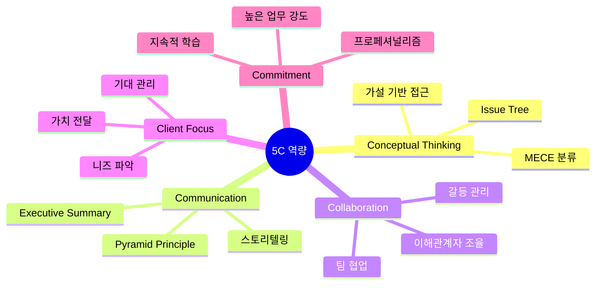
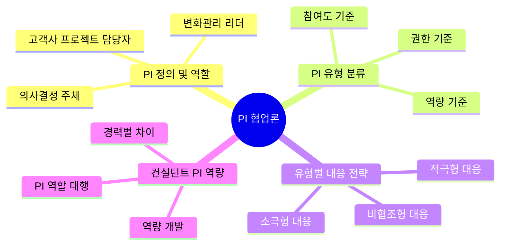
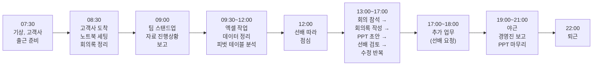
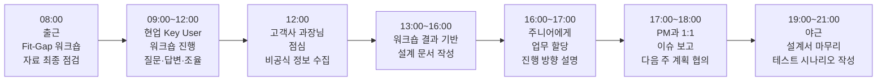
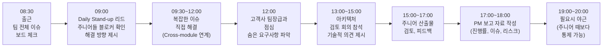
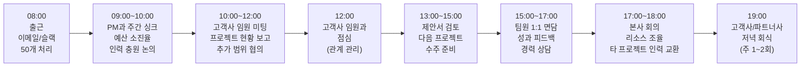
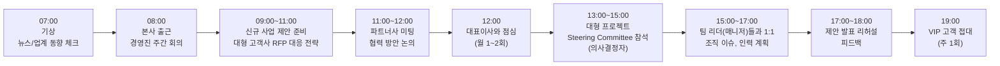
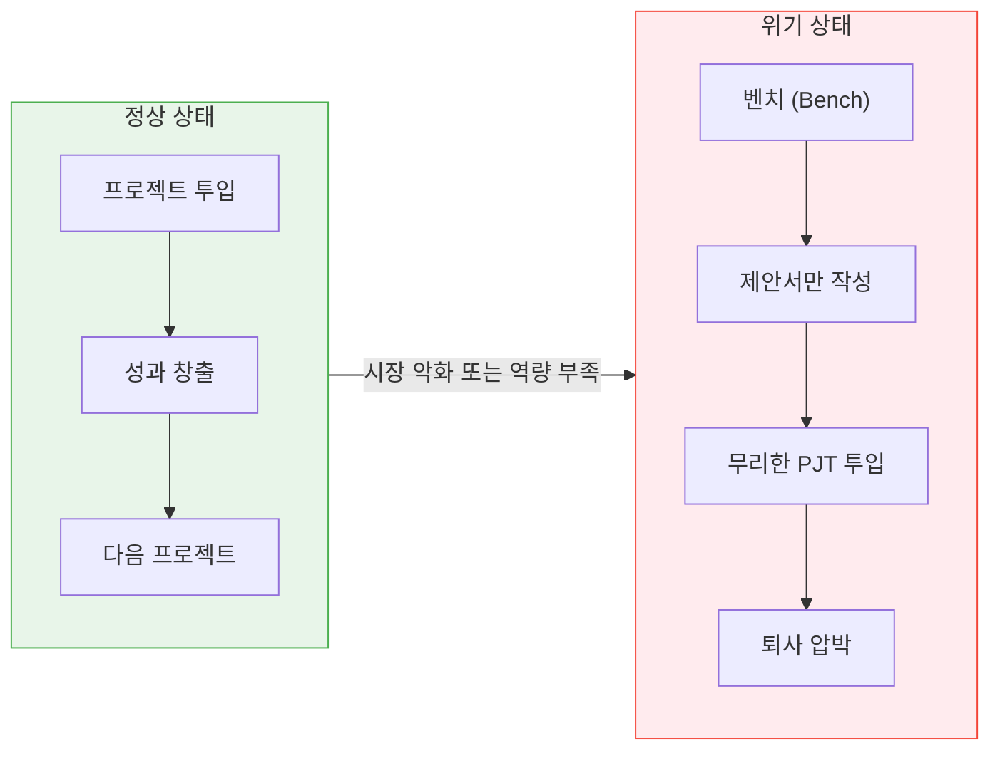

# [7회차] 컨설턴트 역량과 커리어 패스

No: 7
난이도: 초급
단계: Wrap-up
상태: 완료
선행 학습: [1회차] 컨설팅 개요: 산업 구조와 프로젝트 라이프사이클 (%5B1%ED%9A%8C%EC%B0%A8%5D%20%EC%BB%A8%EC%84%A4%ED%8C%85%20%EA%B0%9C%EC%9A%94%20%EC%82%B0%EC%97%85%20%EA%B5%AC%EC%A1%B0%EC%99%80%20%ED%94%84%EB%A1%9C%EC%A0%9D%ED%8A%B8%20%EB%9D%BC%EC%9D%B4%ED%94%84%EC%82%AC%EC%9D%B4%ED%81%B4%201cba38087d154212a68b70a49da58926.md)
소요시간(분): 35
중요도: 중간 (Medium)
학습 목표: 컨설턴트 핵심 역량(5C), PI 협업론 및 유형별 대응 전략, 커리어 경로 이해

컨설턴트 팀워크와 성장

### [8회차] 컨설턴트 역량과 커리어 패스

---

---

<aside>
🎯

**학습 목표**

- **컨설턴트 핵심 역량** 5가지 이해
- **PI(고객사 담당자) 협업론** 및 유형별 대응 전략 습득
- **커리어 패스 및 성장 경로** 파악
- **연봉/처우** 및 업계 현실 인식
- 컨설팅 업계 **진입 경로와 준비 방법** 습득
</aside>

---

## 1. 컨설턴트 핵심 역량 (5C)

<aside>
💡

컨설턴트에게 요구되는 역량은 **5C**로 정리됩니다.

기술적 전문성보다 **문제 해결 능력과 소통 능력**이 더 중요합니다.

</aside>

<aside>
🧠

**1. Conceptual Thinking** (구조화 사고)

복잡한 문제를 단순하게 분해하는 능력

- MECE 분류
- Issue Tree / Logic Tree
- 가설 기반 접근
- 80/20 법칙 적용

**실전 예시**: "재고가 많다"는 문제를 "안전재고 과다 / 불용재고 / 예측 오류 / 발주 정책"으로 MECE 분류

</aside>

<aside>
💬

**2. Communication** (소통 능력)

명확하고 설득력 있게 전달하는 능력

- 경영진 보고 (Executive Summary)
- 현업 인터뷰 (경청 + 질문)
- 프레젠테이션 (스토리텔링)
- 문서 작성 (Pyramid Principle)

**실전 예시**: 30분 보고를 위해 3일간 분석 → 핵심 메시지 3개로 압축

</aside>

<aside>
🤝

**3. Collaboration** (협업 능력)

다양한 이해관계자와 함께 일하는 능력

- 팀 내 협업 (분업 + 통합)
- 고객사 현업 협업
- 다부서 이해관계자 조율
- 갈등 관리

**실전 예시**: 컨설턴트는 고객사 임원진, 현업 실무자, IT, 외부 협력사 등 다양한 이해관계자와 동시에 협업하며 요구사항을 조율

</aside>

<aside>
📊

**4. Client Focus** (고객 중심)

고객의 성공을 최우선으로 하는 태도

- 고객 니즈 파악 (명시적 + 암묵적)
- 기대 관리 (Under Promise, Over Deliver)
- 가치 전달 (ROI 증명)
- 장기 관계 구축

**실전 예시**: 고객이 "보고서"를 요청했지만 실제로 원하는 건 "의사결정 근거"

</aside>

<aside>
⚡

**5. Commitment** (몰입과 끈기)

높은 업무 강도를 견디는 프로페셔널리즘

- 마감 압박 하에서도 품질 유지
- 주 50-60시간+ 근무 (프로젝트 피크 시)
- 지속적 학습 (새로운 산업/기술)
- 출장/이동 (고객사 상주)

**현실**: "Work-Life Balance보다 Work-Life Integration" - 일과 삶의 경계가 모호

</aside>

---

## 2. PI 협업론: 고객사 담당자와의 파트너십

<aside>
🤝

**PI(Process Innovation Owner)**란?

고객사에서 프로젝트를 담당하는 **카운터파트너**입니다.

컨설턴트의 성공은 **어떤 PI를 만나느냐**에 크게 좌우됩니다.

그러나 고객사마다 케바케(Case by Case)이므로, 컨설턴트는 **PI 역할까지 수행할 역량**을 길러야 합니다.

</aside>

### 2.1 PI Owner 정의와 역할

<aside>
📌

**PI Owner란 누구인가?**

- **Process Innovation Owner**
- 고객사 측에서 프로젝트를 주도하는 담당자
- 컨설턴트와 현업 사이의 **브릿지 역할**
- 의사결정, 정보 제공, 변화관리의 핵심 주체
</aside>

<aside>
🏢

**고객사 프로젝트 조직에서의 위치**

- **실무자급 PI**: 실제 업무 수행자, 상세 요구사항 제공
- **관리자급 PI**: 팀장/과장급, 부서 의사결정권
</aside>

<aside>
⚙️

**PI의 핵심 책임**

| **영역** | **책임** | **상세 내용** |
| --- | --- | --- |
| 의사결정 | 요구사항 확정 | 현업 니즈를 취합하여 최종 요구사항 결정 |
| 정보 제공 | 데이터/자료 제공 | As-Is 프로세스, 시스템 정보, 실적 데이터 제공 |
| 조율 | 이해관계자 조율 | 유관부서 간 의견 충돌 조정, 합의 도출 |
| 변화관리 | 현업 동기부여 | 새로운 프로세스/시스템에 대한 현업 설득 및 교육 |
| 품질 검증 | UAT 주도 | 사용자 수용 테스트(UAT) 주도 및 결과 승인 |
</aside>

### 2.2 PI 유형 분류 (MECE 관점)

<aside>
📊

PI를 **3가지 기준**으로 MECE하게 분류합니다.

어떤 유형의 PI를 만나느냐에 따라 프로젝트 전략이 달라집니다.

</aside>

<aside>
💡

**기준 1: 참여도**

| 유형 | 특징 |
| --- | --- |
| **적극형** | 주도적으로 참여, 의견 제시, 빠른 의사결정 |
| **소극형** | 요청시만 반응, 의견 없음, 수동적 태도 |
| **비협조형** | 프로젝트 저항, 지연 유발, 비협조적 태도 |
</aside>

<aside>
🎓

**기준 2: 역량 수준**

| 유형 | 특징 |
| --- | --- |
| **전문가형** | 도메인 지식 풀부, 스스로 문제 해결 |
| **학습형** | 기본 지식 보유, 학습 의지 있음 |
| **역량부족형** | 지식/경험 부족, 판단 어려움 |
</aside>

<aside>
🔑

**기준 3: 권한 수준**

| 유형 | 특징 |
| --- | --- |
| **의사결정권 유** | 즉석 결정 가능, 빠른 진행 |
| **의사결정권 무** | 상위 보고 필수, 지연 발생 |
</aside>

### 2.3 PI 유형별 대응 전략

<aside>
🎯

**PI 유형-전략 매트릭스**

각 유형별로 **컨설턴트가 취해야 할 전략**이 다릅니다.

</aside>

| **참여도  역량** | **전문가형** | **학습형** | **역량부족형** |
| --- | --- | --- | --- |
| **적극형** | 파트너십 구축
상호 존중 기반 협업 | 가이드 제공
함께 성장하는 관계 | 주의 필요
잘못된 방향으로 갈 수 있음 |
| **소극형** | 동기부여 필요
참여 유도 | 단계별 안내
인내심 있는 설명 | 컨설턴트가 리드
PI 역할 대행 |
| **비협조형** | 이해관계 파악
저항 원인 분석 | 상위자 통한 압력
성공 사례 제시 | 스폰서 에스컬레이션
PI 교체 요청 검토 |

<aside>
🟢

**적극형 PI 대응 전략**

- **Best Case**: 파트너십 관계 구축
- 주도권 존중, 의견 적극 반영
- 정기적인 1:1 미팅으로 신뢰 강화
- 성과를 함께 공유하며 동기부여

**주의점**: 전문가형이지만 잘못된 방향으로 갈 수 있으므로 방향성 검증 필수

</aside>

<aside>
🟡

**소극형 PI 대응 전략**

- 참여를 이끌어내는 것이 핵심
- **Why**를 설명: "이게 왜 중요한지" 강조
- 작은 성공 경험을 통해 자신감 부여
- 질문을 통해 의견을 이끌어내기

**실전 팁**: "어떻게 생각하세요?" 대신 "A와 B 중 어느 쪽이 더 적합할까요?"

</aside>

<aside>
🔴

**비협조형 PI 대응 전략**

- 저항의 **근본 원인** 파악이 우선
- 일 증가 우려? 직위 위협? 변화 불편?
- 상위자(스폰서)를 통한 압력 행사
- 성공 사례 제시로 변화 효과 입증

**최후 수단**: PI 교체 요청 (스폰서 통해)

</aside>

### 2.4 컨설턴트의 PI 역할 대행 역량

<aside>
⚠️

**현실**: 고객사마다 PI 수준이 다릅니다 (케바케)

따라서 컨설턴트는 **PI 역할까지 수행할 역량**을 길러야 합니다.

</aside>

<aside>
📉

**PI 공백 상황이란?**

- PI가 바쁘서 프로젝트에 집중 불가
- PI의 역량이 부족하여 의사결정 지연
- PI가 비협조적이거나 저항
- 고객사 내부 정치로 PI가 소외됨
- 프로젝트 중간에 PI가 교체/퇴사
</aside>

<aside>
💪

**컨설턴트가 대행해야 할 PI 역할**

- 현업 의견 수렴 및 조율
- 요구사항 우선순위 제안
- 이해관계자 간 갈등 조정
- 의사결정을 위한 옵션 제시
- 변화관리 리드
</aside>

<aside>
👤

**경력 수준별 PI 대응 역량 차이**

| **구분** | **신입 컨설턴트** | **경력직 컨설턴트** | **시사점** |
| --- | --- | --- | --- |
| 도메인 지식 | 이론 중심, 학습 중 | 실무 경험 풀부, 즉시 적용 | 경력직 유리 |
| 현업 공감 | 현업 고충 이해 어려움 | "저도 해봤습니다" 공감 형성 | 경력직 유리 |
| 의사결정 유도 | 옵션 제시 역량 부족 | 장단점 분석, 추천안 제시 | 경력직 유리 |
| 신뢰 구축 | 시간 소요, 실력 증명 필요 | 빠른 신뢰 획득 (전문성 인정) | 경력직 유리 |
| 정치적 대응 | 조직 정치 파악 어려움 | 암묵적 역학 관계 파악 | 경력직 유리 |
</aside>

### 2.5 PI와의 신뢰 구축 및 갈등 관리

<aside>
✅

**신뢰 구축 5단계**

1. **초기 관계 형성**: 첫 미팅에서 전문성 + 겸손 보이기
2. **Quick Win 창출**: 작은 성공 경험으로 신뢰 확보
3. **약속 이행**: 말한 것은 반드시 지키기
4. **투명한 소통**: 이슈/리스크 숨기지 않기
5. **성공 공유**: 성과를 PI의 공으로 돌리기
</aside>

<aside>
🛡️

**갈등 상황 대응 전략**

1. **감정 분리**: 감정적 반응 억제, 사실 중심 대화
2. **원인 파악**: 왜 갈등이 생겼는지 근본 원인 탐색
3. **옵션 제시**: "이것 아니면 저것" 선택지 제공
4. **에스컬레이션**: 해결 불가 시 상위자 보고
5. **문서화**: 합의 내용 반드시 문서로 남기기
</aside>

<aside>
💬

**PI 커뮤니케이션 실전 팁**

| 상황 | 잘못된 예 | 올바른 예 |
| --- | --- | --- |
| 요구사항 거절 시 | "그건 안 됩니다" | "그 방식은 이런 제약이 있습니다. 대안으로 A와 B가 있는데요" |
| 지연 발생 시 | "고객사에서 답이 안 와서 늦었습니다" | "이 부분은 함께 의사결정이 필요합니다. 오늘 회의에서 확정하면 일정 맞출 수 있습니다" |
| 의견 불일치 시 | "제 생각이 맞습니다" | "두 의견 모두 장단점이 있습니다. 함께 기준을 정해서 평가해볼까요?" |
</aside>

<aside>
🌟

**PI 협업 핵심 Takeaway**

- 어떤 PI를 만나느냐에 따라 프로젝트 성패가 좌우됩니다
- 그러나 PI를 선택할 수 없으므로, **어떤 PI든 대응할 역량**을 길러야 합니다
- 특히 **경력직 컨설턴트**는 PI 역할 대행 역량에서 유리합니다
- 신입도 **도메인 학습 + 소통 스킬 + 조직 정치 이해**로 극복 가능
</aside>

---

## 3. 컨설턴트의 하루 (실제 사례)

<aside>
📅

**ERP구축 프로젝트 중 Senior Consultant의 하루** 
(고객사 상주 기준)

| **시간** | **활동** | **상세 내용** |
| --- | --- | --- |
| 08:30 | 출근/세팅 | 고객사 출근, 이메일/슬랙 확인, 오늘 일정 정리 |
| 09:00 | Daily Stand-up | 팀 미팅: 어제 진행상황, 오늘 계획, 이슈 공유 |
| 09:30-12:00 | 현업 미팅 | 구매/자재관리 Key User와 Fit-Gap 검토 워크숍 |
| 12:00-13:00 | 점심 | 고객사 담당자와 점심 (관계 구축) |
| 13:00-15:00 | 개발/설정 | 어제 확정된 요구사항 Configuration 작업 |
| 15:00-16:00 | 이슈 대응 | 테스트 중 발견된 오류 분석 및 해결 |
| 16:00-17:00 | 문서 작성 | 설계 명세서 업데이트, 회의록 정리 |
| 17:00-18:00 | 팀 싱크 | PM과 주간 진행상황 리뷰, 다음 주 계획 |
| 18:00-19:00 | 저녁 | 팀 저녁 (또는 개인 시간) |
| 19:00-21:00 | 야근 | 밀린 문서 작업, 내일 미팅 준비 (프로젝트 상황에 따라) |
</aside>

<aside>
🔍

**PI (Process Innovation) 프로젝트 중 Consultant의 하루**
(분석 단계 기준)

| **시간** | **활동** | **상세 내용** |
| --- | --- | --- |
| 08:30 | 출근/준비 | 고객사 출근, 오늘 인터뷰 대상자 및 질문지 최종 점검 |
| 09:00 | 팀 미팅 | 어제 인터뷰 결과 공유, 오늘 일정 조율 |
| 09:30-12:00 | 현업 인터뷰 | 구매팀 As-Is 프로세스 인터뷰 (2-3명씩 순차 진행) |
| 12:00-13:00 | 점심 | 인터뷰 대상자와 점심 (비공식 정보 수집) |
| 13:00-15:00 | 인터뷰 정리 | 오전 인터뷰 내용 문서화, 프로세스 맵 초안 작성 |
| 15:00-17:00 | 추가 인터뷰 | 생산관리팀 인터뷰 또는 현장 방문 (공장 견학) |
| 17:00-18:00 | 분석 작업 | Pain Point 정리, 개선 기회 도출, Gap 분석 |
| 18:00-19:00 | 팀 싱크 | PM과 진행상황 공유, 이슈/리스크 보고 |
| 19:00-21:00 | 산출물 작성 | As-Is 프로세스 맵, 인터뷰 결과서, To-Be 방향성 초안 |
</aside>

<aside>
💡

**PI 프로젝트 특징**: ERP 구축 전 단계로, **전 영역을 광범위하게** 분석합니다.

하루에 3-5건의 인터뷰를 진행하며, 빠르게 현황을 파악하는 것이 핵심입니다.

</aside>

<aside>
⚙️

**BPR (Business Process Reengineering) 프로젝트 중 Senior Consultant의 하루** (설계 단계 기준)

| **시간** | **활동** | **상세 내용** |
| --- | --- | --- |
| 08:30 | 출근/데이터 점검 | 고객사 출근, 전일 요청한 데이터 수신 여부 확인 |
| 09:00 | Daily Stand-up | 팀 미팅: 분석 진행상황, 블로커 공유 |
| 09:30-12:00 | 심층 분석 | 특정 영역 Deep Dive - 데이터 분석, 현장 관찰, 문제 원인 추적 |
| 12:00-13:00 | 점심 | 현업 실무자와 점심 (현장 목소리 청취) |
| 13:00-15:00 | 워크숍 | Key User 대상 To-Be 프로세스 설계 워크숍 |
| 15:00-17:00 | 솔루션 설계 | 시스템 개선안 상세 설계, 화면 Mockup 작성 |
| 17:00-18:00 | 이해관계자 조율 | 유관 부서 협의 (IT팀, 현업팀 간 요구사항 조율) |
| 18:00-19:00 | 문서 작업 | 개선안 설계서, ROI 분석, 실행 계획 수립 |
| 19:00-21:00 | 보고서 작성 | 경영진 보고용 Executive Summary, 주간 보고서 |
</aside>

<aside>
💡

**BPR 프로젝트 특징**: **특정 영역을 깊이 있게** 분석하고 고도화합니다.

PI보다 인터뷰 수는 적지만, 데이터 분석과 현장 관찰에 더 많은 시간을 투자합니다.

실제 정량적 효과(예: 재고 감소, 리드타임 단축)를 증명해야 합니다.

</aside>

### PI vs BPR 프로젝트 일과 비교

| **구분** | **PI 프로젝트** | **BPR 프로젝트** |
| --- | --- | --- |
| **하루 인터뷰 수** | 3-5건 (다수 부서) | 1-2건 (동일 영역 심층) |
| **주요 활동** | 인터뷰, 프로세스 매핑 | 데이터 분석, 현장 관찰, 솔루션 설계 |
| **산출물 특징** | 전사 프로세스 맵, ERP 요구사항 | 개선안 상세 설계, ROI 분석 |
| **야근 패턴** | 인터뷰 정리 + 다음날 준비 | 분석 작업 + 경영진 보고서 |
| **고객 접점** | 다양한 부서 담당자 | 특정 영역 Key User + 의사결정권자 |

---

## 4. 커리어 패스 (운영 컨설팅 기준)

### 4.1 레벨별 역할과 연봉

[제목 없음](%5B7%ED%9A%8C%EC%B0%A8%5D%20%EC%BB%A8%EC%84%A4%ED%84%B4%ED%8A%B8%20%EC%97%AD%EB%9F%89%EA%B3%BC%20%EC%BB%A4%EB%A6%AC%EC%96%B4%20%ED%8C%A8%EC%8A%A4/%EC%A0%9C%EB%AA%A9%20%EC%97%86%EC%9D%8C%202ca87a1932c48047b908c80502a5cb1d.csv)

| **레벨** | **연차** | **역할** | **핵심 업무** |
| --- | --- | --- | --- |
| **Associate** | 0-2년 | 실무 담당 | ·자료 수집/분석
 문서 작성/회의록
 시니어 보조 |
| **Consultant** | 3-5년 | 모듈 담당 | ·특정 모듈 설계/구현
 Key User 교육
 이슈 해결 |
| **Senior Consultant** | 5-8년 | 복수 모듈 총괄 | ·복수 모듈 총괄
 주니어 멘토링
 고객 직접 대응 |
| **Manager** | 8-12년 | 영역 리더 | ·영역 총괄
 팀 관리
 고객 관계 관리 |
| **Senior Manager** | 12-15년 | 프로젝트 관리 | ·PM/IM 역할
프로젝트 총괄
 품질/리스크 관리 |
| **Director** | 15-18년 | 사업 책임 | ·PM/IM 역할
 프로젝트 총괄
 전략적 의사결정 |
| **Senior Director** | 18-20년 | 상무 |  대형 프로젝트 액팅 PM
 대형 프로젝트 총괄 |
| **Partner/임원** | 20년+ | 경영진 | ·영업/수주
·사업부 경영
 대외 영업
 전략적 의사결정 |

<aside>
💰

**참고**: 연봉은 회사, 성과, 프로젝트에 따라 크게 다릅니다.

</aside>

### 4.2 승진 소요 기간

<aside>
📈

레벨 간 승진에 필요한 **평균 소요 기간**입니다.

성과와 조직 상황에 따라 빠르거나 느릴 수 있습니다.

</aside>

| **승진 단계** | **소요 기간** | **특징** |
| --- | --- | --- |
| Associate → Consultant | 1-2년 | 거의 자동 승진, 기본 역량 검증 |
| Consultant → Senior Consultant | 2-3년 | 성과 기반, 독립적 업무 수행 능력 필요 |
| Senior Consultant → Manager | 2-3년 | 이직 많은 시기, 리더십 검증 |
| Manager → Senior Manager | 3-4년 | PM 역할 수행, 영업/수주 참여 시작 |
| Senior Manager → Director | 4-5년 | **경쟁 치열**, 파트너 트랙 진입, 사업 책임 시작 |
| Director → Partner | 3-5년 | **매우 제한적**, 실적+정치력+운 필요 |

### 4.3 연차별 커리어 라이프 (구체적 시나리오)

<aside>
🎬

각 단계에서 **실제로 어떤 삶을 살게 되는지** 구체적으로 그려봅니다.

대학생과 주니어가 5년 후, 10년 후 자신의 모습을 상상할 수 있도록 작성했습니다.

</aside>

---

### 🟢 Associate (0~2년차) — "스펀지 모드"

<aside>
👶

**페르소나**: 김신입 (26세, 입사 1년차)

</aside>

**일상 스케줄**

**성장 포인트**

- 엑셀/PPT 속도가 비약적으로 향상
- 회의록 쓰면서 업무 흐름 파악

**속마음**

> *"이게 맞나 싶다가도, 6개월 전 나와 지금 나를 비교하면 확실히 늘었다. 아직은 버틸 만하다."*
> 

---

### 🔵 Consultant (3~5년차) — "한 우물 파기"

<aside>
🧑‍💼

**페르소나**: 박컨설 (29세, 입사 4년차)

</aside>

**일상 스케줄**

**역할 변화**

- **담당자 → 책임자**
- **고객 직접 대응**: Key User 질문에 직접 답변, 신뢰 구축

**고민**

> *“이제 조금 알겠다.” (하지만 큰 그림은 아직 못 봄)*
> 

---

### 🟣 Senior Consultant (5~8년차) — "팀의 허리"

<aside>
🧑‍🏫

**페르소나**: 이시니어 (33세, 입사 7년차)

</aside>

**일상 스케줄**

**책임의 무게**

- **품질 책임**: 내 파트에서 결함 나오면 내 책임
- **사람 관리**: 주니어 1~2명의 성장과 이탈 방지
- **고객 신뢰**: "이시니어가 하면 된다"는 평판 구축

**분기점**

> *"이제 선택해야 한다. 계속 컨설팅에서 Manager 가려면 더 큰 영역을 이끌고, 관리도 해야 하고... 고객사 제안 받았는데, WLB 생각하면 솔깃하다. 결혼도 했고."*
> 

---

### 🟠 Manager (8~12년차) — "사람과 숫자 관리"

<aside>
👔

**페르소나**: 최매니저 (38세, 입사 10년차)

</aside>

**일상 스케줄**

**업무 본질 변화**

- **실무 → 관리**
- **기술 → 사람**
- **단기 → 장기**: 이번 프로젝트 + 다음 프로젝트 동시 생각

**현실**

> *"예전엔 기술로 승부했는데, 이제 슬슬 관계가 중요하고 숲을 보는 시야가 중요하다. 고객 비위, 본사 눈치, 팀원 관리... 에너지 소모가 다른 방향으로 간다. 그래도 연봉은 확실히 올랐다."*
> 

---

### 🔴 Senior Manager ~ Director (12~18년차) — "사업가의 영역"

<aside>
🎩

**페르소나**: 정디렉터 (45세, 입사 16년차)

</aside>

**일상 스케줄**

**고민의 차원**

- **시장**: 우리 Practice가 3년 후에도 유효한가?
- **조직**: 핵심 인재 이탈 방지, 후계자 양성
- **수주**: 올해 목표 매출 달성할 수 있나?
- **경쟁**: 경쟁사가 저가로 치고 들어오면?

**속마음**

> *"이제 책임은 더 무거워졌다. 잘못되면 내 이름이 걸린다. 대신 성공하면 올라간다"*
> 

---

### ⚫ Partner (20년+) — "경영자"

<aside>
👑

**페르소나**: 한파트너 (52세, 파트너 3년차)

</aside>

**역할**

- 회사 지분 보유 (또는 P&L 책임)
- 대형 고객사 최종 의사결정권자
- 신규 서비스/시장 개척
- 업계 오피니언 리더

**일상**

- 고정된 일과 없음, 전략적 판단 중심
- 주요 고객사 CEO/임원과 골프/식사
- 업계 포럼 기조연설
- 글로벌 파트너 회의 (연 2~4회 해외)

**도달률**

> *"Associate 100명 중 Partner까지 가는 사람은 1~2명. 실력만으로 안 되고, 운과 타이밍, 정치력이 모두 필요하다."*
> 

---

## 5. 커리어 분기점과 Exit 옵션

<aside>
🔀

컨설턴트 경력 5-8년차에 **중요한 커리어 분기점**이 옵니다.

</aside>

### 5.1 Exit 옵션 비교

| **옵션** | **장점** | **단점** | **적합한 사람** |
| --- | --- | --- | --- |
| **컨설팅 잔류** | • 다양한 프로젝트 경험
• 높은 연봉 성장
• 넓은 네트워크 | • WLB 어려움
• 승진 경쟁 치열
• 번아웃 리스크 | 성장 욕구 강하고
변화를 즐기는 사람 |
| **고객사 이직**
(현업 전환) | • 안정적 근무환경
• 깊은 전문성
• WLB 개선 | • 연봉 정체 가능
• 경험 범위 축소
• 조직 정치 | 특정 산업/기능에
관심 있는 사람 |
| **스타트업** | • 스톡옵션
• 빠른 의사결정
• 넓은 역할 | • 높은 리스크
• 연봉 하락 가능
• 체계 부족 | 창업 마인드
있는 사람 |
| **프리랜서** | • 높은 일당
• 유연한 일정
• 프로젝트 선택권 | • 불안정한 수입
• 복지 없음
• 영업 필요 | 전문성 확보한
시니어 |

### 5.2 실제 커리어 사례

<aside>
👤

**사례 1: 고객사 전환**

- 대기업 SI 7년차 Senior
- 구매 실무 전문가
- 제조업 고객사 구매팀장으로 이직
- 연봉 비슷, WLB 대폭 개선
- "프로젝트마다 바뀌는 게 지쳤다"
</aside>

<aside>
👤

**사례 2: 컨설팅 잔류**

- 글로벌 펌 12년차 Director
- SCM 전문가로 포지셔닝
- 아시아 리드 역할
- 연봉 1.5억+, 출장 많음
- "새로운 문제 푸는 게 재밌다"
</aside>

<aside>
👤

**사례 3: 스타트업 전환**

- 대기업 SI 5년차 Consultant
- 물류 스타트업 CPO로 합류
- 연봉 20% 하락 + 스톡옵션
- 1년 후 시리즈B, 스톡 가치 상승
- "내 손으로 만드는 게 좋다"
</aside>

<aside>
👤

**사례 4: 프리랜서 전환**

- 대기업 SI 10년차 Manager 퇴사
- SAP MM 프리랜서
- 일당 70-100만원
- 연 8-9개월 프로젝트
- "쉬고 싶을 때 쉴 수 있다"
</aside>

<aside>
👤

**사례 5: 컨설팅펌 간 이직 + 본부 이동**

- K사 출신, 해당 영역 1위인 P사로 이직
- 함께 제안서 쓰던 선배가 "이 영역 재미없고 커리어와 안 맞다"며 이탈 → 현실 충격
- EY 이직 고려 중 본부 이동 기회
- 현재: 전략 프로젝트에 집중
- **"같은 펌 안에서도 방향 전환이 가능하다"**
</aside>

<aside>
💡

**사례 5의 시사점**

- **펌 간 이직**: 전문 영역을 키우려면 해당 영역 강자로 이동하는 것이 유리
- **현실 인식**: 같은 팀에서도 커리어 방향은 개인마다 다름
- **대안 탐색**: 이직만이 답이 아님 — 사내 본부 이동도 유효한 옵션
- **유연성**: 컨설팅 커리어는 고정된 길이 아닌 선택의 연속
</aside>

---

## 6. 컨설팅 업계 진입 방법

### 6.1 진입 경로

| **경로** | **대상** | **준비 사항** | **난이도** |
| --- | --- | --- | --- |
| **신입 공채** | 대졸 신입 | • 학점 3.7+
• 인턴/대외활동
• Case Interview | ⭐⭐⭐⭐ |
| **경력 채용** | 산업체 경력자 | • 관련 업무 경험 3년+
• 도메인 전문성
• 프로젝트 경험 | ⭐⭐ |

### 6.2 면접 준비 팁

<aside>
📝

**Case Interview 준비**

운영 컨설팅 면접에서는 전략 컨설팅만큼 어려운 케이스는 나오지 않지만, 기본적인 구조화 사고는 필수입니다.

</aside>

**자주 나오는 질문 유형**:

1. **경험 기반**: "가장 어려웠던 프로젝트와 해결 방법은?"
2. **상황 대응**: "고객이 무리한 요구를 하면 어떻게 대응하겠는가?"
3. **기술 질문**: “BTP의 핵심 기능은?"
4. **케이스**: "A사의 재고가 과다합니다. 원인과 해결책은?"

**준비 방법**:

- [ ]  STAR 기법으로 경험 정리 (Situation-Task-Action-Result)
- [ ]  지원 회사의 최근 프로젝트 조사
- [ ]  해당 산업/기능 기본 지식 학습
- [ ]  Mock Interview 3회 이상 연습

---

## 7. 컨설팅의 장단점 (솔직한 현실)

<aside>
✅

**장점**

- **빠른 성장**: 다양한 산업/프로젝트 경험
- **높은 연봉**: 동기 대비 20-30% 높음
- **넓은 네트워크**: 다양한 고객사/동료
- **Exit 옵션**: 어디로든 이직 용이
- **문제 해결 능력**: 어떤 문제든 접근 가능
- **전문성**: 특정 분야 전문가로 성장
</aside>

<aside>
❌

**단점**

- **WLB 어려움**: 야근/주말 근무 빈번
- **출장 많음**: 고객사 상주, 가정과 분리
- **불확실성**: 프로젝트 종료 후 다음 프로젝트
- **정치**: 고객사/팀 내 이해관계 조율
- **번아웃**: 지속적인 고강도 업무
- **Up or Out**: 승진 못하면 이탈 압박
</aside>

---

## 8. 컨설팅펌 리스크와 생존 전략 (현실 인식)

<aside>
⚠️

컨설팅펌에서 일하려면 반드시 알아야 할 **현실적인 리스크**가 있습니다.

**"회사가 나를 지켜줄 것"**이라는 순진한 기대는 버려야 합니다.

</aside>

### 8.1 펌의 영속성은 보장되지 않는다

<aside>
🏢

**컨설팅펌은 영원하지 않습니다.**

글로벌 펌이라도 특정 국가에서 철수하거나 사업을 재편하는 일이 빈번합니다.

</aside>

### 한국 시장 철수/재편 사례

| **펌** | **시기 및 상황** | **상세 내용** |
| --- | --- | --- |
| **베어링포인트** | 2010년 삼정KPMG에 인수 | • 미국 본사 경영 악화로 글로벌 구조조정
• 삼정KPMG가 한국 법인 인수, 120여명 고용 승계
• 이후 한국에서 베어링포인트 브랜드 소멸 |
| **액센츄어** | 2020년대 초 메타넷에 매각 | • 글로벌 1위 펌이었으나 한국 컨설팅 사업 철수
• IT 아웃소싱은 유지, 컨설팅 사업부 매각
• 현재 한국에서 전략/운영 컨설팅 사업 미운영 |
| **삼정KPMG** | 2013년 컨설팅 100억대 손실 | • 베어링포인트 인수 후 시너지 실패
• 인력 670명 → 439명으로 급감
• 이후 구조조정 및 사업 재편 |

<aside>
⚠️

**시사점: 펌의 영속성은 보장되지 않는다**

- 글로벌 1위 펌도 철수할 수 있음
- Big4도 대규모 손실과 구조조정 경험
- 인수합병 후 브랜드 소멸 사례 빈번
- **결론**: 펌에 대한 충성보다 **본인의 시장 가치**를 높이는 데 집중
</aside>

<aside>
💡

**Point**: 현재 잘 나가는 펌도 10년 후를 보장할 수 없습니다.

펌에 대한 충성보다 **본인의 시장 가치**를 높이는 데 집중해야 합니다.

</aside>

### 8.2 컨설턴트 고용의 현실

<aside>
👤

컨설턴트는 **정규직이지만 마음 편히 있을 수 있는 자리가 아닙니다.**

시장 상황과 개인 역량에 따라 언제든 위기가 올 수 있습니다.

</aside>

<aside>
📉

**벤치(Bench) 상태란?**

- 프로젝트에 투입되지 못하고 **본사 대기**
- 마케팅용 제안서 작성, 내부 업무 등 할당
- 길어지면 "쓸모없는 사람" 낙인
- 연속 벤치 시 퇴사 압박 시작
</aside>

<aside>
🚪

**퇴사 압박의 형태**

- 본인 역량과 무관한 **무리한 프로젝트** 투입
- 성공 가능성 낮은 PJT에 배치
- 연봉 동결 / 승진 누락
- 은근한 권고사직 압박
</aside>

### 8.3 생존 전략: 능력이 곧 보험

<aside>
🛡️

컨설팅펌에서 살아남으려면 **"회사가 나를 지켜줄 것"**이라는 생각을 버려야 합니다.

능력이 곧 보험이고, 시장 가치가 곧 안전망입니다.

</aside>

| **전략** | **구체적 행동** | **기대 효과** |
| --- | --- | --- |
| **역량 개발** | • 특정 영역 전문성 구축
• 자격증/인증 취득
• 새로운 기술/트렌드 학습 | 시장에서 대체 불가능한 인재로 포지셔닝 |
| **네트워크 구축** | • 고객사 담당자와 관계 유지
• 동종업계 인맥 관리
• 헤드헌터 채널 확보 | 위기 시 빠른 이직 기회 확보 |
| **Exit 옵션 준비** | • 이력서 상시 업데이트
• 시장 동향 파악
• 고객사 제안 검토 | 언제든 움직일 수 있는 유연성 확보 |
| **재무적 준비** | • 6개월 이상 비상금 확보
• 과도한 지출 자제 | 실직 시에도 여유 있는 구직 활동 가능 |

<aside>
💬

**현직자의 조언**

> "컨설팅펌에서 10년 넘게 일하면서 느낀 건, **회사는 결국 나를 지켜주지 않는다**는 것입니다.
> 

> 시장이 좋을 때는 모두가 스타지만, 나빠지면 가장 먼저 정리되는 것도 컨설턴트입니다.
> 

> **내 능력과 네트워크만이 진짜 안전망**입니다."
> 
</aside>

---

## 🎯 핵심 Takeaway

<aside>
📌

**1. 5C 역량 = 컨설턴트의 무기**

- Conceptual Thinking + Communication이 핵심
- 기술보다 **문제 해결 능력**이 차별화 포인트

**2. PI 협업 = 프로젝트 성패의 핵심**

- 어떤 PI를 만나는냐에 따라 프로젝트 성패 좌우
- 고객사마다 케바케이므로 **PI 역할 대행 역량** 필수
- 경력직 컨설턴트가 PI 대응에서 유리

**3. 커리어 = 선택의 연속**

- 5-8년차에 중요한 분기점
- 컨설팅 잔류 / 고객사 / 스타트업 / 프리랜서
- 어느 쪽이든 컨설팅 경험은 **평생 자산**

**4. 진입 준비**

- 신입: Case Interview + 인턴 경험
- 경력: 도메인 전문성 + 프로젝트 경험
- 공통: **구조화 사고 훈련**이 핵심

**5. 현실 인식**

- 높은 연봉과 빠른 성장의 대가는 **시간과 에너지**
- 5년은 해봐야 컨설팅이 맞는지 알 수 있음
- "컨설팅은 직업이 아니라 **수련 과정**"
</aside>

---

<aside>
💼

**사업기획 직무 연계**

본 회차의 **컨설턴트 역량과 커리어 패스**는 사업기획 직무의 **핵심 역량 개발 및 커리어 설계** 영역과 연결됩니다.

| 컨설팅 역량 | 사업기획 적용 |
| --- | --- |
| 5C 역량 (Conceptual Thinking) | 사업 기회안 구조화, 이슈 분석 |
| Communication | 경영진 보고, 이해관계자 설득 |
| Client Focus | 고객/시장 니즈 파악, 가치 전달 |
| 커리어 패스 이해 | 사업기획 직무 내 성장 경로 설계 |
| Exit 옵션 분석 | 컨설팅 경험 후 사업기획 직무 이동 가능성 |

**활용 포인트**: 컨설턴트 **5C 역량**은 사업기획자에게도 필수 역량이며, 특히 **구조화 사고와 커뮤니케이션 능력**은 경영진 보고 및 사업 제안에 직결됩니다.

</aside>