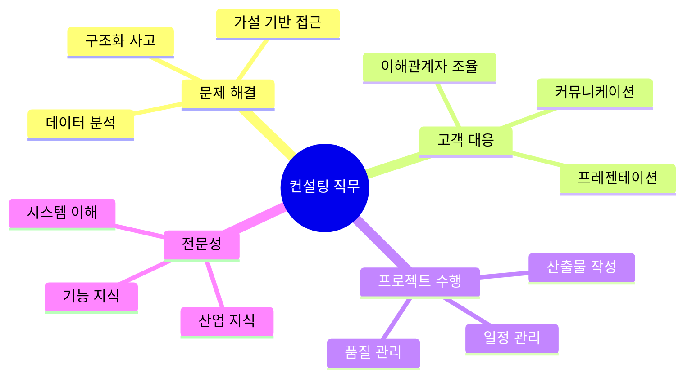
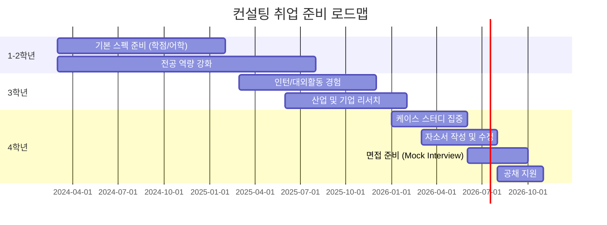
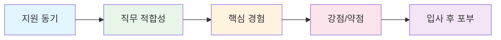
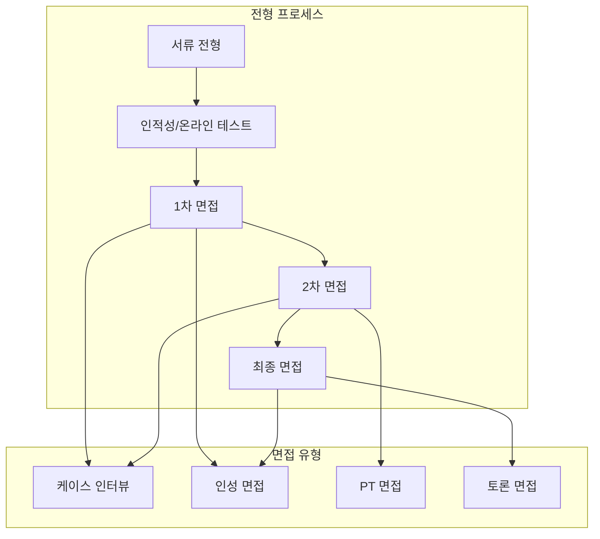

# [8회차] 컨설팅펌 취업 실전 전략

No: 8
난이도: 초급
단계: Interview Prep
상태: 완료
선행 학습: [7회차] 컨설턴트 역량과 커리어 패스 (%5B7%ED%9A%8C%EC%B0%A8%5D%20%EC%BB%A8%EC%84%A4%ED%84%B4%ED%8A%B8%20%EC%97%AD%EB%9F%89%EA%B3%BC%20%EC%BB%A4%EB%A6%AC%EC%96%B4%20%ED%8C%A8%EC%8A%A4%2023fcdb3ddfa04804befd967dd638e050.md)
소요시간(분): 30
중요도: 낮음 (Low)
학습 목표: 컨설팅 취업을 위한 실전 준비 전략 수립 및 자기소개서/면접 대비

취업 준비와 면접 전략

### [9회차] 컨설팅 취업 실전 전략

---

---

<aside>
🎯

**학습 목표**

- 컨설팅 **직무 특성과 필수 역량** 재정리
- **현직자 관점의 취업 준비 타임라인** 이해
- **스펙 & 이력서 준비 로드맵** 수립
- **자기소개서 작성 전략** 습득
- **면접(케이스/인성) 대비 전략** 체득
</aside>

---

## 1. 컨설팅 직무 Overview

<aside>
📌

**8회차 복습 연계**

직무 상세 및 워크플로우는 [[7회차] 컨설턴트 역량과 커리어 패스](%5B7%ED%9A%8C%EC%B0%A8%5D%20%EC%BB%A8%EC%84%A4%ED%84%B4%ED%8A%B8%20%EC%97%AD%EB%9F%89%EA%B3%BC%20%EC%BB%A4%EB%A6%AC%EC%96%B4%20%ED%8C%A8%EC%8A%A4%2023fcdb3ddfa04804befd967dd638e050.md)를 참조하세요.

본 회차에서는 **취업 실전 관점**으로 재구성합니다.

</aside>

### 1.1 컨설팅 직무 핵심 키워드

<aside>
💼

**운영 컨설팅**

- **핵심**: 프로세스 개선 + 시스템 구축
- **일상**: 고객사 상주, 현업 미팅, 설계/개발
- **역량**: 도메인 지식 + 기술 이해 + 소통
</aside>

<aside>
📊

**전략 컨설팅**

- **핵심**: 경영 전략 수립 + 의사결정 지원
- **일상**: 데이터 분석, 인터뷰, 보고서 작성
- **역량**: 논리력 + 분석력 + 스토리텔링
</aside>

### 1.2 취업 시 평가받는 5대 역량 (5C 재정리)

| **역량** | **정의** | **취업 시 어필 포인트** |
| --- | --- | --- |
| **Conceptual** | 구조화 사고 | MECE 분류, 문제 정의, 가설 수립 경험 |
| **Communication** | 명확한 전달 | 발표 경험, 보고서 작성, 설득 사례 |
| **Collaboration** | 팀워크 | 팀 프로젝트, 갈등 해결, 리더/팔로워 경험 |
| **Client Focus** | 고객 중심 | 니즈 파악, 서비스 경험, 피드백 반영 사례 |
| **Commitment** | 몰입과 끈기 | 높은 목표 달성, 어려움 극복, 지속적 학습 |

---

## 2. 현직자의 취업준비 전략

<aside>
💡

현직 컨설턴트들이 공통적으로 강조하는 **3가지 마인드셋**입니다.

</aside>

<aside>
1️⃣

**"스펙보다 경험의 깊이"**

- 단순 나열 X → **임팩트 있는 경험 2-3개**에 집중
- "무엇을 했나"보다 **"왜, 어떻게, 결과는"**이 중요
- 실패 경험도 OK → 학습 포인트가 핵심
</aside>

<aside>
2️⃣

**"Why 컨설팅?에 대한 명확한 답"**

- 막연한 동경 X → **구체적 동기** 필수
- "다양한 산업 경험" (X) → "특정 문제를 구조화해서 해결하고 싶다" (O)
- 본인 경험과 연결된 **진정성** 있는 스토리
</aside>

<aside>
3️⃣

**"준비는 빠를수록 좋다"**

- 3학년부터 인턴/대외활동 경험 쌓기
- 케이스 스터디는 **최소 3개월** 연습
- 산업/기업 리서치는 **지원 전 6개월** 시작
</aside>

### 2.1 취업 준비 타임라인 (대학생 기준)

<aside>
⏰

**시기별 핵심 액션**

</aside>

| **시기** | **핵심 활동** | **상세 내용** |
| --- | --- | --- |
| **1-2학년** | 기초 역량 확보 | • 학점 3.5+ 유지
• 어학 (OPIc IM2+, TOEIC 850+)
• 엑셀/PPT 기본기 |
| **3학년 상반기** | 경험 쌓기 | • 인턴십 지원 (컨설팅펌)
• 학회/공모전 참여
• 산업 분석 프로젝트 |
| **3학년 하반기** | 방향 설정 | • 전략 vs 운영 방향 결정
• 타겟 펌 리스트업
• 선배/현직자 커피챗 |
| **4학년 상반기** | 집중 준비 | • 케이스 스터디 (주 3회 이상)
• 자소서 초안 작성
• Mock Interview 시작 |
| **4학년 하반기** | 실전 돌입 | • 하반기 공채 지원
• 면접 집중 연습
• 피드백 기반 보완 |

---

## 3. 스펙 & 이력서 준비 로드맵

### 3.1 컨설팅펌이 보는 스펙 우선순위

<aside>
📋

스펙은 **Threshold(최소 기준)** 역할입니다.

기준을 넘으면 **경험의 질**로 승부합니다.

</aside>

| **우선순위** | **항목** | **최소 기준** | **경쟁력 기준** |
| --- | --- | --- | --- |
| 1 | **학점** | 3.0/4.5 이상 | 3.7/4.5 이상 |
| 2 | **어학** | OPIc IM2 / TOEIC 850 | OPIc IH / TOEIC 900+ |
| 3 | **경험** | - | 관련 인턴 1회 이상 + 리더 경험 |
| 4 | **학력** | 4년제 대졸 | 상위권 대학 / 관련 전공 |

### 3.2 이력서 작성 핵심 원칙

<aside>
✅

**DO (해야 할 것)**

- **정량화**: "매출 15% 증가 기여"
- **액션 동사**: "기획, 분석, 리드, 개선"
- **역할 명시**: "팀장으로서..."
- **1페이지 원칙**: 핵심만 압축
- **최신순 정렬**: 가장 최근 경험 먼저
</aside>

<aside>
❌

**DON'T (하지 말 것)**

- 모호한 표현: "다양한 업무 수행"
- 나열식 서술: "A, B, C 담당"
- 과도한 스펙 자랑
- 오타/문법 오류
- 비관련 경험 과다 포함
</aside>

### 3.3 경험별 어필 포인트 예시

| **경험 유형** | **Bad Example ❌** | **Good Example ✅** |
| --- | --- | --- |
| **인턴** | "데이터 분석 업무 수행" | "고객 이탈 데이터 분석으로 이탈률 12% 감소 기여, 경영진 보고 주도" |
| **프로젝트** | "팀 프로젝트 참여" | "5인 팀 PM으로 8주간 재고 최적화 프로젝트 수행, 재고비용 20% 절감안 도출" |
| **대외활동** | "마케팅 학회 활동" | "마케팅 학회 기획팀장, 월 2회 케이스 스터디 운영, 신입 교육 커리큘럼 설계" |

---

## 4. 자기소개서 작성 전략

<aside>
📝

자기소개서는 **"왜 이 사람을 뽑아야 하는가?"**에 대한 답입니다.

칭찬이 아닌 **기여 가능성**을 보여주세요.

</aside>

### 4.1 컨설팅 자소서 핵심 항목

### 4.2 항목별 작성 가이드

<aside>
1️⃣

**지원 동기 (Why Consulting? Why This Firm?)**

</aside>

**작성 공식**

1. **계기**: 컨설팅에 관심 갖게 된 구체적 경험
2. **연결**: 본인 역량/가치관과의 연결
3. **Why This Firm**: 해당 펌만의 차별점
4. **기여**: 입사 후 어떤 가치를 더할 것인지

**예시 구조**

> "학부 시절 A 프로젝트에서 복잡한 재고 문제를 MECE로 분류하여 해결한 경험이 있습니다. 이 과정에서 **구조화된 문제 해결**의 매력을 느꼈고, 이것이 업(業)이 되는 컨설팅에 지원하게 되었습니다. 특히 귀사의 **제조/공급망 전문성**과 **데이터 기반 접근**은 제 경험과 부합합니다."
> 

<aside>
2️⃣

**핵심 경험 (STAR 기법 활용)**

</aside>

| **단계** | **질문** | **작성 팁** |
| --- | --- | --- |
| **S**ituation | 어떤 상황이었나? | 배경을 1-2문장으로 간결하게 (언제, 어디서, 무슨 문제) |
| **T**ask | 무엇을 해야 했나? | 본인의 역할과 목표를 명확히 |
| **A**ction | 무엇을 했나? | **가장 중요** - 구체적 행동, 본인만의 차별화 포인트 |
| **R**esult | 결과는? | 정량적 성과 + 배운 점 (실패해도 학습 포인트 강조) |

<aside>
3️⃣

**강점/약점**

</aside>

**강점 작성 원칙**

- 5C 역량 중 1-2개와 연결
- 추상적 단어 X → **구체적 사례로 증명**
- "저의 강점은 끈기입니다" (X)
- "6개월간 매일 1시간 케이스 스터디를 수행한 경험이 있습니다" (O)

**약점 작성 원칙**

- 치명적 약점 X (예: "시간 관리 못함")
- **개선 노력 + 성장** 스토리 포함
- 장점을 가장한 약점 X ("너무 완벽주의")
- 진정성 있되 **관리 가능한** 약점 선택

### 4.3 자소서 체크리스트

- [ ]  **두괄식**: 첫 문장에 핵심 메시지가 있는가?
- [ ]  **구체성**: 추상적 표현 없이 사례로 증명했는가?
- [ ]  **정량화**: 숫자로 성과를 표현했는가?
- [ ]  **일관성**: 이력서와 스토리가 연결되는가?
- [ ]  **차별화**: "나만의" 경험/관점이 드러나는가?
- [ ]  **분량**: 각 항목별 지정 분량을 준수했는가?
- [ ]  **맞춤법**: 오타/문법 오류가 없는가?

---

## 5. 면접 준비 전략

### 5.1 컨설팅 면접 유형

### 5.2 케이스 인터뷰 준비

<aside>
🧩

**케이스 인터뷰**는 구조화 사고력을 평가합니다.

정답보다 **접근 방식과 논리 전개**가 핵심입니다.

</aside>

**자주 출제되는 케이스 유형:**

| **유형** | **예시 문제** | **접근법** |
| --- | --- | --- |
| **시장 규모 추정** | "한국의 연간 우산 시장 규모는?" | Top-down / Bottom-up 분해 |
| **수익성 개선** | "A사의 영업이익률이 하락했다. 원인과 해결책은?" | 수익 = 매출 - 비용 → MECE 분해 |
| **신규 사업 진입** | "B사가 전기차 시장에 진출해야 하는가?" | 시장 매력도 + 내부 역량 + 리스크 |
| **운영 최적화** | "재고 비용을 20% 줄이는 방안은?" | 현황 분석 → 원인 → 개선안 → 우선순위 |

**케이스 인터뷰 진행 구조:**

<aside>
1️⃣

**Step 1: 문제 정의 (1-2분)**

- 문제를 본인 언어로 재정의
- 불명확한 점 질문
- 범위/제약조건 확인
</aside>

<aside>
2️⃣

**Step 2: 구조화 (3-5분)**

- MECE 프레임워크 제시
- 가설 설정
- 우선순위 설명
</aside>

<aside>
3️⃣

**Step 3: 분석 (15-20분)**

- 데이터 요청/해석
- 가설 검증
- 논리적 추론
</aside>

<aside>
4️⃣

**Step 4: 결론 (2-3분)**

- 핵심 메시지 요약
- 액션 플랜 제시
- 리스크/한계 언급
</aside>

### 5.3 인성 면접 준비

<aside>
👤

인성 면접은 **"이 사람과 함께 일하고 싶은가?"**를 평가합니다.

</aside>

**자주 나오는 질문 유형:**

| **카테고리** | **예시 질문** | **평가 포인트** |
| --- | --- | --- |
| **지원 동기** | "왜 컨설팅인가? 왜 우리 회사인가?" | 진정성, 준비도 |
| **자기 이해** | "본인의 강점/약점은? 실패 경험은?" | 자기 인식, 성장 마인드 |
| **팀워크** | "갈등 상황에서 어떻게 대처했는가?" | 협업 능력, 소통 |
| **문제 해결** | "가장 어려웠던 문제와 해결 과정은?" | 논리력, 실행력 |
| **스트레스** | "압박 상황에서 어떻게 대응하는가?" | 회복 탄력성 |

**답변 원칙 (20초 룰):**

<aside>
⏱️

- 모든 답변을 **20초 내외**로 압축
- **두괄식**: 결론 → 근거 → 사례 순서
- 면접관 질문을 **주어로 사용**하여 논점 이탈 방지
- 장황한 설명 X → 핵심만 전달
</aside>

### 5.4 면접 준비 체크리스트

**케이스 인터뷰:**

- [ ]  케이스 스터디 50+ 문제 연습
- [ ]  Mock Interview 10회 이상 수행
- [ ]  시장 규모 추정 숫자 감각 익히기
- [ ]  MECE 프레임워크 숙달
- [ ]  계산 실수 방지 연습 (암산/필산)

**인성 면접:**

- [ ]  지원 동기 스크립트 준비 (30초/1분/2분 버전)
- [ ]  STAR 기법으로 경험 5개 정리
- [ ]  예상 질문 30개 답변 연습
- [ ]  지원 회사 최근 뉴스/프로젝트 조사
- [ ]  역질문 3개 이상 준비

---

## 🎯 핵심 Takeaway

<aside>
📌

**1. 스펙은 Threshold, 경험의 깊이로 승부**

- 기본 스펙(학점/어학)은 최소 기준만 충족
- 차별화는 **임팩트 있는 경험 2-3개**에서 나옴

**2. 자소서 = 기여 가능성 증명**

- 회사 칭찬 X → **내가 어떤 가치를 더하는가**
- STAR 기법 + 정량화 + 두괄식

**3. 면접 = 구조화 사고 + 소통 능력**

- 케이스: 정답보다 **접근 방식과 논리 전개**
- 인성: 20초 룰, 두괄식, 진정성

**4. 준비는 빠를수록 좋다**

- 케이스 스터디: 최소 3개월 / 50문제+
- Mock Interview: 10회+
- 현직자 커피챗: 5회+
</aside>

---

<aside>
🔗

**관련 자료**

- [[7회차] 컨설턴트 역량과 커리어 패스](%5B7%ED%9A%8C%EC%B0%A8%5D%20%EC%BB%A8%EC%84%A4%ED%84%B4%ED%8A%B8%20%EC%97%AD%EB%9F%89%EA%B3%BC%20%EC%BB%A4%EB%A6%AC%EC%96%B4%20%ED%8C%A8%EC%8A%A4%2023fcdb3ddfa04804befd967dd638e050.md) - 5C 역량 및 커리어 상세
- https://www.insightbay.co.kr/v2
- 아이컨 카페 : [https://cafe.naver.com/iloveconsulting](https://cafe.naver.com/iloveconsulting)

</aside>