# [9회차] Interview Prep: 컨설팅펌 면접 준비 가이드

No: 9
난이도: 중급
단계: Interview Prep
상태: 완료
선행 학습: [7회차] 컨설턴트 역량과 커리어 패스 (%5B7%ED%9A%8C%EC%B0%A8%5D%20%EC%BB%A8%EC%84%A4%ED%84%B4%ED%8A%B8%20%EC%97%AD%EB%9F%89%EA%B3%BC%20%EC%BB%A4%EB%A6%AC%EC%96%B4%20%ED%8C%A8%EC%8A%A4%2023fcdb3ddfa04804befd967dd638e050.md)
소요시간(분): 30
중요도: 낮음 (Low)
학습 목표: 컨설팅펌 면접 프로세스 및 케이스 인터뷰 준비 전략 수립


컨설팅펌 면접 인터뷰

### [9회차] Interview Prep: 컨설팅펌 면접 준비 가이드

> 컨설팅펌 입사를 위한 면접은 **케이스 인터뷰**와 **핏(Fit) 인터뷰**로 구성됩니다. 체계적인 준비가 합격의 열쇠입니다.
> 

---

## 1. 컨설팅펌 면접 구조

### 1.1 면접 프로세스 개요

| 단계 | 내용 | 평가 요소 |
| --- | --- | --- |
| 서류 전형 | 이력서, 자기소개서, 학력/경력 | 기본 자격 요건 |
| 1차 면접 | 케이스 + 핏 인터뷰 | 문제해결력, 커뮤니케이션 |
| 2차 면접 | 심화 케이스 + 파트너 면접 | 리더십, 문화 적합성 |
| 최종 | 레퍼런스 체크, 오퍼 협상 | 검증 및 조건 협의 |

### 1.2 MBB vs. 국내 컨설팅펌 차이

- **MBB (McKinsey, BCG, Bain)**: 케이스 중심, 구조화된 평가 기준
- **국내 대형펌**: 산업 지식 + 실무 경험 비중 높음
- **부티크펌**: 특정 도메인 전문성 강조

---

## 2. 케이스 인터뷰 (Case Interview)

### 2.1 케이스 유형

<aside>
📊

**주요 케이스 유형**

1. **수익성 분석** (Profitability): 매출↓ or 비용↑ 원인 진단
2. **시장 진입** (Market Entry): 신규 시장/사업 타당성 분석
3. **M&A / 투자**: 인수 대상 가치 평가, 시너지 분석
4. **가격 전략** (Pricing): 최적 가격 결정, 가격 탄력성
5. **운영 개선** (Operations): 프로세스 효율화, 비용 절감
</aside>

### 2.2 케이스 접근 프레임워크

```mermaid
flowchart LR
    subgraph Step1["1. 문제 정의"]
        A1[Clarifying Questions]
        A2[범위 확정]
    end
    
    subgraph Step2["2. 가설 수립"]
        B1[초기 가설]
        B2[검증 포인트]
    end
    
    subgraph Step3["3. 구조화"]
        C1[MECE 분해]
        C2[프레임워크 적용]
    end
    
    subgraph Step4["4. 분석"]
        D1[데이터 분석]
        D2[가설 검증]
    end
    
    subgraph Step5["5. 결론"]
        E1[핵심 인사이트]
        E2[제언/Next Step]
    end
    
    Step1 --> Step2 --> Step3 --> Step4 --> Step5
    
    style Step1 fill:#e3f2fd
    style Step2 fill:#e8f5e9
    style Step3 fill:#fff3e0
    style Step4 fill:#fce4ec
    style Step5 fill:#f3e5f5
```



**MECE 구조화 원칙**

```
문제 정의 → 가설 수립 → 구조화 → 분석 → 결론/제언
```

**범용 프레임워크**

- **3C**: Customer, Competitor, Company
- **4P**: Product, Price, Place, Promotion
- **Profit Tree**: Revenue(P×Q) - Cost(Fixed+Variable)
- **Value Chain**: Inbound → Operations → Outbound → Marketing → Service

### 2.3 케이스 풀이 팁

| Do's ✅ | Don'ts ❌ |
| --- | --- |
| 문제를 명확히 확인 (Clarifying Questions) | 바로 프레임워크 적용 |
| 가설 기반 접근 | 모든 분기 탐색 시도 |
| 큰 그림 먼저, 디테일은 필요 시 | 숫자 계산에만 몰두 |
| 면접관과 대화하며 진행 | 혼자 침묵 속 고민 |
| 명확한 결론과 Next Step 제시 | "잘 모르겠습니다" |

---

## 3. 핏 인터뷰 (Fit/Behavioral Interview)

### 3.1 핏 인터뷰 목적

- 조직 문화와의 적합성
- 리더십/팀워크 역량
- 동기(Motivation)와 커리어 목표

### 3.2 자주 나오는 질문 유형

<aside>
💬

**핵심 질문 카테고리**

1. **Why Consulting?** - 컨설팅을 선택한 이유
2. **Why This Firm?** - 해당 펌을 지원한 이유
3. **Leadership** - 리더십 발휘 경험
4. **Teamwork** - 팀 갈등 해결 경험
5. **Challenge** - 어려운 상황 극복 경험
6. **Failure** - 실패와 학습 경험
7. **Achievement** - 가장 자랑스러운 성과
</aside>

### 3.3 STAR 기법 활용

| 요소 | 설명 | 예시 |
| --- | --- | --- |
| **S**ituation | 상황 배경 | "매출 20% 하락한 사업부에서..." |
| **T**ask | 본인의 역할/과제 | "원인 분석과 개선안 도출을 맡아..." |
| **A**ction | 구체적 행동 | "3C 분석 후 가격 전략 재수립..." |
| **R**esult | 정량적 결과 | "6개월 내 매출 15% 회복, KPI 달성" |

---

---

## 4. 실전 팁

### 4.1 면접 당일 체크리스트

- [ ]  펌 최신 뉴스/프로젝트 사례 확인
- [ ]  케이스 노트 필기구 준비
- [ ]  STAR 스토리 3~5개 최종 점검
- [ ]  예상 질문에 대한 역질문 준비
- [ ]  복장/시간/장소 더블체크

### 4.2 흔한 실수와 대처법

| 실수 | 대처법 |
| --- | --- |
| 긴장으로 머리가 하얘짐 | "잠시 정리하겠습니다" 후 구조화 |
| 계산 실수 | 빠르게 인정하고 수정 |
| 모르는 산업 케이스 | 일반적 원칙 적용 + 가정 명시 |
| 핏 질문에 두서없는 답변 | STAR 구조로 재정리 |

### 5.3 차별화 포인트

<aside>
⭐

**합격자들의 공통점**

1. **구조적 사고**: 복잡한 문제를 단순하게 분해
2. **가설 중심**: "~라면 ~일 것이다" 방식의 접근
3. **커뮤니케이션**: 면접관과의 원활한 상호작용
4. **비즈니스 센스**: 숫자와 전략의 연결
5. **진정성**: Why Consulting에 대한 명확한 답
</aside>

---

## 📝 실습 과제

1. **케이스 연습**: 수익성 케이스 1개를 20분 내 구조화하고 풀이해보기
2. **핏 스토리 작성**: STAR 기법으로 리더십 경험 1개 작성 (300자 내외)
3. **Why Consulting 답변**: 본인만의 진정성 있는 답변 1분 스크립트 작성