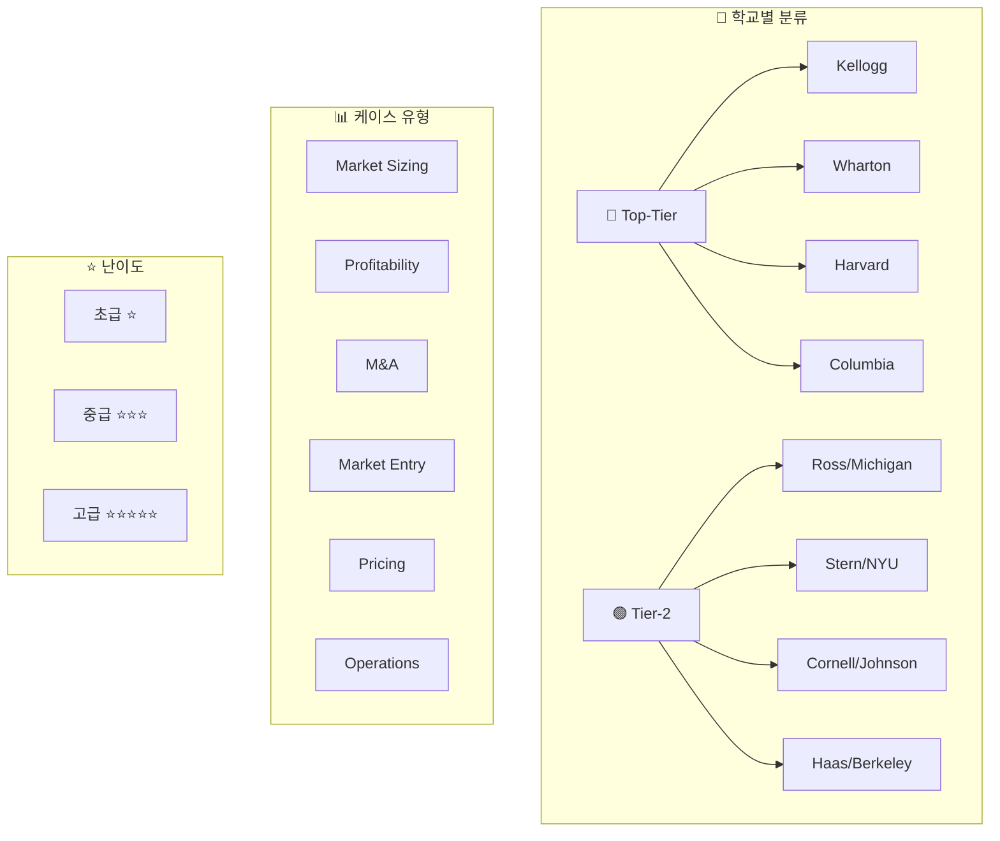

# [참고] 케이스 인터뷰 자료집

No: 10
난이도: 중급
단계: Interview Prep
상태: 완료
선행 학습: [9회차] Interview Prep: 컨설팅펌 면접 준비 가이드 (%5B9%ED%9A%8C%EC%B0%A8%5D%20Interview%20Prep%20%EC%BB%A8%EC%84%A4%ED%8C%85%ED%8E%8C%20%EB%A9%B4%EC%A0%91%20%EC%A4%80%EB%B9%84%20%EA%B0%80%EC%9D%B4%EB%93%9C%203c646b9f2c6248d8b1187e8c28504738.md)
중요도: 낮음 (Low)
학습 목표: 컨설팅펌 케이스 인터뷰 유형별 문제 풀이 및 산업 지식 습득

컨설팅 케이스 인터뷰 참고자료

> 본 페이지는 컨설팅펌 케이스 인터뷰 준비를 위한 참고자료를 **MECE 원칙**에 따라 3가지 관점으로 구조화합니다.
> 

---

## 📊 전체 구조 개요

---

## 🅰️ 출처(펌)별 분류

<aside>
🔷

**BAIN & Company** *(11개 파일)*

- 시장추정, 수익성 분석, 신규사업, Pricing 케이스

[Case B.pdf](%5B%EC%B0%B8%EA%B3%A0%5D%20%EC%BC%80%EC%9D%B4%EC%8A%A4%20%EC%9D%B8%ED%84%B0%EB%B7%B0%20%EC%9E%90%EB%A3%8C%EC%A7%91/Case_B.pdf)

</aside>

<aside>
🟢

**BCG (Boston Consulting Group)** *(10개 파일)*

- 수익개선, 성장전략, 산업분석, 가치사슬 케이스
</aside>

<aside>
🔵

**McKinsey & Company** *(1개 파일)*

- 신규시장 진출 선발문제
</aside>

<aside>
⚪

**기타 / Mock 케이스** *(13개 파일)*

- 종합 케이스, 기출문제, 유형별 연습 자료
</aside>

---

## 🅱️ 케이스 유형별 분류

<aside>
📏

**시장추정 (Market Sizing)**

- 시장 규모 추정, Driver 분석, Factor 도출

[2008_BAIN 1-1_면접관 미상_시장추정 numbering.doc](%5B%EC%B0%B8%EA%B3%A0%5D%20%EC%BC%80%EC%9D%B4%EC%8A%A4%20%EC%9D%B8%ED%84%B0%EB%B7%B0%20%EC%9E%90%EB%A3%8C%EC%A7%91/2008_BAIN_1-1_%EB%A9%B4%EC%A0%91%EA%B4%80_%EB%AF%B8%EC%83%81_%EC%8B%9C%EC%9E%A5%EC%B6%94%EC%A0%95_numbering.doc)

[시기 미상_BAIN_면접관 미상_시장 추정을 위한 Driver 추출 및 다양한 Factor를 보는 관점.doc](%5B%EC%B0%B8%EA%B3%A0%5D%20%EC%BC%80%EC%9D%B4%EC%8A%A4%20%EC%9D%B8%ED%84%B0%EB%B7%B0%20%EC%9E%90%EB%A3%8C%EC%A7%91/%EC%8B%9C%EA%B8%B0_%EB%AF%B8%EC%83%81_BAIN_%EB%A9%B4%EC%A0%91%EA%B4%80_%EB%AF%B8%EC%83%81_%EC%8B%9C%EC%9E%A5_%EC%B6%94%EC%A0%95%EC%9D%84_%EC%9C%84%ED%95%9C_Driver_%EC%B6%94%EC%B6%9C_%EB%B0%8F_%EB%8B%A4%EC%96%91%ED%95%9C_Factor%EB%A5%BC_%EB%B3%B4%EB%8A%94_%EA%B4%80%EC%A0%90.doc)

[2011Spring 1-1_BAIN_김재균SAC_신사업 수요 추정.doc](%5B%EC%B0%B8%EA%B3%A0%5D%20%EC%BC%80%EC%9D%B4%EC%8A%A4%20%EC%9D%B8%ED%84%B0%EB%B7%B0%20%EC%9E%90%EB%A3%8C%EC%A7%91/2011Spring_1-1_BAIN_%EA%B9%80%EC%9E%AC%EA%B7%A0SAC_%EC%8B%A0%EC%82%AC%EC%97%85_%EC%88%98%EC%9A%94_%EC%B6%94%EC%A0%95.doc)

[2010Mock_BCG_이승훈AC_산업 및 시장분석.doc](%5B%EC%B0%B8%EA%B3%A0%5D%20%EC%BC%80%EC%9D%B4%EC%8A%A4%20%EC%9D%B8%ED%84%B0%EB%B7%B0%20%EC%9E%90%EB%A3%8C%EC%A7%91/2010Mock_BCG_%EC%9D%B4%EC%8A%B9%ED%9B%88AC_%EC%82%B0%EC%97%85_%EB%B0%8F_%EC%8B%9C%EC%9E%A5%EB%B6%84%EC%84%9D.doc)

</aside>

<aside>
💰

**수익성 분석 (Profitability)**

- 수익 하락 원인 진단, 수익구조 개선, 매출 증대

[2008_BAIN_면접관 미상_수익하락원인진단_해결방안제시.doc](%5B%EC%B0%B8%EA%B3%A0%5D%20%EC%BC%80%EC%9D%B4%EC%8A%A4%20%EC%9D%B8%ED%84%B0%EB%B7%B0%20%EC%9E%90%EB%A3%8C%EC%A7%91/2008_BAIN_%EB%A9%B4%EC%A0%91%EA%B4%80_%EB%AF%B8%EC%83%81_%EC%88%98%EC%9D%B5%ED%95%98%EB%9D%BD%EC%9B%90%EC%9D%B8%EC%A7%84%EB%8B%A8_%ED%95%B4%EA%B2%B0%EB%B0%A9%EC%95%88%EC%A0%9C%EC%8B%9C.doc)

[시기 미상_BAIN_면접관 미상_수익하락원인파악 _ 경쟁 대응 방안.doc](%5B%EC%B0%B8%EA%B3%A0%5D%20%EC%BC%80%EC%9D%B4%EC%8A%A4%20%EC%9D%B8%ED%84%B0%EB%B7%B0%20%EC%9E%90%EB%A3%8C%EC%A7%91/%EC%8B%9C%EA%B8%B0_%EB%AF%B8%EC%83%81_BAIN_%EB%A9%B4%EC%A0%91%EA%B4%80_%EB%AF%B8%EC%83%81_%EC%88%98%EC%9D%B5%ED%95%98%EB%9D%BD%EC%9B%90%EC%9D%B8%ED%8C%8C%EC%95%85___%EA%B2%BD%EC%9F%81_%EB%8C%80%EC%9D%91_%EB%B0%A9%EC%95%88.doc)

[시기 미상_BAIN_면접관 미상_매출증대.doc](%5B%EC%B0%B8%EA%B3%A0%5D%20%EC%BC%80%EC%9D%B4%EC%8A%A4%20%EC%9D%B8%ED%84%B0%EB%B7%B0%20%EC%9E%90%EB%A3%8C%EC%A7%91/%EC%8B%9C%EA%B8%B0_%EB%AF%B8%EC%83%81_BAIN_%EB%A9%B4%EC%A0%91%EA%B4%80_%EB%AF%B8%EC%83%81_%EB%A7%A4%EC%B6%9C%EC%A6%9D%EB%8C%80.doc)

[2008Spring 2-1_BCG_정경운 팀장_수익개선.doc](%5B%EC%B0%B8%EA%B3%A0%5D%20%EC%BC%80%EC%9D%B4%EC%8A%A4%20%EC%9D%B8%ED%84%B0%EB%B7%B0%20%EC%9E%90%EB%A3%8C%EC%A7%91/2008Spring_2-1_BCG_%EC%A0%95%EA%B2%BD%EC%9A%B4_%ED%8C%80%EC%9E%A5_%EC%88%98%EC%9D%B5%EA%B0%9C%EC%84%A0.doc)

[2009Fall 3-1_BCG_윤병석 Partner_수치계산 및 매출증대.doc](%5B%EC%B0%B8%EA%B3%A0%5D%20%EC%BC%80%EC%9D%B4%EC%8A%A4%20%EC%9D%B8%ED%84%B0%EB%B7%B0%20%EC%9E%90%EB%A3%8C%EC%A7%91/2009Fall_3-1_BCG_%EC%9C%A4%EB%B3%91%EC%84%9D_Partner_%EC%88%98%EC%B9%98%EA%B3%84%EC%82%B0_%EB%B0%8F_%EB%A7%A4%EC%B6%9C%EC%A6%9D%EB%8C%80.doc)

[2010Spring 2-2_BCG_강성현 팀장_매출하락의 원인 및 수익구조 개선 방안.doc](%5B%EC%B0%B8%EA%B3%A0%5D%20%EC%BC%80%EC%9D%B4%EC%8A%A4%20%EC%9D%B8%ED%84%B0%EB%B7%B0%20%EC%9E%90%EB%A3%8C%EC%A7%91/2010Spring_2-2_BCG_%EA%B0%95%EC%84%B1%ED%98%84_%ED%8C%80%EC%9E%A5_%EB%A7%A4%EC%B6%9C%ED%95%98%EB%9D%BD%EC%9D%98_%EC%9B%90%EC%9D%B8_%EB%B0%8F_%EC%88%98%EC%9D%B5%EA%B5%AC%EC%A1%B0_%EA%B0%9C%EC%84%A0_%EB%B0%A9%EC%95%88.doc)

[2010Spring 2-2_BCG_도영진 팀장_판매량 확대_가치사슬 분석.doc](%5B%EC%B0%B8%EA%B3%A0%5D%20%EC%BC%80%EC%9D%B4%EC%8A%A4%20%EC%9D%B8%ED%84%B0%EB%B7%B0%20%EC%9E%90%EB%A3%8C%EC%A7%91/2010Spring_2-2_BCG_%EB%8F%84%EC%98%81%EC%A7%84_%ED%8C%80%EC%9E%A5_%ED%8C%90%EB%A7%A4%EB%9F%89_%ED%99%95%EB%8C%80_%EA%B0%80%EC%B9%98%EC%82%AC%EC%8A%AC_%EB%B6%84%EC%84%9D.doc)

[쇼핑.docx](%5B%EC%B0%B8%EA%B3%A0%5D%20%EC%BC%80%EC%9D%B4%EC%8A%A4%20%EC%9D%B8%ED%84%B0%EB%B7%B0%20%EC%9E%90%EB%A3%8C%EC%A7%91/%EC%87%BC%ED%95%91.docx)

</aside>

<aside>
🚀

**신규사업 진출 (Market Entry)**

- 신사업 타당성 검토, 시장 진출 전략, 신규 채널 개발

[2008_BAIN_면접관 미상_신규사업 착수 및 투자 타당성 검토.doc](%5B%EC%B0%B8%EA%B3%A0%5D%20%EC%BC%80%EC%9D%B4%EC%8A%A4%20%EC%9D%B8%ED%84%B0%EB%B7%B0%20%EC%9E%90%EB%A3%8C%EC%A7%91/2008_BAIN_%EB%A9%B4%EC%A0%91%EA%B4%80_%EB%AF%B8%EC%83%81_%EC%8B%A0%EA%B7%9C%EC%82%AC%EC%97%85_%EC%B0%A9%EC%88%98_%EB%B0%8F_%ED%88%AC%EC%9E%90_%ED%83%80%EB%8B%B9%EC%84%B1_%EA%B2%80%ED%86%A0.doc)

[2011Spring 1-2_BAIN_유달내이사_신사업 진출.doc](%5B%EC%B0%B8%EA%B3%A0%5D%20%EC%BC%80%EC%9D%B4%EC%8A%A4%20%EC%9D%B8%ED%84%B0%EB%B7%B0%20%EC%9E%90%EB%A3%8C%EC%A7%91/2011Spring_1-2_BAIN_%EC%9C%A0%EB%8B%AC%EB%82%B4%EC%9D%B4%EC%82%AC_%EC%8B%A0%EC%82%AC%EC%97%85_%EC%A7%84%EC%B6%9C.doc)

[2010Spring 2-1_BCG_고영석 이사_성장전략 및 자료해석과 수치계산.doc](%5B%EC%B0%B8%EA%B3%A0%5D%20%EC%BC%80%EC%9D%B4%EC%8A%A4%20%EC%9D%B8%ED%84%B0%EB%B7%B0%20%EC%9E%90%EB%A3%8C%EC%A7%91/2010Spring_2-1_BCG_%EA%B3%A0%EC%98%81%EC%84%9D_%EC%9D%B4%EC%82%AC_%EC%84%B1%EC%9E%A5%EC%A0%84%EB%9E%B5_%EB%B0%8F_%EC%9E%90%EB%A3%8C%ED%95%B4%EC%84%9D%EA%B3%BC_%EC%88%98%EC%B9%98%EA%B3%84%EC%82%B0.doc)

[2010Spring 2-1_BCG_윤경은 PL_시장진출 및 신규채널 개발.doc](%5B%EC%B0%B8%EA%B3%A0%5D%20%EC%BC%80%EC%9D%B4%EC%8A%A4%20%EC%9D%B8%ED%84%B0%EB%B7%B0%20%EC%9E%90%EB%A3%8C%EC%A7%91/2010Spring_2-1_BCG_%EC%9C%A4%EA%B2%BD%EC%9D%80_PL_%EC%8B%9C%EC%9E%A5%EC%A7%84%EC%B6%9C_%EB%B0%8F_%EC%8B%A0%EA%B7%9C%EC%B1%84%EB%84%90_%EA%B0%9C%EB%B0%9C.doc)

[2010Winter McK RI 선발문제_신규시장 진출.doc](%5B%EC%B0%B8%EA%B3%A0%5D%20%EC%BC%80%EC%9D%B4%EC%8A%A4%20%EC%9D%B8%ED%84%B0%EB%B7%B0%20%EC%9E%90%EB%A3%8C%EC%A7%91/2010Winter_McK_RI_%EC%84%A0%EB%B0%9C%EB%AC%B8%EC%A0%9C_%EC%8B%A0%EA%B7%9C%EC%8B%9C%EC%9E%A5_%EC%A7%84%EC%B6%9C.doc)

[신규사업진출.docx](%5B%EC%B0%B8%EA%B3%A0%5D%20%EC%BC%80%EC%9D%B4%EC%8A%A4%20%EC%9D%B8%ED%84%B0%EB%B7%B0%20%EC%9E%90%EB%A3%8C%EC%A7%91/%EC%8B%A0%EA%B7%9C%EC%82%AC%EC%97%85%EC%A7%84%EC%B6%9C.docx)

</aside>

<aside>
🏷️

**가격결정 (Pricing)**

- 가격 전략, 프라이싱 모델

[시기 미상_BAIN_면접관 미상_Pricing.doc](%5B%EC%B0%B8%EA%B3%A0%5D%20%EC%BC%80%EC%9D%B4%EC%8A%A4%20%EC%9D%B8%ED%84%B0%EB%B7%B0%20%EC%9E%90%EB%A3%8C%EC%A7%91/%EC%8B%9C%EA%B8%B0_%EB%AF%B8%EC%83%81_BAIN_%EB%A9%B4%EC%A0%91%EA%B4%80_%EB%AF%B8%EC%83%81_Pricing.doc)

[가격결정.docx](%5B%EC%B0%B8%EA%B3%A0%5D%20%EC%BC%80%EC%9D%B4%EC%8A%A4%20%EC%9D%B8%ED%84%B0%EB%B7%B0%20%EC%9E%90%EB%A3%8C%EC%A7%91/%EA%B0%80%EA%B2%A9%EA%B2%B0%EC%A0%95.docx)

</aside>

<aside>
🤝

**M&A / Turn-around**

- 인수합병, 기업 구조조정

[M_A.docx](%5B%EC%B0%B8%EA%B3%A0%5D%20%EC%BC%80%EC%9D%B4%EC%8A%A4%20%EC%9D%B8%ED%84%B0%EB%B7%B0%20%EC%9E%90%EB%A3%8C%EC%A7%91/M_A.docx)

[Turn-around.docx](%5B%EC%B0%B8%EA%B3%A0%5D%20%EC%BC%80%EC%9D%B4%EC%8A%A4%20%EC%9D%B8%ED%84%B0%EB%B7%B0%20%EC%9E%90%EB%A3%8C%EC%A7%91/Turn-around.docx)

</aside>

<aside>
📊

**종합 / 기타 케이스**

- 산업 분석, Portfolio 관리, 가치사슬 분석

[시기 미상_BAIN_면접관 미상_Process Break Down_산식만들어 수치 구하기.doc](%5B%EC%B0%B8%EA%B3%A0%5D%20%EC%BC%80%EC%9D%B4%EC%8A%A4%20%EC%9D%B8%ED%84%B0%EB%B7%B0%20%EC%9E%90%EB%A3%8C%EC%A7%91/%EC%8B%9C%EA%B8%B0_%EB%AF%B8%EC%83%81_BAIN_%EB%A9%B4%EC%A0%91%EA%B4%80_%EB%AF%B8%EC%83%81_Process_Break_Down_%EC%82%B0%EC%8B%9D%EB%A7%8C%EB%93%A4%EC%96%B4_%EC%88%98%EC%B9%98_%EA%B5%AC%ED%95%98%EA%B8%B0.doc)

[2010 Mock-BCG 이승훈 AC.docx](%5B%EC%B0%B8%EA%B3%A0%5D%20%EC%BC%80%EC%9D%B4%EC%8A%A4%20%EC%9D%B8%ED%84%B0%EB%B7%B0%20%EC%9E%90%EB%A3%8C%EC%A7%91/2010_Mock-BCG_%EC%9D%B4%EC%8A%B9%ED%9B%88_AC.docx)

[2010Spring 3-1_BCG_이병남 대표_산업 분석_제품 Portfolio 관리.doc](%5B%EC%B0%B8%EA%B3%A0%5D%20%EC%BC%80%EC%9D%B4%EC%8A%A4%20%EC%9D%B8%ED%84%B0%EB%B7%B0%20%EC%9E%90%EB%A3%8C%EC%A7%91/2010Spring_3-1_BCG_%EC%9D%B4%EB%B3%91%EB%82%A8_%EB%8C%80%ED%91%9C_%EC%82%B0%EC%97%85_%EB%B6%84%EC%84%9D_%EC%A0%9C%ED%92%88_Portfolio_%EA%B4%80%EB%A6%AC.doc)

[CASE M.docx](%5B%EC%B0%B8%EA%B3%A0%5D%20%EC%BC%80%EC%9D%B4%EC%8A%A4%20%EC%9D%B8%ED%84%B0%EB%B7%B0%20%EC%9E%90%EB%A3%8C%EC%A7%91/CASE_M.docx)

[CASE M.pdf](%5B%EC%B0%B8%EA%B3%A0%5D%20%EC%BC%80%EC%9D%B4%EC%8A%A4%20%EC%9D%B8%ED%84%B0%EB%B7%B0%20%EC%9E%90%EB%A3%8C%EC%A7%91/CASE_M.pdf)

[수익성분석.docx](%5B%EC%B0%B8%EA%B3%A0%5D%20%EC%BC%80%EC%9D%B4%EC%8A%A4%20%EC%9D%B8%ED%84%B0%EB%B7%B0%20%EC%9E%90%EB%A3%8C%EC%A7%91/%EC%88%98%EC%9D%B5%EC%84%B1%EB%B6%84%EC%84%9D.docx)

[시장현황.docx](%5B%EC%B0%B8%EA%B3%A0%5D%20%EC%BC%80%EC%9D%B4%EC%8A%A4%20%EC%9D%B8%ED%84%B0%EB%B7%B0%20%EC%9E%90%EB%A3%8C%EC%A7%91/%EC%8B%9C%EC%9E%A5%ED%98%84%ED%99%A9.docx)

[컨설팅 이슈분석.docx](%5B%EC%B0%B8%EA%B3%A0%5D%20%EC%BC%80%EC%9D%B4%EC%8A%A4%20%EC%9D%B8%ED%84%B0%EB%B7%B0%20%EC%9E%90%EB%A3%8C%EC%A7%91/%EC%BB%A8%EC%84%A4%ED%8C%85_%EC%9D%B4%EC%8A%88%EB%B6%84%EC%84%9D.docx)

</aside>

---

## 🅲 산업별 Profile (seeMORE Industry Series)

> 💡 **활용 가이드**: 각 산업 Profile에는 **산업 정의, 주요 Player, 부서별 업무, 수익구조, 면접 필수 질문**이 포함되어 있습니다. 케이스 인터뷰 및 인성 면접 준비에 필수입니다.
> 

---

### 💼 금융업 (Financial Services)

<aside>
📈

**증권 (Securities)**

- **정의**: 자금 수요자(기업/정부)와 공급자(투자자) 간 거래를 중개하는 금융업
- **주요 Player**: 우리투자증권, 대우증권, 삼성증권, 미래에셋증권 등
- **수익원**: Brokerage(50~60%), IB, 자산관리, PI(자기자본운용)
- **면접 필수**: 은행 vs 증권사 차이, 금리인하 영향, 수익 다각화 전략

[%5B%EC%B0%B8%EA%B3%A0%5D%20%EC%BC%80%EC%9D%B4%EC%8A%A4%20%EC%9D%B8%ED%84%B0%EB%B7%B0%20%EC%9E%90%EB%A3%8C%EC%A7%91/%EC%A6%9D%EA%B6%8C.pdf](%5B%EC%B0%B8%EA%B3%A0%5D%20%EC%BC%80%EC%9D%B4%EC%8A%A4%20%EC%9D%B8%ED%84%B0%EB%B7%B0%20%EC%9E%90%EB%A3%8C%EC%A7%91/%EC%A6%9D%EA%B6%8C.pdf)

</aside>

<aside>
🏦

**은행 (Banking)**

- **정의**: 예금 수취 및 대출을 통한 금융 중개 기능 수행
- **주요 Player**: KB국민, 신한, 우리, 하나, NH농협 등
- **수익원**: 이자수익(예대마진), 비이자수익(수수료, 외환)
- **면접 필수**: BIS 자기자본비율, 공공성 vs 수익성, 디지털뱅킹 전략

[%5B%EC%B0%B8%EA%B3%A0%5D%20%EC%BC%80%EC%9D%B4%EC%8A%A4%20%EC%9D%B8%ED%84%B0%EB%B7%B0%20%EC%9E%90%EB%A3%8C%EC%A7%91/%EC%9D%80%ED%96%89.pdf](%5B%EC%B0%B8%EA%B3%A0%5D%20%EC%BC%80%EC%9D%B4%EC%8A%A4%20%EC%9D%B8%ED%84%B0%EB%B7%B0%20%EC%9E%90%EB%A3%8C%EC%A7%91/%EC%9D%80%ED%96%89.pdf)

</aside>

<aside>
🛡️

**생명보험 (Life Insurance)**

- **정의**: 사람의 생존/사망에 관한 위험을 보장하는 금융서비스
- **주요 Player**: 삼성생명, 한화생명, 교보생명, 신한라이프 등
- **수익원**: 보험료수익, 투자수익, 위험차익
- **면접 필수**: 저금리 환경 대응, 상품 포트폴리오, 언더라이팅

[%5B%EC%B0%B8%EA%B3%A0%5D%20%EC%BC%80%EC%9D%B4%EC%8A%A4%20%EC%9D%B8%ED%84%B0%EB%B7%B0%20%EC%9E%90%EB%A3%8C%EC%A7%91/%EC%83%9D%EB%AA%85%EB%B3%B4%ED%97%98.pdf](%5B%EC%B0%B8%EA%B3%A0%5D%20%EC%BC%80%EC%9D%B4%EC%8A%A4%20%EC%9D%B8%ED%84%B0%EB%B7%B0%20%EC%9E%90%EB%A3%8C%EC%A7%91/%EC%83%9D%EB%AA%85%EB%B3%B4%ED%97%98.pdf)

</aside>

<aside>
🔒

**손해보험 (Non-Life Insurance)**

- **정의**: 재산/배상책임/상해 등 손해를 보상하는 보험
- **주요 Player**: 삼성화재, 현대해상, DB손해보험, KB손해보험 등
- **수익원**: 보험영업이익, 투자영업이익
- **면접 필수**: 손해율 관리, 자동차보험 시장, 리스크 관리

[%5B%EC%B0%B8%EA%B3%A0%5D%20%EC%BC%80%EC%9D%B4%EC%8A%A4%20%EC%9D%B8%ED%84%B0%EB%B7%B0%20%EC%9E%90%EB%A3%8C%EC%A7%91/%EC%86%90%ED%95%B4%EB%B3%B4%ED%97%98.pdf](%5B%EC%B0%B8%EA%B3%A0%5D%20%EC%BC%80%EC%9D%B4%EC%8A%A4%20%EC%9D%B8%ED%84%B0%EB%B7%B0%20%EC%9E%90%EB%A3%8C%EC%A7%91/%EC%86%90%ED%95%B4%EB%B3%B4%ED%97%98.pdf)

</aside>

<aside>
💳

**신용카드 (Credit Card)**

- **정의**: 소비자 신용을 기반으로 결제/대출 서비스 제공
- **주요 Player**: 삼성카드, 신한카드, KB국민카드, 현대카드 등
- **수익원**: 가맹점수수료, 카드론이자, 연회비
- **면접 필수**: 핀테크 대응, 빅데이터 활용, 수수료율 규제 영향

[%5B%EC%B0%B8%EA%B3%A0%5D%20%EC%BC%80%EC%9D%B4%EC%8A%A4%20%EC%9D%B8%ED%84%B0%EB%B7%B0%20%EC%9E%90%EB%A3%8C%EC%A7%91/%EC%8B%A0%EC%9A%A9%EC%B9%B4%EB%93%9C.pdf](%5B%EC%B0%B8%EA%B3%A0%5D%20%EC%BC%80%EC%9D%B4%EC%8A%A4%20%EC%9D%B8%ED%84%B0%EB%B7%B0%20%EC%9E%90%EB%A3%8C%EC%A7%91/%EC%8B%A0%EC%9A%A9%EC%B9%B4%EB%93%9C.pdf)

</aside>

---

### 🏭 제조업 (Manufacturing)

<aside>
💻

**반도체 (Semiconductor)**

- **정의**: 전자기기의 핵심 부품인 반도체를 설계/제조하는 산업
- **주요 Player**: 삼성전자, SK하이닉스, 인텔, TSMC, 퀄컴 등
- **분류**: 메모리(DRAM/NAND), 시스템(AP/CPU), 파운드리
- **면접 필수**: 슈퍼사이클, 미세공정 경쟁, 중국 견제 영향

[%5B%EC%B0%B8%EA%B3%A0%5D%20%EC%BC%80%EC%9D%B4%EC%8A%A4%20%EC%9D%B8%ED%84%B0%EB%B7%B0%20%EC%9E%90%EB%A3%8C%EC%A7%91/%EB%B0%98%EB%8F%84%EC%B2%B4.pdf](%5B%EC%B0%B8%EA%B3%A0%5D%20%EC%BC%80%EC%9D%B4%EC%8A%A4%20%EC%9D%B8%ED%84%B0%EB%B7%B0%20%EC%9E%90%EB%A3%8C%EC%A7%91/%EB%B0%98%EB%8F%84%EC%B2%B4.pdf)

</aside>

<aside>
🛢️

**석유화학 (Petrochemical)**

- **정의**: 원유를 정제하여 화학제품을 생산하는 장치산업
- **주요 Player**: LG화학, 롯데케미칼, 한화솔루션, SK이노베이션 등
- **특징**: 대규모 설비투자, 경기민감도 높음, 수직계열화
- **면접 필수**: 납사크래킹, 스프레드, 친환경 전환 전략

[%5B%EC%B0%B8%EA%B3%A0%5D%20%EC%BC%80%EC%9D%B4%EC%8A%A4%20%EC%9D%B8%ED%84%B0%EB%B7%B0%20%EC%9E%90%EB%A3%8C%EC%A7%91/%EC%84%9D%EC%9C%A0%ED%99%94%ED%95%99.pdf](%5B%EC%B0%B8%EA%B3%A0%5D%20%EC%BC%80%EC%9D%B4%EC%8A%A4%20%EC%9D%B8%ED%84%B0%EB%B7%B0%20%EC%9E%90%EB%A3%8C%EC%A7%91/%EC%84%9D%EC%9C%A0%ED%99%94%ED%95%99.pdf)

</aside>

<aside>
🚗

**자동차 (Automotive)**

- **정의**: 완성차 및 부품을 설계/제조/판매하는 산업
- **주요 Player**: 현대차, 기아, GM, 토요타, 폭스바겐 등
- **트렌드**: 전기차(EV), 자율주행, 커넥티드카
- **면접 필수**: 플랫폼 전략, 전동화 전환, 공급망 관리

[%5B%EC%B0%B8%EA%B3%A0%5D%20%EC%BC%80%EC%9D%B4%EC%8A%A4%20%EC%9D%B8%ED%84%B0%EB%B7%B0%20%EC%9E%90%EB%A3%8C%EC%A7%91/%EC%9E%90%EB%8F%99%EC%B0%A8.pdf](%5B%EC%B0%B8%EA%B3%A0%5D%20%EC%BC%80%EC%9D%B4%EC%8A%A4%20%EC%9D%B8%ED%84%B0%EB%B7%B0%20%EC%9E%90%EB%A3%8C%EC%A7%91/%EC%9E%90%EB%8F%99%EC%B0%A8.pdf)

</aside>

<aside>
🚢

**조선 (Shipbuilding)**

- **정의**: 선박을 설계/건조하는 중공업 산업
- **주요 Player**: HD현대중공업, 삼성중공업, 한화오션 등
- **선종**: 컨테이너선, 탱커, LNG선, 해양플랜트
- **면접 필수**: 신조선가, 수주잔량, LNG운반선 시장

[%5B%EC%B0%B8%EA%B3%A0%5D%20%EC%BC%80%EC%9D%B4%EC%8A%A4%20%EC%9D%B8%ED%84%B0%EB%B7%B0%20%EC%9E%90%EB%A3%8C%EC%A7%91/%EC%A1%B0%EC%84%A0%EC%82%B0%EC%97%85.pdf](%5B%EC%B0%B8%EA%B3%A0%5D%20%EC%BC%80%EC%9D%B4%EC%8A%A4%20%EC%9D%B8%ED%84%B0%EB%B7%B0%20%EC%9E%90%EB%A3%8C%EC%A7%91/%EC%A1%B0%EC%84%A0%EC%82%B0%EC%97%85.pdf)

</aside>

<aside>
⛽

**정유 (Oil Refining)**

- **정의**: 원유를 정제하여 석유제품을 생산/판매하는 산업
- **주요 Player**: SK에너지, GS칼텍스, 에쓰오일, 현대오일뱅크 등
- **수익원**: 정제마진, 석유제품 판매
- **면접 필수**: 정제마진 결정요인, 친환경 전환, 신사업 진출

[%5B%EC%B0%B8%EA%B3%A0%5D%20%EC%BC%80%EC%9D%B4%EC%8A%A4%20%EC%9D%B8%ED%84%B0%EB%B7%B0%20%EC%9E%90%EB%A3%8C%EC%A7%91/%EC%A0%95%EC%9C%A0%EC%82%B0%EC%97%85.pdf](%5B%EC%B0%B8%EA%B3%A0%5D%20%EC%BC%80%EC%9D%B4%EC%8A%A4%20%EC%9D%B8%ED%84%B0%EB%B7%B0%20%EC%9E%90%EB%A3%8C%EC%A7%91/%EC%A0%95%EC%9C%A0%EC%82%B0%EC%97%85.pdf)

</aside>

---

### 🏗️ 건설/부동산 (Construction & Real Estate)

<aside>
🏢

**건설 (Construction)**

- **정의**: 토목/건축/플랜트 등 사회 인프라를 건설하는 산업
- **주요 Player**: 삼성물산, 현대건설, GS건설, 대우건설 등
- **사업영역**: 주택, 토목, 플랜트, 해외건설
- **면접 필수**: 수주전략, 원가관리, 부동산 시장 전망

[%5B%EC%B0%B8%EA%B3%A0%5D%20%EC%BC%80%EC%9D%B4%EC%8A%A4%20%EC%9D%B8%ED%84%B0%EB%B7%B0%20%EC%9E%90%EB%A3%8C%EC%A7%91/%EA%B1%B4%EC%84%A4.pdf](%5B%EC%B0%B8%EA%B3%A0%5D%20%EC%BC%80%EC%9D%B4%EC%8A%A4%20%EC%9D%B8%ED%84%B0%EB%B7%B0%20%EC%9E%90%EB%A3%8C%EC%A7%91/%EA%B1%B4%EC%84%A4.pdf)

</aside>

---

### 📱 IT / 전자 (IT & Electronics)

<aside>
🖥️

**디스플레이 (Display)**

- **정의**: TV/모바일 등에 사용되는 화면 패널을 제조하는 산업
- **주요 Player**: 삼성디스플레이, LG디스플레이, BOE, AUO 등
- **기술**: LCD, OLED, MicroLED, QD
- **면접 필수**: 중국 업체 추격, OLED 전환, 차세대 기술

[%5B%EC%B0%B8%EA%B3%A0%5D%20%EC%BC%80%EC%9D%B4%EC%8A%A4%20%EC%9D%B8%ED%84%B0%EB%B7%B0%20%EC%9E%90%EB%A3%8C%EC%A7%91/%EB%94%94%EC%8A%A4%ED%94%8C%EB%A0%88%EC%9D%B4.pdf](%5B%EC%B0%B8%EA%B3%A0%5D%20%EC%BC%80%EC%9D%B4%EC%8A%A4%20%EC%9D%B8%ED%84%B0%EB%B7%B0%20%EC%9E%90%EB%A3%8C%EC%A7%91/%EB%94%94%EC%8A%A4%ED%94%8C%EB%A0%88%EC%9D%B4.pdf)

</aside>

<aside>
📱

**휴대폰 (Mobile Phone)**

- **정의**: 스마트폰 및 관련 부품을 설계/제조하는 산업
- **주요 Player**: 삼성전자, 애플, 화웨이, 샤오미 등
- **트렌드**: 폴더블, 5G, AI 통합
- **면접 필수**: 프리미엄 전략, 생태계 경쟁, 부품 내재화

[%5B%EC%B0%B8%EA%B3%A0%5D%20%EC%BC%80%EC%9D%B4%EC%8A%A4%20%EC%9D%B8%ED%84%B0%EB%B7%B0%20%EC%9E%90%EB%A3%8C%EC%A7%91/%ED%9C%B4%EB%8C%80%ED%8F%B0.pdf](%5B%EC%B0%B8%EA%B3%A0%5D%20%EC%BC%80%EC%9D%B4%EC%8A%A4%20%EC%9D%B8%ED%84%B0%EB%B7%B0%20%EC%9E%90%EB%A3%8C%EC%A7%91/%ED%9C%B4%EB%8C%80%ED%8F%B0.pdf)

</aside>

---

### ✈️ 운송/물류 (Transportation & Logistics)

<aside>
✈️

**항공운송 (Aviation)**

- **정의**: 항공기를 이용한 여객/화물 운송 서비스
- **주요 Player**: 대한항공, 아시아나, 제주항공, 진에어 등
- **수익원**: 여객수익, 화물수익
- **면접 필수**: Load Factor, Yield 관리, LCC 전략

[%5B%EC%B0%B8%EA%B3%A0%5D%20%EC%BC%80%EC%9D%B4%EC%8A%A4%20%EC%9D%B8%ED%84%B0%EB%B7%B0%20%EC%9E%90%EB%A3%8C%EC%A7%91/%ED%95%AD%EA%B3%B5%EC%9A%B4%EC%86%A1%EC%97%85.pdf](%5B%EC%B0%B8%EA%B3%A0%5D%20%EC%BC%80%EC%9D%B4%EC%8A%A4%20%EC%9D%B8%ED%84%B0%EB%B7%B0%20%EC%9E%90%EB%A3%8C%EC%A7%91/%ED%95%AD%EA%B3%B5%EC%9A%B4%EC%86%A1%EC%97%85.pdf)

</aside>

<aside>
🚢

**해운 (Shipping)**

- **정의**: 선박을 이용한 화물/여객 운송 서비스
- **주요 Player**: HMM, 팬오션, 에버그린, 머스크 등
- **분류**: 컨테이너, 벌크, 탱커
- **면접 필수**: 운임지수(BDI/CCFI), 얼라이언스, 친환경 규제

[%5B%EC%B0%B8%EA%B3%A0%5D%20%EC%BC%80%EC%9D%B4%EC%8A%A4%20%EC%9D%B8%ED%84%B0%EB%B7%B0%20%EC%9E%90%EB%A3%8C%EC%A7%91/%ED%95%B4%EC%9A%B4%EC%82%B0%EC%97%85.pdf](%5B%EC%B0%B8%EA%B3%A0%5D%20%EC%BC%80%EC%9D%B4%EC%8A%A4%20%EC%9D%B8%ED%84%B0%EB%B7%B0%20%EC%9E%90%EB%A3%8C%EC%A7%91/%ED%95%B4%EC%9A%B4%EC%82%B0%EC%97%85.pdf)

</aside>

---

### 🛒 유통/서비스 (Retail & Services)

<aside>
🌐

**종합상사 (Trading Company)**

- **정의**: 국내외 상품 무역 및 투자 사업을 수행하는 기업
- **주요 Player**: 삼성물산, 포스코인터내셔널, LX인터내셔널, SK네트웍스 등
- **사업영역**: 트레이딩, 자원개발, 신사업 투자
- **면접 필수**: 사업 포트폴리오, 리스크 관리, 신성장 동력

[%5B%EC%B0%B8%EA%B3%A0%5D%20%EC%BC%80%EC%9D%B4%EC%8A%A4%20%EC%9D%B8%ED%84%B0%EB%B7%B0%20%EC%9E%90%EB%A3%8C%EC%A7%91/%EC%A2%85%ED%95%A9%EC%83%81%EC%82%AC.pdf](%5B%EC%B0%B8%EA%B3%A0%5D%20%EC%BC%80%EC%9D%B4%EC%8A%A4%20%EC%9D%B8%ED%84%B0%EB%B7%B0%20%EC%9E%90%EB%A3%8C%EC%A7%91/%EC%A2%85%ED%95%A9%EC%83%81%EC%82%AC.pdf)

</aside>

---

### 📚 산업 종합 참고자료

<aside>
📖

**산업 분석 종합 가이드**

- 다양한 산업을 한눈에 비교 분석할 수 있는 종합 자료

[%5B%EC%B0%B8%EA%B3%A0%5D%20%EC%BC%80%EC%9D%B4%EC%8A%A4%20%EC%9D%B8%ED%84%B0%EB%B7%B0%20%EC%9E%90%EB%A3%8C%EC%A7%91/%EC%82%B0%EC%97%85%EC%A0%95%EB%A6%AC%ED%8C%8C%EC%9D%BC_%EC%B0%B8%EA%B3%A0%EC%9A%A9.pdf](%5B%EC%B0%B8%EA%B3%A0%5D%20%EC%BC%80%EC%9D%B4%EC%8A%A4%20%EC%9D%B8%ED%84%B0%EB%B7%B0%20%EC%9E%90%EB%A3%8C%EC%A7%91/%EC%82%B0%EC%97%85%EC%A0%95%EB%A6%AC%ED%8C%8C%EC%9D%BC_%EC%B0%B8%EA%B3%A0%EC%9A%A9.pdf)

</aside>

---

## 📎 기출문제 / 데이터 파일

<aside>
📋

**기출문제 모음**

[2010_BCG 기출.xlsx](%5B%EC%B0%B8%EA%B3%A0%5D%20%EC%BC%80%EC%9D%B4%EC%8A%A4%20%EC%9D%B8%ED%84%B0%EB%B7%B0%20%EC%9E%90%EB%A3%8C%EC%A7%91/2010_BCG_%EA%B8%B0%EC%B6%9C.xlsx)

[2012spring_기출.xlsx](%5B%EC%B0%B8%EA%B3%A0%5D%20%EC%BC%80%EC%9D%B4%EC%8A%A4%20%EC%9D%B8%ED%84%B0%EB%B7%B0%20%EC%9E%90%EB%A3%8C%EC%A7%91/2012spring_%EA%B8%B0%EC%B6%9C.xlsx)

</aside>

---

## 🔗 MBA Case Book 컬렉션 (MECE 분석)

---

### 🏫 학교별 분류

<aside>
🔵

**Tier 1: Top MBA**

**1. Kellogg (Northwestern)**

- 버전: 2004, 2012
- 특징: 체계적 구성, 상세한 프레임워크
- 구성: Interview Overview, Case Types, Practice Cases
- 난이도: ⭐⭐⭐ (중급~고급)
</aside>

<aside>
📚

**Top MBA Case Book**

- Harvard, Wharton, Columbia, Kellogg, Ross, Stern, Cornell, Haas 등

[Case Book  - Kellogg.pdf](%5B%EC%B0%B8%EA%B3%A0%5D%20%EC%BC%80%EC%9D%B4%EC%8A%A4%20%EC%9D%B8%ED%84%B0%EB%B7%B0%20%EC%9E%90%EB%A3%8C%EC%A7%91/Case_Book__-_Kellogg.pdf)

---

**2. Wharton (UPenn)**

- 버전: 2007, 2008
- 특징: 산업 개요 + 14개 Practice Cases
- 구성: Industry Overview, Firm Profiles, Frameworks
- 난이도: ⭐⭐⭐⭐ (중급~고급)

[Case Book  - Wharton 2008.pdf](%5B%EC%B0%B8%EA%B3%A0%5D%20%EC%BC%80%EC%9D%B4%EC%8A%A4%20%EC%9D%B8%ED%84%B0%EB%B7%B0%20%EC%9E%90%EB%A3%8C%EC%A7%91/Case_Book__-_Wharton_2008.pdf)

[Case Book - Columbia 2004.pdf](%5B%EC%B0%B8%EA%B3%A0%5D%20%EC%BC%80%EC%9D%B4%EC%8A%A4%20%EC%9D%B8%ED%84%B0%EB%B7%B0%20%EC%9E%90%EB%A3%8C%EC%A7%91/Case_Book_-_Columbia_2004.pdf)

---

**3. Harvard (HBS)**

- 특징: 높은 브랜드 인지도, 실전 중심
- 구성: Real-world scenarios, Strategic thinking
- 난이도: ⭐⭐⭐⭐⭐ (고급)

[Case Book - Harvard.pdf](%5B%EC%B0%B8%EA%B3%A0%5D%20%EC%BC%80%EC%9D%B4%EC%8A%A4%20%EC%9D%B8%ED%84%B0%EB%B7%B0%20%EC%9E%90%EB%A3%8C%EC%A7%91/Case_Book_-_Harvard.pdf)

---

**4. Columbia (CBS)**

- 버전: 2004, 2006
- 특징: 분석 스킬, 문제 해결 프레임워크
- 구성: Case Interview Overview, Frameworks, Practice
- 난이도: ⭐⭐⭐⭐ (중급~고급)

[Case Book - Columbia v4 2006.pdf](%5B%EC%B0%B8%EA%B3%A0%5D%20%EC%BC%80%EC%9D%B4%EC%8A%A4%20%EC%9D%B8%ED%84%B0%EB%B7%B0%20%EC%9E%90%EB%A3%8C%EC%A7%91/Case_Book_-_Columbia_v4_2006.pdf)

[Case Book - Harvard.docx](%5B%EC%B0%B8%EA%B3%A0%5D%20%EC%BC%80%EC%9D%B4%EC%8A%A4%20%EC%9D%B8%ED%84%B0%EB%B7%B0%20%EC%9E%90%EB%A3%8C%EC%A7%91/Case_Book_-_Harvard.docx)

</aside>

</column>

<aside>
🟢

**Tier 2: Strong MBA**

**5. Ross (Michigan)**

- 버전: 2005, 2006
- 특징: 실용적 접근, 다양한 산업
- 구성: Industry Guides, Practice Cases
- 난이도: ⭐⭐⭐ (중급)

[Case Book - Ross 2005.pdf](%5B%EC%B0%B8%EA%B3%A0%5D%20%EC%BC%80%EC%9D%B4%EC%8A%A4%20%EC%9D%B8%ED%84%B0%EB%B7%B0%20%EC%9E%90%EB%A3%8C%EC%A7%91/Case_Book_-_Ross_2005.pdf)

[Case Book - Ross 2006.pdf](%5B%EC%B0%B8%EA%B3%A0%5D%20%EC%BC%80%EC%9D%B4%EC%8A%A4%20%EC%9D%B8%ED%84%B0%EB%B7%B0%20%EC%9E%90%EB%A3%8C%EC%A7%91/Case_Book_-_Ross_2006.pdf)

---

**6. Stern (NYU)**

- 버전: 2006
- 특징: Sample Frameworks, Industry Overviews
- 케이스 유형: Profitability, M&A, Pricing, Operations
- 난이도: ⭐⭐~⭐⭐⭐⭐ (Easy~Hard 표기)

[Case Book - Stern 2006.pdf](%5B%EC%B0%B8%EA%B3%A0%5D%20%EC%BC%80%EC%9D%B4%EC%8A%A4%20%EC%9D%B8%ED%84%B0%EB%B7%B0%20%EC%9E%90%EB%A3%8C%EC%A7%91/Case_Book_-_Stern_2006.pdf)

---

**7. Cornell (Johnson)**

- 특징: Industry Guides 포함 (Retail, Pharma, Banking 등)
- 케이스 유형: Growth, Profitability
- 난이도: ⭐~⭐⭐⭐⭐⭐ (1-5 스타 레이팅)

[Case Book - Wharton 2007.pdf](%5B%EC%B0%B8%EA%B3%A0%5D%20%EC%BC%80%EC%9D%B4%EC%8A%A4%20%EC%9D%B8%ED%84%B0%EB%B7%B0%20%EC%9E%90%EB%A3%8C%EC%A7%91/Case_Book_-_Wharton_2007.pdf)

---

**8. Haas (Berkeley)**

- 버전: 2000
- 특징: West Coast 관점, Tech 케이스 포함
- 난이도: ⭐⭐⭐ (중급)

[Case Study Guide - Wharton.pdf](%5B%EC%B0%B8%EA%B3%A0%5D%20%EC%BC%80%EC%9D%B4%EC%8A%A4%20%EC%9D%B8%ED%84%B0%EB%B7%B0%20%EC%9E%90%EB%A3%8C%EC%A7%91/Case_Study_Guide_-_Wharton.pdf)

</aside>

</columns>

---

### 📊 케이스 유형별 분류

| 유형 | 설명 | 포함 Case Book | 직무특강 활용 |
| --- | --- | --- | --- |
| **Market Sizing** | 시장 규모 추정 | Kellogg, Wharton, Stern | 논리적 사고력 훈련 |
| **Profitability** | 수익성 분석/개선 | 전 학교 공통 | 수익구조 이해 |
| **M&A** | 인수합병 전략 | Columbia, Stern, Cornell | 전략적 의사결정 |
| **Market Entry** | 신규 시장 진출 | Wharton, Harvard, Ross | 시장 분석 역량 |
| **Pricing** | 가격 전략 | Stern, Kellogg | 가격 민감도 분석 |
| **Operations** | 운영 효율화 | Stern, Ross | 프로세스 개선 |
| **Growth Strategy** | 성장 전략 | Cornell, Columbia | 사업 확장 전략 |
| **Industry Analysis** | 산업 분석 | Wharton, Stern | Porter's 5 Forces |

---

### ⭐ 난이도별 분류

<aside>
🟢

**초급 (Entry Level)**

- 대상: 케이스 인터뷰 입문자
- 추천: Cornell, Haas
- 특징: 기본 프레임워크 학습, 단순한 구조
- 소요시간: 15~20분/케이스
</aside>

<aside>
🟡

**중급 (Intermediate)**

- 대상: 기본기 갖춘 준비생
- 추천: Kellogg, Ross, Stern
- 특징: 복합 프레임워크, 수리 분석 포함
- 소요시간: 25~35분/케이스
</aside>

<aside>
🔴

**고급 (Advanced)**

- 대상: MBB 지원자
- 추천: Harvard, Wharton, Columbia
- 특징: 복잡한 시나리오, 다층적 분석
- 소요시간: 40~50분/케이스
</aside>

---

### 🎯 직무특강 활용 가이드

<aside>
📋

**MECE 커리큘럼 구성 권장안**

| 회차 | 주제 | 활용 Case Book | 케이스 유형 |
| --- | --- | --- | --- |
| 1 | 케이스 인터뷰 개요 | Kellogg (Intro) | Framework 소개 |
| 2 | Market Sizing 기초 | Stern, Cornell | 시장 규모 추정 |
| 3 | Profitability 분석 | Wharton, Ross | 수익성 케이스 |
| 4 | Market Entry 전략 | Columbia, Harvard | 시장 진출 |
| 5 | M&A / Growth | Stern, Cornell | 인수합병, 성장 |
| 6 | 종합 실전 연습 | Harvard, Wharton | Mock Interview |
</aside>

---

### 🔧 실무 펌 자료

<aside>
🏢

**Bain & Company Workshop**

- 특징: 실제 컨설팅펌의 케이스 접근법
- 구성: Core Frameworks, Problem Solving, Practice
- 활용: 인터뷰어 관점 이해

[Columbia_samplecases.pdf](%5B%EC%B0%B8%EA%B3%A0%5D%20%EC%BC%80%EC%9D%B4%EC%8A%A4%20%EC%9D%B8%ED%84%B0%EB%B7%B0%20%EC%9E%90%EB%A3%8C%EC%A7%91/Columbia_samplecases.pdf)

</aside>

---

### 📁 기타 Case Book 파일

<aside>
📚

**추가 참고자료**

[Cornell Case Book.doc](%5B%EC%B0%B8%EA%B3%A0%5D%20%EC%BC%80%EC%9D%B4%EC%8A%A4%20%EC%9D%B8%ED%84%B0%EB%B7%B0%20%EC%9E%90%EB%A3%8C%EC%A7%91/Cornell_Case_Book.doc)

[cornellcasebook2005.doc](%5B%EC%B0%B8%EA%B3%A0%5D%20%EC%BC%80%EC%9D%B4%EC%8A%A4%20%EC%9D%B8%ED%84%B0%EB%B7%B0%20%EC%9E%90%EB%A3%8C%EC%A7%91/cornellcasebook2005.doc)

[Case_book_Wharton.doc](%5B%EC%B0%B8%EA%B3%A0%5D%20%EC%BC%80%EC%9D%B4%EC%8A%A4%20%EC%9D%B8%ED%84%B0%EB%B7%B0%20%EC%9E%90%EB%A3%8C%EC%A7%91/Case_book_Wharton.doc)

[Case_samples_McKinsey_II.doc](%5B%EC%B0%B8%EA%B3%A0%5D%20%EC%BC%80%EC%9D%B4%EC%8A%A4%20%EC%9D%B8%ED%84%B0%EB%B7%B0%20%EC%9E%90%EB%A3%8C%EC%A7%91/Case_samples_McKinsey_II.doc)

[Case_workshop_bain.ppt](%5B%EC%B0%B8%EA%B3%A0%5D%20%EC%BC%80%EC%9D%B4%EC%8A%A4%20%EC%9D%B8%ED%84%B0%EB%B7%B0%20%EC%9E%90%EB%A3%8C%EC%A7%91/Case_workshop_bain.ppt)

[Haas Consulting Casebook 2000.pdf](%5B%EC%B0%B8%EA%B3%A0%5D%20%EC%BC%80%EC%9D%B4%EC%8A%A4%20%EC%9D%B8%ED%84%B0%EB%B7%B0%20%EC%9E%90%EB%A3%8C%EC%A7%91/Haas_Consulting_Casebook_2000.pdf)

[CoreSkillTraining_Problem Solving.pdf](%5B%EC%B0%B8%EA%B3%A0%5D%20%EC%BC%80%EC%9D%B4%EC%8A%A4%20%EC%9D%B8%ED%84%B0%EB%B7%B0%20%EC%9E%90%EB%A3%8C%EC%A7%91/CoreSkillTraining_Problem_Solving.pdf)

</aside>